<!--
  MyHR — Assembled Graduation Documentation
-->

<!--
  FRONT MATTER — MyHR Graduation Documentation
  Fill the bracketed [ ] fields before submission (team members, supervisors, logos).
  Convert to PDF/Word with Times New Roman per the faculty template at export time.
-->

<div align="center">

# Ain Shams University
### Faculty of Computer & Information Sciences
#### Computer Science Department

<br/>

# MyHR — An Adaptive AI-Powered Hiring & Interview Platform

<br/>

*[Cover background image suitable for the project]*

<br/><br/>

**June 2026**

<br/>

*[Sponsor logo if exists]*  &nbsp;&nbsp;&nbsp;&nbsp; *[ITIDA logo if exists]*

</div>

<div style="page-break-after: always;"></div>

<div align="center">

# Ain Shams University
### Faculty of Computer & Information Sciences
#### Computer Science Department

<br/>

# MyHR — An Adaptive AI-Powered Hiring & Interview Platform

This documentation is submitted in partial fulfillment of the requirements for the
**Bachelor's degree in Computer and Information Sciences**

<br/>

**By**

| Name | Department |
|------|------------|
| [Team Member 1] | [Department] |
| [Team Member 2] | [Department] |
| [Team Member 3] | [Department] |
| [Team Member 4] | [Department] |

<br/>

**Under Supervision of**

**[Supervisor 1]**
[Supervisor Title], [Department] Department,
Faculty of Computer and Information Sciences, Ain Shams University.

**[Supervisor 2]**
[Supervisor Title], [Department] Department,
Faculty of Computer and Information Sciences, Ain Shams University.

<br/>

**June 2026**

</div>

<div style="page-break-after: always;"></div>

## Revision History

| Version | Date | Author | Description |
|---------|------|--------|-------------|
| 0.1 | 2026-06 | Project Team | Initial draft of all chapters |
| 1.0 | 2026-06 | Project Team | First complete release for review |

<div style="page-break-after: always;"></div>

<div align="center">

# Acknowledgements

</div>

All praise and thanks to ALLAH, who provided us the ability to complete this work.

We are grateful to our families, whose continuous support and encouragement carried us
through every year of study.

We offer our sincerest gratitude to our supervisors, **[Supervisor 1]** and
**[Supervisor 2]**, who guided this project with their patience, knowledge, and experience,
and whose feedback shaped both the engineering and the scientific rigor of MyHR.

Finally, we thank our friends and everyone who supported us throughout the development of
this project.

<div style="page-break-after: always;"></div>

<div align="center">

# Abstract

</div>

Recruitment at scale is bottlenecked by two manual, time-consuming, and inconsistency-prone
tasks: screening large volumes of résumés (CVs) against a job description (JD), and
conducting first-round interviews. **MyHR** is an adaptive, AI-powered hiring platform that
automates both. It pairs an **enterprise hiring portal** — where companies post jobs, upload
CVs in batches, and obtain neural rankings of candidates — with an **AI interview engine**
that conducts a grounded, adaptive, voice-or-text interview and produces a defensible,
server-computed score for every candidate.

The platform is built on three cooperating subsystems. A **Large Language Model (LLM) agent**,
orchestrated as a state machine with LangGraph and powered by Groq's `llama-3.3-70b-versatile`,
generates interview questions and evaluates answers. A **hybrid Retrieval-Augmented Generation
(RAG) layer** grounds every question in the candidate's own CV and the JD using sparse
retrieval (BM25), dense retrieval (Pinecone with `all-mpnet-base-v2` embeddings), Reciprocal
Rank Fusion, and a cross-encoder reranker. A **custom neural layer** of eight PyTorch models
contributes CV–JD skill matching, multi-dimensional answer evaluation, candidate ranking,
adaptive question difficulty (reinforcement learning), emotion analysis, and performance
prediction. Final answer scores are produced by a transparent blend that weights the LLM
judgment at 65%, the neural evaluator at 20%, and the deep scoring model at 15%, with a
relevance gate that suppresses the neural contribution on off-topic answers.

The system is delivered as a **React** single-page application and a **FastAPI** backend, with
**Firebase Authentication**, **Cloud Firestore** persistence, role-based access control
separating candidates from enterprise HR users, and token-based public interview links. This
document describes the problem, the relevant background, the proposed system architecture, the
detailed implementation of each component, the testing strategy, and the project's conclusions
and future work.

**Keywords:** AI interview, retrieval-augmented generation, LLM agent, candidate ranking,
neural scoring, FastAPI, React, Firestore, adaptive difficulty.

<div style="page-break-after: always;"></div>

<div align="center">

# Table of Contents

</div>

<div class="toc">
<p class="front"><a href="#acknowledgements">Acknowledgements</a><span class="lead"></span><span class="pg">i</span></p>
<p class="front"><a href="#abstract">Abstract</a><span class="lead"></span><span class="pg">ii</span></p>
<p class="front"><a href="#list-of-figures">List of Figures</a><span class="lead"></span><span class="pg">iv</span></p>
<p class="front"><a href="#list-of-tables">List of Tables</a><span class="lead"></span><span class="pg">v</span></p>
<p class="front"><a href="#list-of-abbreviations">List of Abbreviations</a><span class="lead"></span><span class="pg">vi</span></p>

<p class="ch"><a href="#ch1">Chapter 1 — Introduction</a><span class="lead"></span><span class="pg">1</span></p>
<p class="s1">1.1 Problem Definition<span class="lead"></span><span class="pg">1</span></p>
<p class="s2">1.1.1 History<span class="lead"></span><span class="pg">1</span></p>
<p class="s2">1.1.2 Applications<span class="lead"></span><span class="pg">2</span></p>
<p class="s1">1.2 Motivation<span class="lead"></span><span class="pg">3</span></p>
<p class="s1">1.3 Objectives<span class="lead"></span><span class="pg">3</span></p>
<p class="s1">1.4 Scope<span class="lead"></span><span class="pg">5</span></p>
<p class="s1">1.5 Functional Requirements<span class="lead"></span><span class="pg">6</span></p>
<p class="s1">1.6 Non-Functional Requirements<span class="lead"></span><span class="pg">7</span></p>
<p class="s1">1.7 Project Timeline<span class="lead"></span><span class="pg">8</span></p>
<p class="s1">1.8 Documentation Outline<span class="lead"></span><span class="pg">9</span></p>

<p class="ch"><a href="#ch2">Chapter 2 — Background</a><span class="lead"></span><span class="pg">10</span></p>
<p class="s1">2.1 Retrieval-Augmented Generation<span class="lead"></span><span class="pg">10</span></p>
<p class="s1">2.2 LLM Agent Orchestration<span class="lead"></span><span class="pg">11</span></p>
<p class="s1">2.3 Transformer Embeddings & Reranking<span class="lead"></span><span class="pg">12</span></p>
<p class="s1">2.4 Neural Answer Scoring<span class="lead"></span><span class="pg">12</span></p>
<p class="s1">2.5 Reinforcement Learning for Adaptive Difficulty<span class="lead"></span><span class="pg">13</span></p>
<p class="s1">2.6 Emotion Recognition & Proctoring<span class="lead"></span><span class="pg">13</span></p>
<p class="s1">2.7 Platform Technologies<span class="lead"></span><span class="pg">14</span></p>

<p class="ch"><a href="#ch3">Chapter 3 — System Analysis & Design</a><span class="lead"></span><span class="pg">15</span></p>
<p class="s1">3.1 System Architecture<span class="lead"></span><span class="pg">15</span></p>
<p class="s1">3.2 Three-Layer Architecture<span class="lead"></span><span class="pg">16</span></p>
<p class="s1">3.3 Component Diagram<span class="lead"></span><span class="pg">17</span></p>
<p class="s1">3.4 Enterprise Hiring Workflow<span class="lead"></span><span class="pg">18</span></p>
<p class="s1">3.5 Candidate Interview Workflow<span class="lead"></span><span class="pg">19</span></p>
<p class="s1">3.6 Authentication & Authorization Design<span class="lead"></span><span class="pg">20</span></p>
<p class="s1">3.7 Database Design (ER Model)<span class="lead"></span><span class="pg">21</span></p>
<p class="s1">3.8 Deployment Design<span class="lead"></span><span class="pg">22</span></p>
<p class="s1">3.9 Interview Activity Diagram<span class="lead"></span><span class="pg">23</span></p>

<p class="ch"><a href="#ch4">Chapter 4 — System Implementation</a><span class="lead"></span><span class="pg">24</span></p>
<p class="s1">4.1 Hybrid RAG Pipeline<span class="lead"></span><span class="pg">24</span></p>
<p class="s1">4.2 LangGraph Interview Agent<span class="lead"></span><span class="pg">26</span></p>
<p class="s1">4.3 AI/ML Model Layer<span class="lead"></span><span class="pg">28</span></p>
<p class="s1">4.4 Enterprise Layer<span class="lead"></span><span class="pg">31</span></p>
<p class="s1">4.5 Training Layer<span class="lead"></span><span class="pg">33</span></p>
<p class="s1">4.6 Database Design<span class="lead"></span><span class="pg">35</span></p>
<p class="s1">4.7 API Reference<span class="lead"></span><span class="pg">37</span></p>
<p class="s1">4.8 Authentication & Authorization<span class="lead"></span><span class="pg">39</span></p>
<p class="s1">4.9 Configuration<span class="lead"></span><span class="pg">41</span></p>
<p class="s1">4.10 Proctoring, Speech & Anti-Cheating<span class="lead"></span><span class="pg">42</span></p>
<p class="s1">4.11 Cross-Cutting Concerns<span class="lead"></span><span class="pg">44</span></p>

<p class="ch"><a href="#ch5">Chapter 5 — System Testing</a><span class="lead"></span><span class="pg">45</span></p>
<p class="s1">5.1 Testing Strategy<span class="lead"></span><span class="pg">45</span></p>
<p class="s1">5.2 Installation<span class="lead"></span><span class="pg">46</span></p>
<p class="s1">5.3 Running the System<span class="lead"></span><span class="pg">47</span></p>
<p class="s1">5.4 Automated Test Suite<span class="lead"></span><span class="pg">48</span></p>
<p class="s1">5.5 End-to-End Walkthrough<span class="lead"></span><span class="pg">49</span></p>

<p class="ch"><a href="#ch6">Chapter 6 — Results & Discussion</a><span class="lead"></span><span class="pg">52</span></p>
<p class="s1">6.1 Model Results<span class="lead"></span><span class="pg">52</span></p>
<p class="s1">6.2 RAG & Grounding Results<span class="lead"></span><span class="pg">53</span></p>
<p class="s1">6.3 System & Backend Performance<span class="lead"></span><span class="pg">54</span></p>
<p class="s1">6.4 Enterprise Funnel Results<span class="lead"></span><span class="pg">55</span></p>
<p class="s1">6.5 Strengths · 6.6 Weaknesses · 6.7 Lessons Learned<span class="lead"></span><span class="pg">55</span></p>

<p class="ch"><a href="#ch7">Chapter 7 — Conclusion and Future Work</a><span class="lead"></span><span class="pg">58</span></p>
<p class="s1">7.1 Conclusion<span class="lead"></span><span class="pg">58</span></p>
<p class="s1">7.2 Known Limitations<span class="lead"></span><span class="pg">59</span></p>
<p class="s1">7.3 Future Work<span class="lead"></span><span class="pg">60</span></p>

<p class="ch"><a href="#tools">Tools</a><span class="lead"></span><span class="pg">61</span></p>
<p class="ch"><a href="#references">References</a><span class="lead"></span><span class="pg">62</span></p>
<p class="ch"><a href="#appendices">Appendices</a><span class="lead"></span><span class="pg">63</span></p>
</div>

> Page numbers are indicative; the live page numbers are printed in the footer of the exported
> document.

<div style="page-break-after: always;"></div>

<div align="center">

# List of Figures

</div>

<div class="toc">
<p><a href="#ch1">Figure 1.1 — Project Time Plan (Gantt)</a><span class="lead"></span><span class="pg">8</span></p>
<p><a href="#ch3">Figure 3.1 — System Architecture</a><span class="lead"></span><span class="pg">15</span></p>
<p><a href="#ch3">Figure 3.2 — Three-Layer Architecture</a><span class="lead"></span><span class="pg">16</span></p>
<p><a href="#ch3">Figure 3.3 — Component Diagram</a><span class="lead"></span><span class="pg">17</span></p>
<p><a href="#ch3">Figure 3.4 — Enterprise Hiring Workflow (Sequence)</a><span class="lead"></span><span class="pg">18</span></p>
<p><a href="#ch3">Figure 3.5 — Candidate Interview Workflow (Sequence)</a><span class="lead"></span><span class="pg">19</span></p>
<p><a href="#ch3">Figure 3.6 — Authentication & Authorization Flow</a><span class="lead"></span><span class="pg">20</span></p>
<p><a href="#ch3">Figure 3.7 — Database Entity-Relationship Diagram</a><span class="lead"></span><span class="pg">21</span></p>
<p><a href="#ch3">Figure 3.8 — Deployment Diagram</a><span class="lead"></span><span class="pg">22</span></p>
<p><a href="#ch3">Figure 3.9 — Interview Turn (Activity Diagram)</a><span class="lead"></span><span class="pg">23</span></p>
<p><a href="#ch4">Figure 4.1 — Hybrid RAG Pipeline</a><span class="lead"></span><span class="pg">24</span></p>
<p><a href="#ch4">Figure 4.2 — LangGraph Agent State Graph</a><span class="lead"></span><span class="pg">26</span></p>
<p><a href="#ch4">Figure 4.3 — Answer Scoring and Blend</a><span class="lead"></span><span class="pg">27</span></p>
<p><a href="#ch4">Figure 4.4 — Training Pipeline</a><span class="lead"></span><span class="pg">33</span></p>
<p><a href="#ch4">Figure 4.5 — Proctoring Detection Pipeline</a><span class="lead"></span><span class="pg">42</span></p>
<p><a href="#ch6">Figure 6.1 — Score Distribution & Model Agreement</a><span class="lead"></span><span class="pg">52</span></p>
</div>

<div style="page-break-after: always;"></div>

<div align="center">

# List of Tables

</div>

<div class="toc">
<p><a href="#ch1">Table 1.1 — Comparison with Existing Solutions</a><span class="lead"></span><span class="pg">2</span></p>
<p><a href="#ch1">Table 1.2 — Functional Requirements</a><span class="lead"></span><span class="pg">6</span></p>
<p><a href="#ch1">Table 1.3 — Non-Functional Requirements</a><span class="lead"></span><span class="pg">7</span></p>
<p><a href="#ch2">Table 2.1 — Platform Technology Stack</a><span class="lead"></span><span class="pg">14</span></p>
<p><a href="#ch4">Table 4.1 — Neural Model Layer</a><span class="lead"></span><span class="pg">28</span></p>
<p><a href="#ch4">Table 4.2 — Firestore Collections</a><span class="lead"></span><span class="pg">35</span></p>
<p><a href="#ch4">Table 4.3 — API Reference: Interview & System Endpoints</a><span class="lead"></span><span class="pg">37</span></p>
<p><a href="#ch4">Table 4.4 — API Reference: Enterprise Endpoints</a><span class="lead"></span><span class="pg">38</span></p>
<p><a href="#ch4">Table 4.5 — Environment Variables</a><span class="lead"></span><span class="pg">41</span></p>
<p><a href="#ch5">Table 5.1 — Automated Test Summary</a><span class="lead"></span><span class="pg">48</span></p>
<p><a href="#ch6">Table 6.1 — Model Test-Set Metrics</a><span class="lead"></span><span class="pg">52</span></p>
<p><a href="#ch6">Table 6.2 — System Strengths and Weaknesses</a><span class="lead"></span><span class="pg">56</span></p>
<p><a href="#tools">Table T.1 — Tools Used</a><span class="lead"></span><span class="pg">61</span></p>
</div>

<div style="page-break-after: always;"></div>

<div align="center">

# List of Abbreviations

</div>

| Abbreviation | Meaning |
|--------------|---------|
| API | Application Programming Interface |
| ATS | Applicant Tracking System |
| BM25 | Best Matching 25 (sparse ranking function) |
| CV | Curriculum Vitae (résumé) |
| EAR | Eye Aspect Ratio |
| HR | Human Resources |
| IPR | Iris Position Ratio |
| JD | Job Description |
| LLM | Large Language Model |
| MLP | Multi-Layer Perceptron |
| NDCG | Normalized Discounted Cumulative Gain |
| PII | Personally Identifiable Information |
| PPO | Proximal Policy Optimization |
| RAG | Retrieval-Augmented Generation |
| RBAC | Role-Based Access Control |
| RL | Reinforcement Learning |
| RRF | Reciprocal Rank Fusion |
| SPA | Single-Page Application |
| STT | Speech-to-Text |
| TTS | Text-to-Speech |
| VAD | Voice Activity Detection |
| WS | WebSocket |


<div style="page-break-after: always;"></div>

<div align="center" id="ch1">

# Chapter One

# Introduction

</div>

<br/>

**Chapter Outline**

- 1.1 Problem Definition
  - 1.1.1 History
  - 1.1.2 Applications
- 1.2 Motivation
- 1.3 Objectives
- 1.4 Scope
- 1.5 Functional Requirements
- 1.6 Non-Functional Requirements
- 1.7 Project Timeline
- 1.8 Documentation Outline

---

## 1.1 Problem Definition

Hiring is one of the most resource-intensive processes a company undertakes, and two of its
earliest stages are also its most repetitive:

- **Résumé screening.** For a single open role, recruiters may receive hundreds of CVs. Each
  must be read, compared against the job description, and judged for fit. The process is slow,
  subjective, and inconsistent between reviewers and across time of day.
- **First-round interviewing.** Even after shortlisting, conducting an initial screening
  interview for every promising candidate consumes scarce interviewer time. Scheduling alone
  introduces days of delay, and the quality of questions varies with the interviewer's
  preparation and fatigue.

These two stages share a common weakness: they depend on a human reading the same kinds of
documents and asking the same kinds of questions, over and over, with no guarantee of
consistency. The result is a hiring funnel that is **slow, expensive, hard to audit, and
vulnerable to unconscious bias**.

MyHR addresses this problem directly. It provides:

1. An **enterprise portal** that ingests CVs in bulk, parses them, matches them against the
   job's required skills, and ranks candidates with neural models — turning hundreds of
   documents into an ordered shortlist in seconds.
2. An **AI interview engine** that conducts an adaptive, grounded interview with each invited
   candidate and returns a single, defensible score and a structured report, without occupying
   any human interviewer's time.

In short, the problem statement is: *manual CV screening and first-round interviewing are
slow, inconsistent, and costly; they can be made faster and more consistent by grounding an
LLM-driven interviewer in the candidate's own documents and by scoring candidates with
purpose-trained neural models.*

### 1.1.1 History

The two enabling technologies behind MyHR matured only recently:

- **Applicant Tracking Systems (ATS)** have existed for decades, but classical ATS rely on
  keyword matching. They reward candidates who echo the job description's wording rather than
  candidates who actually possess the underlying skills, and they cannot conduct an interview.
- **Large Language Models (LLMs)** became capable of fluent, context-aware question generation
  and answer evaluation only after the transformer architecture and instruction-tuned chat
  models. However, an LLM used naively will *hallucinate* — it may ask about experience the
  candidate never claimed, or score an answer it never actually grounded in the role.
- **Retrieval-Augmented Generation (RAG)** emerged as the standard technique to keep an LLM
  grounded in trustworthy source documents. By retrieving the most relevant passages of a CV
  and JD and feeding them to the model, RAG constrains the interview to facts that actually
  exist in the candidate's profile.

MyHR combines these threads: it replaces keyword ATS matching with neural skill matching, and
it replaces an ungrounded LLM with a RAG-grounded interview agent whose scores are
cross-checked by dedicated neural evaluators.

### 1.1.2 Applications

The platform serves two distinct audiences from one codebase:

- **Enterprise hiring (primary).** A company requests access, is approved by a platform
  administrator, posts jobs, uploads candidate CVs, receives a neural ranking, invites the top
  candidates to an AI interview by email, and reviews completed interviews and aggregate
  analytics on a dashboard.
- **Candidate self-practice (secondary).** An individual candidate can sign up and run mock AI
  interviews against their own CV to prepare for real interviews, tracking their readiness over
  time.

Both audiences are gated by **role-based access control**: an account is either a *candidate*
or an enterprise *HR* user, and the two roles are mutually exclusive for a given email.

Table 1.1 positions MyHR against the two categories of existing tools. Traditional applicant
tracking systems screen by keyword and cannot interview; a general-purpose LLM chatbot can
converse but is ungrounded, scores opaquely, and offers no enterprise workflow. MyHR combines
grounded interviewing with neural screening inside a multi-tenant product.

**Table 1.1 — Comparison with Existing Solutions.**

| Capability | Keyword ATS | Generic LLM chatbot | MyHR |
|------------|:----------:|:-------------------:|:----:|
| CV screening | Keyword match | None | Neural skill match + rubric |
| Conducts an interview | No | Yes (ungrounded) | Yes (CV/JD-grounded) |
| Answer scoring | None | Single opaque score | Transparent LLM + neural blend |
| Resists off-topic fluency | N/A | No | Yes (relevance gate) |
| Integrity / proctoring | No | No | Iris-gaze + face count |
| Multi-tenant enterprise workflow | Yes | No | Yes |
| Server-side, tamper-proof scoring | N/A | No | Yes |

---

## 1.2 Motivation

The motivation for MyHR is to demonstrate that a **single, coherent system can automate the
top of the hiring funnel without sacrificing trustworthiness**. Three concerns drove the
design:

- **Grounding over fluency.** An interviewer that sounds fluent but invents facts is worse than
  useless. MyHR's central engineering bet is that every question and every score must be
  grounded in retrieved evidence from the candidate's own CV and the JD.
- **Defensibility over convenience.** A candidate's score must be computed on the server from
  evidence the candidate cannot tamper with, and it must be explainable as a transparent blend
  of an LLM judgment and purpose-trained neural models rather than a single opaque number.
- **Separation of concerns.** The enterprise workflow (multi-tenant, authenticated, persisted)
  and the AI interview workflow (stateful, real-time, model-heavy) are genuinely different
  problems, and the architecture keeps them in separate, well-defined layers.

---

## 1.3 Objectives

The project's objectives are grouped into five categories.

**Functional objectives** — what the system must *do*:

1. Allow companies to onboard (request access → admin approval → invitation) and manage job
   postings.
2. Ingest candidate CVs in bulk, parse them, and rank candidates against each job.
3. Conduct an adaptive, voice-or-text AI interview with every invited candidate.
4. Produce a per-candidate interview report and a combined hiring score, and present hiring
   analytics to HR users.

**Technical objectives** — how the system must be *engineered*:

5. Implement a clean three-layer architecture (enterprise / interview-AI / training) with a
   FastAPI backend, a React single-page application, and Firestore persistence.
6. Expose a well-defined REST + WebSocket API and cover the core logic with automated tests.
7. Keep the codebase maintainable and containerized for reproducible deployment.

**AI objectives** — the intelligence the system must exhibit:

8. Ground every interview question in retrieved evidence from the candidate's CV and the JD
   (hybrid RAG) so the interviewer never hallucinates experience.
9. Score answers through a transparent blend of an LLM judgment and purpose-trained neural
   models, guarded by a question-to-answer relevance gate.
10. Train and evaluate the neural model layer rigorously, on held-out test sets with standard
    ranking metrics, experiment tracking, and a human-rating validation study.

**Security objectives** — the trust guarantees the system must provide:

11. Authenticate all users via Firebase ID tokens and enforce role-based access control that
    cleanly separates candidates, HR users, and platform administrators.
12. Compute candidate scores server-side only, so a candidate cannot tamper with their result,
    and issue public interview links as cryptographically strong, expiring tokens.
13. Redact personally identifiable information before any document is placed in the vector
    store, and sanitize inputs against prompt-injection.

**Performance objectives** — the responsiveness the system must achieve:

14. Turn a batch of uploaded CVs into a ranked shortlist in seconds rather than hours.
15. Serve hiring analytics from pre-computed aggregates instead of scanning every candidate on
    each request, and load neural models lazily so application startup is not blocked.

---

## 1.4 Scope

**In scope.** Enterprise account onboarding and approval; job posting; batch CV parsing,
skill extraction, and rubric scoring; neural candidate ranking; email-delivered, token-based
interview invitations; an adaptive, RAG-grounded, voice/text AI interview with silent
proctoring; server-side answer scoring and report synthesis; hiring analytics; candidate
self-practice; the full neural training and evaluation pipeline.

**Out of scope / partial.** Production-grade object storage is stubbed against local disk and a
MinIO/S3 configuration rather than a hardened cloud bucket; observability is limited to a
health endpoint, an in-process metrics endpoint, and structured logging; the candidate ranker
is trained on synthetically generated comparative data pending real labeled outcomes; the
human-rating validation study was conducted with a single rater. These items are documented in
**Chapter 7 (Known Limitations and Future Work)**.

---

## 1.5 Functional Requirements

The functional requirements define the behavior the system must exhibit. **Table 1.2** lists
them grouped by actor.

**Table 1.2 — Functional Requirements.**

| ID | Actor | Requirement |
|----|-------|-------------|
| FR-1 | HR (prospective) | Submit an enterprise access request using a corporate email address. |
| FR-2 | Admin | Review, approve, or reject pending access requests. |
| FR-3 | HR | Accept a company invitation and be granted the HR role. |
| FR-4 | HR | Create, view, edit, close, and reopen job postings. |
| FR-5 | HR | Upload candidate CVs in bulk (PDF/DOCX) for a job. |
| FR-6 | System | Parse each CV, extract skills, match against the JD, and compute a rubric score. |
| FR-7 | HR | View candidates ranked by match score and inspect a per-candidate skill breakdown. |
| FR-8 | HR | Invite a candidate to an AI interview (delivers an email link); blocked when the job is closed. |
| FR-9 | Candidate | Open a token-based interview link, grant camera/microphone access, and take the interview. |
| FR-10 | System | Generate adaptive, CV/JD-grounded questions and accept spoken or typed answers. |
| FR-11 | System | Run silent proctoring (face count, gaze) and enforce anti-cheating timing during answers. |
| FR-12 | System | Score answers server-side and synthesize a per-candidate interview report. |
| FR-13 | HR | View a candidate's interview report and combined hiring score; regenerate a report on demand. |
| FR-14 | HR | View company-level hiring analytics and per-job pipeline statistics. |
| FR-15 | Candidate | Self-register for candidate practice interviews. |

---

## 1.6 Non-Functional Requirements

The non-functional requirements define the quality attributes of the system. **Table 1.3**
lists them by category.

**Table 1.3 — Non-Functional Requirements.**

| ID | Category | Requirement |
|----|----------|-------------|
| NFR-1 | Security | All protected endpoints verify a Firebase ID token; scores are computed server-side only. |
| NFR-2 | Security | Public interview links are cryptographically strong, single-purpose, and expire. |
| NFR-3 | Privacy | PII is redacted before indexing; inputs are sanitized against prompt-injection. |
| NFR-4 | Multi-tenancy | Every job-scoped request enforces company ownership (tenant isolation). |
| NFR-5 | Performance | A batch of CVs is parsed and ranked in seconds; analytics are served from pre-computed aggregates. |
| NFR-6 | Reliability | Missing model checkpoints or external services degrade gracefully rather than crash. |
| NFR-7 | Usability | Voice-native interview with a clear status indicator, countdown, and accessible UI. |
| NFR-8 | Maintainability | Clean three-layer separation; core logic covered by an automated test suite. |
| NFR-9 | Portability | Containerized with Docker; runs on CPU or CUDA GPU. |
| NFR-10 | Transparency | Answer scores are an explainable weighted blend, not a single opaque number. |

---

## 1.7 Project Timeline

The project was executed in five overlapping phases: foundations and research, core AI engine,
enterprise layer, training and evaluation, and hardening and documentation.

**Figure 1.1 — Project Time Plan.**

<table class="gantt">
<thead>
<tr><th>Phase</th><th>Oct</th><th>Nov</th><th>Dec</th><th>Jan</th><th>Feb</th><th>Mar</th><th>Apr</th><th>May</th><th>Jun</th><th>Jul</th></tr>
</thead>
<tbody>
<tr><td>Foundations &amp; research</td><td class="on"></td><td class="on"></td><td></td><td></td><td></td><td></td><td></td><td></td><td></td><td></td></tr>
<tr><td>Core AI engine</td><td></td><td class="on"></td><td class="on"></td><td class="on"></td><td></td><td></td><td></td><td></td><td></td><td></td></tr>
<tr><td>Enterprise layer</td><td></td><td></td><td></td><td class="on"></td><td class="on"></td><td class="on"></td><td></td><td></td><td></td><td></td></tr>
<tr><td>Training &amp; evaluation</td><td></td><td></td><td></td><td></td><td></td><td class="on"></td><td class="on"></td><td></td><td></td><td></td></tr>
<tr><td>Hardening &amp; testing</td><td></td><td></td><td></td><td></td><td></td><td></td><td></td><td class="on"></td><td></td><td></td></tr>
<tr><td>Documentation</td><td></td><td class="on"></td><td class="on"></td><td class="on"></td><td class="on"></td><td class="on"></td><td class="on"></td><td class="on"></td><td class="on"></td><td class="on"></td></tr>
</tbody>
</table>

The shaded cells mark each phase's active months (October 2025 – July 2026). Development phases
run sequentially with short overlaps, while documentation is maintained continuously from
mid-November alongside every phase through to final submission.

---

## 1.8 Documentation Outline

The remainder of this document is organized as follows:

- **Chapter 2 (Background)** reviews the techniques and technologies the system relies on:
  retrieval-augmented generation, LLM agent orchestration, transformer embeddings and
  reranking, neural answer scoring, reinforcement learning for adaptive difficulty, emotion
  recognition and proctoring, and the platform stack.
- **Chapter 3 (System Analysis & Design)** presents the high-level architecture, the
  three-layer decomposition, the component and deployment diagrams, the database
  entity-relationship model, and the principal end-to-end workflows as sequence and activity
  diagrams.
- **Chapter 4 (System Implementation)** describes each component in detail — the RAG pipeline,
  the interview agent, the neural models, the enterprise layer, proctoring and anti-cheating,
  the training layer, the database, the API surface, authentication and authorization, and
  configuration — using diagrams and prose descriptions rather than source listings.
- **Chapter 5 (System Testing)** explains the testing strategy, how to install, configure, and
  run the system, the automated test suite, and the end-to-end golden path with screenshots.
- **Chapter 6 (Results & Discussion)** reports the measured outcomes — model metrics, system
  performance, strengths, weaknesses, and lessons learned.
- **Chapter 7 (Conclusion and Future Work)** summarizes the achievements, states the known
  limitations honestly, and proposes future improvements.

The document closes with the tools used, references, a glossary, and appendices.


<div style="page-break-after: always;"></div>

<div align="center" id="ch2">

# Chapter Two

# Background

</div>

<br/>

**Chapter Outline**

- 2.1 Retrieval-Augmented Generation
- 2.2 LLM Agent Orchestration
- 2.3 Transformer Embeddings & Reranking
- 2.4 Neural Answer Scoring
- 2.5 Reinforcement Learning for Adaptive Difficulty
- 2.6 Emotion Recognition & Proctoring
- 2.7 Platform Technologies

This chapter introduces the concepts, algorithms, and technologies that MyHR is built upon. It
is intended to give the reader the background necessary to follow the system design in
Chapter 3 and the implementation in Chapter 4.

---

## 2.1 Retrieval-Augmented Generation

A **Large Language Model (LLM)** generates text by predicting the most likely continuation of
a prompt. While powerful, an LLM only "knows" what was in its training data and what is placed
in its prompt; asked about a specific candidate, it will confidently *hallucinate* details. To
ground an LLM in trustworthy, up-to-date facts, **Retrieval-Augmented Generation (RAG)** first
*retrieves* the most relevant passages from a source corpus and then *augments* the LLM's
prompt with them, so the model reasons over real evidence rather than guesses.

A retrieval system can be **sparse** or **dense**:

- **Sparse retrieval** matches exact terms. **BM25** (Best Matching 25) is the classical sparse
  ranking function; it scores a document by the frequency of the query's terms within it,
  discounted by how common those terms are across the corpus. BM25 excels at exact keyword
  overlap (e.g. a specific framework name) but misses paraphrases.
- **Dense retrieval** matches *meaning*. Each passage is encoded into a high-dimensional vector
  (an *embedding*) by a transformer model, and relevance is measured by vector similarity
  (cosine distance). Dense retrieval captures semantic similarity even when no words overlap,
  but can miss rare exact terms.

Because the two approaches have complementary strengths, modern systems **fuse** them.
**Reciprocal Rank Fusion (RRF)** combines several ranked lists into one by summing, for each
document, a score of `1 / (k + rank)` across the lists, where `k` is a smoothing constant
(commonly 60). RRF is robust because it depends only on a document's *rank* in each list, not
on incomparable raw scores. Finally, a **cross-encoder reranker** re-scores the fused
shortlist by reading the query and each candidate passage *together*, yielding the most precise
ordering at the cost of more computation — which is why it is applied only to the top fused
candidates rather than the whole corpus.

MyHR uses exactly this stack: BM25 + dense (Pinecone) retrieval, RRF with `k = 60`, and a
cross-encoder reranker, to ground each interview question in the candidate's CV and the JD.

---

## 2.2 LLM Agent Orchestration

A single LLM call is stateless. A realistic interview, however, is a *process*: rewrite the
context, retrieve evidence, check that the evidence is good enough, generate a question, accept
an answer, evaluate it, decide whether to continue, and adapt. Coordinating these steps
requires an **agent** — a controller that maintains state and routes execution between
specialized steps.

**LangGraph** models such an agent as a **state graph**: a set of *nodes* (each a function that
reads and writes a shared state object) connected by *edges*. Some edges are **conditional** —
the next node is chosen at runtime based on the current state (for example, "if the retrieved
context is insufficient, re-retrieve; otherwise generate the question"). A **checkpointer**
persists the state between turns so a long-running, multi-question interview can resume exactly
where it left off.

This graph-based formulation makes the interview logic explicit and inspectable, which is
important for a system whose outputs must be defensible. MyHR's interview agent is a LangGraph
state machine whose nodes are `rewrite`, `retrieve`, `grade`, `generate`, and `process_answer`.

---

## 2.3 Transformer Embeddings & Reranking

The quality of dense retrieval depends entirely on the embedding model. MyHR uses
**`all-mpnet-base-v2`**, a sentence-transformer that maps text to a **768-dimensional** vector.
It is a strong general-purpose semantic encoder and is used consistently at both indexing time
and query time — a deliberate choice, because using one embedder to *train* a model and a
*different* one at inference silently degrades accuracy. The same embedder is therefore used
for indexing CV/JD chunks, for the relevance gate in the scoring blend, and for re-encoding
training answers so that the trained models see the same representation they will see in
production.

A **cross-encoder** differs from the bi-encoder used for retrieval. A bi-encoder embeds the
query and the document *independently* and compares the two vectors — fast, because document
vectors can be precomputed. A cross-encoder feeds the query and document *together* through the
transformer and outputs a single relevance score — slower, but far more accurate. MyHR applies
a cross-encoder only as a final reranking step over the small fused candidate set.

---

## 2.4 Neural Answer Scoring

Relying on an LLM as the *sole* judge of an answer has a weakness: the score is an opaque
opinion of one model. MyHR therefore complements the LLM with purpose-trained neural networks:

- A **Multi-Layer Perceptron (MLP)** is a feed-forward neural network of fully connected layers
  with non-linear activations. Given a fixed-length feature vector (here, embeddings of the
  question and answer), an MLP can be trained to regress a quality score.
- A **multi-head** network shares a common representation but ends in several independent output
  "heads," each predicting a different target. MyHR's evaluator uses three heads to score an
  answer's **relevance**, **clarity**, and **depth** separately.

These models are trained with standard supervised learning and evaluated with **rank-aware
metrics** — most importantly **Spearman's rank correlation**, which measures whether the model
orders answers the same way the ground truth does (rather than matching exact values), and
**NDCG** (Normalized Discounted Cumulative Gain) for ranking quality. The final answer score is
a transparent weighted blend of the LLM judgment and these neural evaluators.

---

## 2.5 Reinforcement Learning for Adaptive Difficulty

A good interviewer adapts: if a candidate answers easily, the questions get harder; if they
struggle, the questions get easier. This is naturally framed as a **reinforcement learning
(RL)** problem, where an *agent* observes a *state* (the candidate's recent performance), takes
an *action* (choose the next question's difficulty), and receives a *reward* (a more
informative interview).

**Proximal Policy Optimization (PPO)** is a widely used, stable policy-gradient RL algorithm
that improves the policy in small, clipped steps to avoid destructive updates; **REINFORCE** is
the simpler policy-gradient baseline. MyHR's adaptive-difficulty module is trained in a
simulated interview environment to map a compact performance state to a difficulty action.

---

## 2.6 Emotion Recognition & Proctoring

Two auxiliary signals enrich the interview:

- **Emotion recognition** analyzes the candidate's facial expression and/or vocal tone to
  estimate affective state during the interview, providing context for the report.
- **Proctoring** runs silently to detect integrity issues — whether a face is present, whether
  the candidate is looking away, and whether multiple faces appear. The primary detector is
  **MediaPipe FaceMesh**, which returns 478 facial landmarks including the iris contours and
  therefore supports true eye-gaze estimation, with **OpenCV YuNet** as a lightweight fallback
  for face counting and head pose. Proctoring observations are aggregated per answer and are
  never shown to the candidate.

---

## 2.7 Platform Technologies

MyHR is assembled from established, production-grade components.

**Table 2.1 — Platform Technology Stack.**

| Layer | Technology | Role in MyHR |
|-------|-----------|--------------|
| Frontend | React 18 + Vite 5 | Single-page application (SPA) for candidates and HR |
| Frontend | Radix UI + Tailwind CSS | Accessible component library and styling |
| Frontend | React Router, TanStack Query | Routing and server-state management |
| Frontend | Recharts, Framer Motion | Analytics charts and animations |
| Backend | FastAPI (Python) | REST + WebSocket API server |
| Backend | Uvicorn | ASGI server runtime |
| AI Agent | LangGraph + LangChain | Interview agent state machine |
| LLM | Groq `llama-3.3-70b-versatile` | Question generation and answer evaluation |
| RAG | LlamaIndex + Pinecone | Dense vector index and retrieval |
| RAG | `rank_bm25` | Sparse BM25 retrieval |
| Embeddings | `sentence-transformers` (`all-mpnet-base-v2`) | 768-D text embeddings |
| Neural layer | PyTorch | Eight custom models (scoring, ranking, etc.) |
| Speech | Deepgram SDK | Speech-to-text and text-to-speech |
| Proctoring | MediaPipe FaceMesh + OpenCV (YuNet) | Silent face/iris-gaze detection |
| Privacy | Microsoft Presidio | PII detection and redaction before indexing |
| Auth | Firebase Authentication | Identity and ID-token verification |
| Database | Google Cloud Firestore | Multi-tenant document persistence |
| Email | Resend API / Gmail SMTP | Invitation and notification delivery |
| Training | MLflow + TensorBoard | Experiment tracking and metrics |
| Rate limiting | SlowAPI | Per-route request throttling |

The next chapter shows how these technologies are composed into the MyHR architecture.


<div style="page-break-after: always;"></div>

<div align="center" id="ch3">

# Chapter Three

# System Analysis & Design

</div>

<br/>

**Chapter Outline**

- 3.1 System Architecture
- 3.2 Three-Layer Architecture
- 3.3 Component Diagram
- 3.4 Enterprise Hiring Workflow
- 3.5 Candidate Interview Workflow
- 3.6 Authentication & Authorization Design
- 3.7 Database Design (Entity-Relationship Model)
- 3.8 Deployment Design
- 3.9 Interview Activity Diagram

This chapter presents the analysis and design of MyHR: how the major components are organized,
how they communicate, how users and data flow through the system, and how the persistence,
security, and deployment concerns are structured. Design decisions and trade-offs are noted
throughout; the detailed implementation of each component follows in Chapter 4.

---

## 3.1 System Architecture

MyHR follows a classic **client–server** architecture. A React single-page application runs in
the browser and communicates with a FastAPI backend over HTTP (REST) and, during a live
interview, over a WebSocket. The backend orchestrates four external/internal services: the
LLM (Groq), the vector database (Pinecone), the neural model layer (PyTorch, in-process), and
the persistence and identity services (Firestore and Firebase Authentication). Speech
conversion is handled by Deepgram, and transactional email by Resend or Gmail SMTP.

**Figure 3.1 — System Architecture.**

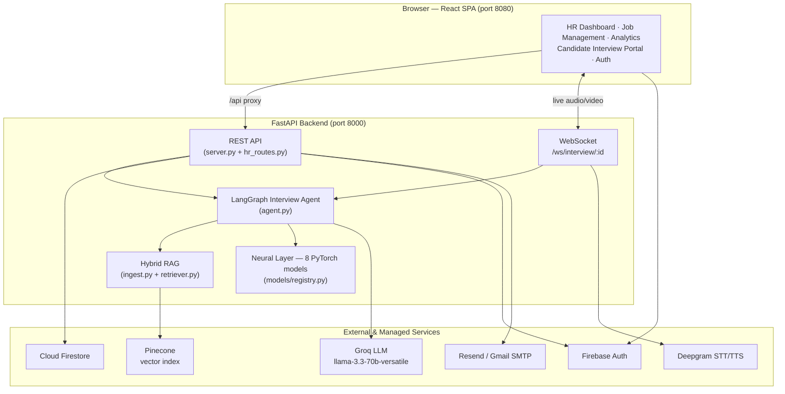

The frontend never talks to Groq, Pinecone, or the neural models directly; all AI work is
mediated by the backend, which is also the only place candidate scores are computed.

---

## 3.2 Three-Layer Architecture

Conceptually, the system decomposes into three layers with distinct responsibilities,
lifecycles, and audiences.

**Figure 3.2 — Three-Layer Architecture.**

```mermaid
flowchart LR
    subgraph L1["Enterprise Layer"]
        direction TB
        E1["Accounts & RBAC"]
        E2["Jobs & CV upload"]
        E3["Neural ranking"]
        E4["Invitations & analytics"]
    end

    subgraph L2["Interview-AI Layer"]
        direction TB
        I1["RAG grounding"]
        I2["LangGraph agent"]
        I3["Answer scoring & blend"]
        I4["Proctoring & report"]
    end

    subgraph L3["Training Layer"]
        direction TB
        T1["Data generation"]
        T2["Model training (8)"]
        T3["Held-out evaluation"]
        T4["Human-rating study"]
    end

    L1 -->|invites candidates into| L2
    L3 -->|produces checkpoints for| L2
    L3 -->|skill matcher & ranker for| L1
```

- The **Enterprise Layer** (`hr_routes.py`, frontend HR pages) is multi-tenant, authenticated,
  and persisted in Firestore. It owns the hiring funnel.
- The **Interview-AI Layer** (`server.py`, `agent.py`, `ingest.py`, `retriever.py`,
  `models/`) is stateful and real-time. It conducts interviews and scores answers.
- The **Training Layer** (`training/`) is offline. It generates data, trains the eight neural
  models, evaluates them on held-out test sets, and runs the human-rating validation study. Its
  outputs are the model checkpoints consumed by the other two layers.

---

## 3.3 Component Diagram

The following diagram shows the principal backend modules and their dependencies.

**Figure 3.3 — Component Diagram.**

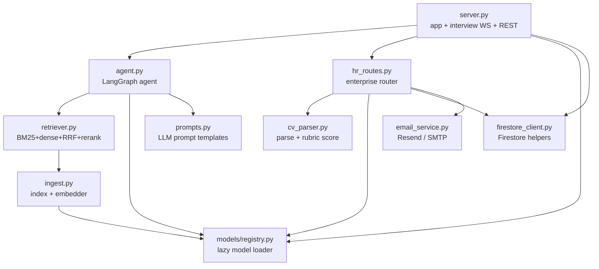

---

## 3.4 Enterprise Hiring Workflow

The enterprise workflow is the hiring funnel, from a company requesting access through to
reviewing completed interviews.

**Figure 3.4 — Enterprise Hiring Workflow (Sequence).**

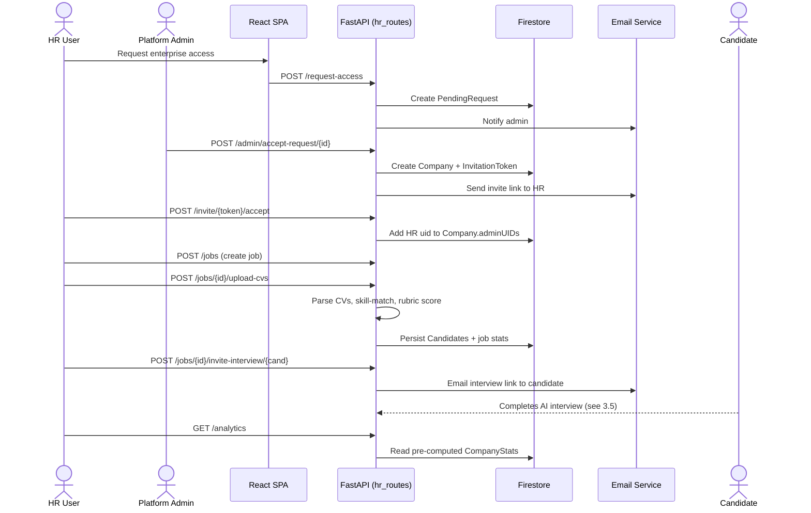

---

## 3.5 Candidate Interview Workflow

When a candidate opens their interview link, they enter a stateful, real-time session driven
by the LangGraph agent.

**Figure 3.5 — Candidate Interview Workflow (Sequence).**

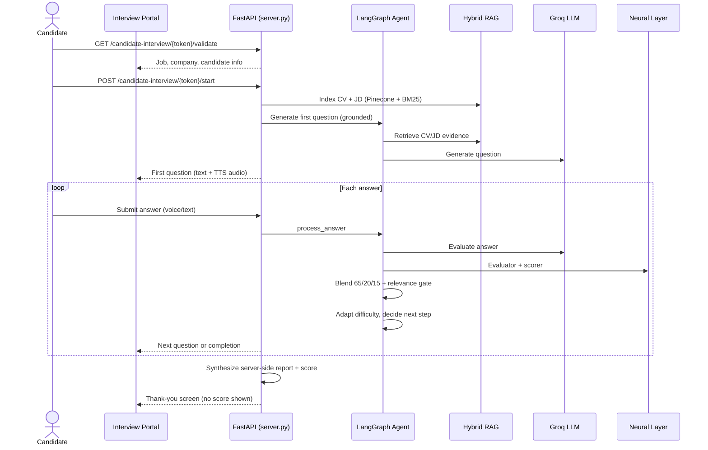

Two design properties are visible here. First, the question is **grounded** before the LLM is
ever called — the agent retrieves CV/JD evidence first. Second, the final score is
**synthesized on the server** from the accumulated evaluations; the candidate is shown only a
thank-you screen, never their score, and cannot influence the number that reaches the HR
dashboard.

---

## 3.6 Authentication & Authorization Design

Identity is delegated to **Firebase Authentication**. The browser authenticates the user and
receives a signed **ID token** (a JSON Web Token); every protected backend request carries this
token in an `Authorization: Bearer …` header, and the backend verifies it with the Firebase
Admin SDK before acting. This keeps password handling and token signing entirely within a
managed identity provider.

Authorization is **role-based**. Three roles exist and are resolved on the server:

- **Candidate** — self-registerable; may run practice interviews.
- **HR (enterprise)** — *not* self-assignable; granted only by accepting a company invitation,
  which adds the user's UID to that company's `adminUIDs` array.
- **Platform administrator** — a fixed allowlist (an `ADMIN_EMAIL` plus optional `ADMIN_UIDS`);
  may approve or reject enterprise access requests.

**Figure 3.6 — Authentication & Authorization Flow.**

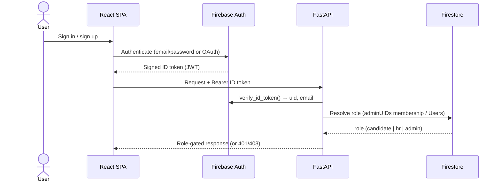

*Design rationale.* Making the HR role grantable only through an invitation — rather than a
self-service toggle — means a malicious user cannot escalate themselves into another company's
data. Tenant isolation is then enforced on every job-scoped route by checking that the job's
`companyId` matches the caller's company.

---

## 3.7 Database Design (Entity-Relationship Model)

MyHR persists all enterprise state in **Cloud Firestore**, a NoSQL document database. The
logical entities and their relationships are shown in Figure 3.7; the physical collection
layout and field-level detail appear in Section 4.6.

**Figure 3.7 — Database Entity-Relationship Diagram.**

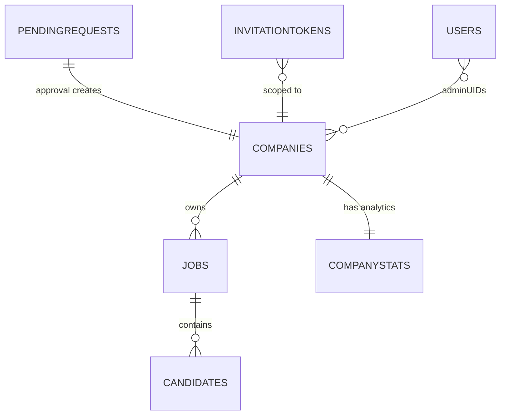

The field-level contents of each collection are listed in Table 4.2 (Section 4.6).

*Design rationale.* Candidates are stored as a **subcollection** under each job
(`Jobs/{jobId}/Candidates`) rather than in a top-level collection, so that listing a job's
candidates is a single scoped query and tenant isolation falls out of the document path. The
denormalized `stats` object on each job and the separate `CompanyStats` document trade a small
amount of write-time bookkeeping for fast, scan-free dashboard reads.

---

## 3.8 Deployment Design

In development the system runs as two processes — the Vite dev server (port 8080) proxying
`/api` to the FastAPI backend (port 8000). The project is also containerized (a `Dockerfile`
and `docker-compose.yml` are provided) so the backend and its dependencies can be brought up
reproducibly.

**Figure 3.8 — Deployment Diagram.**

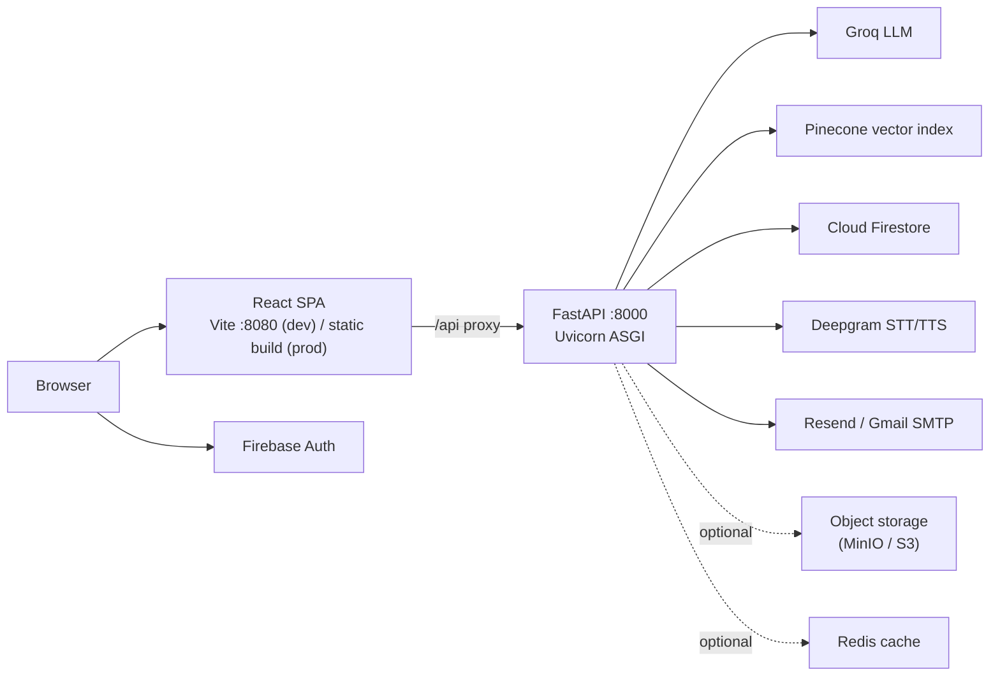

The frontend never contacts Groq, Pinecone, Deepgram, or the neural models directly; all AI
work is mediated by the backend, which is the single place candidate scores are computed.

The container configuration reflects two deliberate decisions. First, the backend image is
based on `python:3.12-slim` and installs only the system libraries the runtime actually needs
(`libglib2.0-0` for OpenCV, `libsndfile1` for audio, and `ffmpeg` for decoding); the heavy
TensorFlow/DeepFace stack is intentionally excluded in favour of the lighter MediaPipe/YuNet
proctor. Second, the multi-hundred-megabyte trained checkpoints are **not** baked into the
image — they are excluded through `.dockerignore` and mounted read-only at runtime, which keeps
the image small and lets models be updated without rebuilding. Secrets are supplied through an
env-file rather than image layers, and generated reports and audio are persisted to host
volumes. A single `docker compose up --build` brings up the backend (8000) and the frontend
(8080) together.

---

## 3.9 Interview Activity Diagram

Figure 3.9 shows the control flow of a single interview turn from the candidate's perspective,
including the proctoring and anti-cheating timing introduced in the portal.

**Figure 3.9 — Interview Turn (Activity Diagram).**

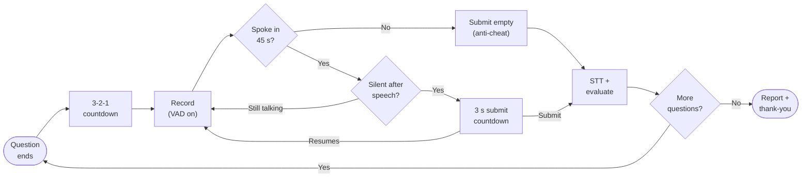

The next chapter details how each of these components is implemented.


<div style="page-break-after: always;"></div>

<div align="center" id="ch4">

# Chapter Four

# System Implementation

</div>

<br/>

**Chapter Outline**

- 4.1 Hybrid RAG Pipeline
- 4.2 LangGraph Interview Agent
- 4.3 AI/ML Model Layer
- 4.4 Enterprise Layer
- 4.5 Training Layer
- 4.6 Database Design
- 4.7 API Reference
- 4.8 Authentication & Authorization
- 4.9 Configuration
- 4.10 Proctoring, Speech & Anti-Cheating
- 4.11 Cross-Cutting Concerns

This chapter describes the detailed implementation of each component. In keeping with the
documentation standard, it explains the design, workflow, and engineering rationale of each
subsystem using diagrams and prose rather than source listings, with a short
results-and-discussion note where relevant.

---

## 4.1 Hybrid RAG Pipeline

**Modules:** `ingest.py` (indexing) and `retriever.py` (retrieval).

When an interview starts, the candidate's CV and the JD are turned into a private, searchable
index scoped to the interview session. Before indexing, every document passes through two
safety filters: **PII redaction** (Microsoft Presidio replaces names, phones, emails, and
similar entities with typed tokens, so raw personal data is never persisted in the vector
store) and a **prompt-injection sanitizer** (regular-expression patterns that strip attempts to
override the system's instructions). The cleaned text is split into overlapping chunks
(`chunk_size = 512`, `chunk_overlap = 50`), each CV chunk is prefixed with a small header
carrying the candidate name and role, and the chunks are written to two stores in parallel:
**Pinecone** (dense vectors, `all-mpnet-base-v2`, 768-D, namespaced by session) and a **local
BM25 store** (raw chunk text for sparse retrieval).

The retrieval stage, illustrated in Figure 4.1, runs the query against both stores
independently and retrieves the top twenty passages from each. The two ranked lists are merged
by **Reciprocal Rank Fusion**, which assigns each passage a score of `1 / (k + rank)` summed
across the lists (`k = 60`); because fusion depends only on a passage's rank in each list, it is
robust to the incomparable raw scores produced by sparse and dense retrieval. The fused
shortlist is then re-scored by the cross-encoder reranker, which reads the query and each
passage jointly to produce the final ordering passed to the agent.

**Figure 4.1 — Hybrid RAG Pipeline (indexing and retrieval).**

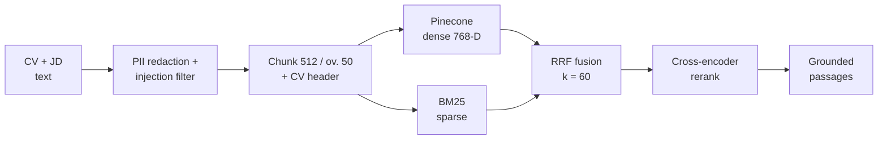

The hybrid design captures both exact-term matches (BM25, useful for specific technologies named
in a JD) and semantic matches (dense retrieval, useful for paraphrased experience). The embedder
is initialized lazily at startup so the ~400 MB model does not block application import, and the
same embedder is used at indexing and query time to avoid a train/inference representation
mismatch.

---

## 4.2 LangGraph Interview Agent

**Module:** `agent.py`. The interview is a LangGraph **state graph** compiled with a
checkpointer so each session's state survives between turns.

**Figure 4.2 — LangGraph Agent State Graph.**

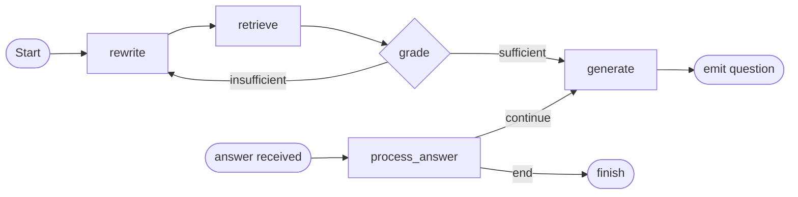

- **rewrite** — reformulates the current topic into an effective retrieval query.
- **retrieve** — runs the hybrid RAG pipeline (Section 4.1) to gather grounded evidence.
- **grade** — checks whether the retrieved context is good enough; a conditional edge
  (`check_grade`) loops back to re-query if not.
- **generate** — prompts the Groq LLM (`llama-3.3-70b-versatile`) to produce the next question
  from the grounded context.
- **process_answer** — evaluates the candidate's answer, updates running performance, adapts
  difficulty, and a conditional edge (`decide_next_step`) decides whether to ask another
  question or end.

### Answer scoring and the blend

When an answer is received, three independent quality signals are computed and combined, as
shown in Figure 4.3. The **LLM judge** produces an overall score on a 0–100 scale; the
**MultiHeadEvaluator** (MOD-4) scores the answer's relevance, clarity, and depth; and the
**CandidateScoringMLP** (MOD-1) produces a deep-learned score from the question and answer
embeddings. Before blending, a **relevance gate** scales the neural contribution by the cosine
similarity between the question and answer embeddings, so a fluent but off-topic answer cannot
earn a high neural score.

**Figure 4.3 — Answer Scoring and Blend.**

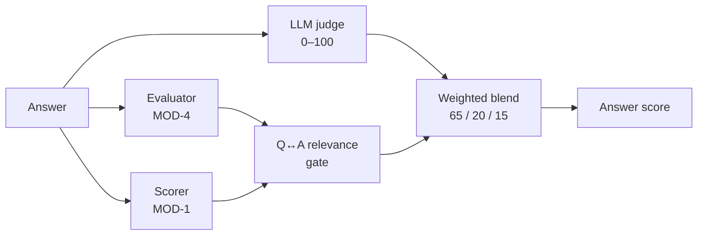

The blend weights are fixed in the code. When all three signals are available the score is
**65% LLM + 20% evaluator + 15% MOD-1** (`_BLEND_3WAY`); when MOD-1 is unavailable the system
degrades gracefully to **65% LLM + 35% evaluator** (`_BLEND_2WAY`). This keeps the LLM as the
primary judge while allowing the purpose-trained models to temper its opinion, and the relevance
gate guards against the most common failure mode, off-topic fluency. Proctoring observations are
aggregated per answer (Section 4.10) and an answer that is flagged suspicious incurs a score
penalty at this stage.

---

## 4.3 AI/ML Model Layer

**Modules:** `models/` with the lazy loader in `models/registry.py`. The registry checks each
checkpoint at startup (a health check), but loads each model into memory only on first use, and
guards against dimension and embedder mismatches.

**Table 4.1 — Neural Model Layer.**

| # | Model | File | Input | Output | Role |
|---|-------|------|-------|--------|------|
| MOD-1 | CandidateScoringMLP | `scoring_model.py` | Q+A embeddings (1536-D) | Score 0–100 | Deep answer scoring in the blend |
| MOD-4 | MultiHeadEvaluator | `multi_head_evaluator.py` | Answer embedding (768-D) | relevance, clarity, depth | Multi-dimensional answer evaluation |
| MOD-5 | NeuralCandidateRanker | `candidate_ranker.py` | 7-D candidate features | Ranking score | Order candidates within a job |
| MOD-6 | PerformancePredictor | `performance_predictor.py` | Interview features | Market-positioning estimate | Auxiliary report signal |
| — | SkillMatchSiamese | `skill_matcher.py` | CV skills, JD skills | Match similarity | CV↔JD skill matching for ranking |
| — | AdaptiveDifficulty | `difficulty_engine.py` | Performance state (3-D/6-D) | Difficulty action | RL-based question difficulty |
| — | EmotionModel | `emotion_model.py` | Face/tone features | Emotion estimate | Affective context for the report |
| — | CrossEncoderScorer | `cross_encoder_scorer.py` | (query, passage) | Relevance | RAG reranking |

Supporting modules include `proctor.py` (MediaPipe/YuNet face and iris-gaze detection),
`feature_extractor.py` (feature assembly), and `explainer.py` (score-explanation helpers).

On held-out test sets (Section 4.5), the MultiHeadEvaluator reaches
Spearman ≈ 0.95 on each of relevance, clarity, and depth, and the scoring MLP reaches
MAE ≈ 0.067 with Spearman ≈ 0.93 — i.e. both models order answers very close to the reference
labels. The candidate ranker is currently trained on synthetically generated comparative data
and is therefore treated as a *tiebreaker* alongside the rubric and interview scores rather than
an absolute measure (see Chapter 7).

---

## 4.4 Enterprise Layer

**Module:** `hr_routes.py` (the `hr_router`), with `cv_parser.py` for CV processing and
`firestore_client.py` for persistence.

The enterprise layer implements the hiring funnel. Key implementation details:

- **Batch CV upload** (`POST /jobs/{id}/upload-cvs`) parses each file, extracts contact details
  and skills, runs the neural **skill matcher** against the JD, computes a **rubric score**, and
  persists each candidate. Uploads are capped at **5 MiB** per file (`MAX_CV_BYTES`), and
  duplicate CVs are skipped by content hash and email.
- **Rubric scoring** (`cv_parser.compute_rubric_score`) scores a CV on four axes — technical
  stack, architecture, experience, and preferred/extra signals — assigns an experience tier
  (senior/mid/junior), and applies a **knock-out rule** (`framework_cap`): if a CV has zero
  skill overlap against a JD that lists at least five extractable skills, its score is capped at
  40, preventing irrelevant CVs from scoring highly.
- **Atomic job statistics** are updated within a Firestore transaction so concurrent uploads do
  not lose updates.
- **Pre-computed analytics.** `GET /analytics` reads a pre-computed `CompanyStats` document
  rather than scanning every candidate on each request; the document is refreshed in the
  background after CV uploads and interview completions, with an in-memory time-to-live cache as
  a fast path. This avoids an O(jobs × candidates) scan on every dashboard load.
- **Ownership checks.** Every job-scoped route verifies that the job belongs to the caller's
  company before returning data, enforcing tenant isolation.

For each uploaded file the upload handler verifies job ownership, rejects oversized files,
extracts the text, and skips duplicates by content hash and email. It then extracts the
candidate's skills, runs the neural skill matcher against the job's skills, computes the rubric
score, and persists the candidate document. After the batch completes, job statistics are
updated in a single atomic transaction and the company analytics document is refreshed in the
background, so neither concurrent uploads nor large batches block the response.

---

## 4.5 Training Layer

**Module:** `training/`. The training layer is offline and produces the checkpoints consumed by
the other layers.

**Figure 4.4 — Training Pipeline.**

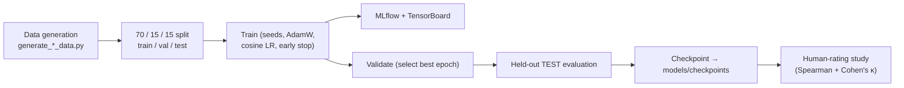

Each trainer (`train_evaluator.py`, `train_scorer.py`, `train_ranker.py`,
`train_skill_matcher.py`, `train_difficulty.py` / `train_difficulty_ppo.py`,
`train_emotion.py`, `train_predictor.py`, `train_cross_encoder.py`) shares the same hygiene:
fixed random seeds, an AdamW optimizer with cosine-annealing learning-rate schedule, early
stopping with best-state restoration, dual MLflow + TensorBoard logging, and rank-aware metrics
(Spearman, NDCG, F1). Models are trained on a **70/15/15** split and final numbers are reported
on the **held-out test fold**, not the validation fold used for early stopping.

To prevent a train/inference embedding mismatch, the evaluator's training answers are
re-encoded with the same `all-mpnet-base-v2` embedder used in production, and the checkpoint is
stamped with the embedder identity so the registry can reject a mismatched model.

**Representative held-out TEST metrics.**

| Model | Metric | Value |
|-------|--------|-------|
| MultiHeadEvaluator | Spearman (relevance) | ≈ 0.95 |
| MultiHeadEvaluator | Spearman (clarity) | ≈ 0.95 |
| MultiHeadEvaluator | Spearman (depth) | ≈ 0.95 |
| CandidateScoringMLP | MAE | ≈ 0.067 |
| CandidateScoringMLP | Spearman | ≈ 0.93 |

A **human-rating study** (`human_rating_study.py`) compares the system's scores against human
ratings on a stratified sample of answers, reporting Spearman's correlation (≈ 0.95) and
Cohen's κ (≈ 0.50). A **fairness audit** and a **RAG evaluation** harness are also provided.

The held-out methodology and the consistent embedder give the reported metrics credibility. As
noted in Chapter 7, the human study currently uses a single rater and should be extended to
several raters for inter-rater reliability.

---

## 4.6 Database Design

MyHR persists all enterprise state in **Cloud Firestore**, a NoSQL document database. The logical
entity model and relationships were presented in the design chapter (Figure 3.7); this section
documents the physical collection layout and the fields each collection carries, summarized in
Table 4.2.

**Table 4.2 — Firestore Collections.**

| Collection | Purpose | Key fields |
|------------|---------|-----------|
| `Companies` | Tenant record | `name`, `adminUIDs`, `domain`, `settings` |
| `Jobs` | Job postings | `companyId`, `title`, `description`, `extractedSkills`, `stats` |
| `Jobs/{id}/Candidates` | Candidates per job (subcollection) | `name`, `email`, `matchScore`, `interviewScore`, `totalScore`, `interviewStatus` |
| `Users` | Portal role registry | `uid`, `role` (`candidate`) |
| `PendingRequests` | Enterprise access requests | `companyName`, `contactEmail`, `status` |
| `InvitationTokens` | Access & interview tokens | `type`, `companyId`, `jobId`, `candidateId`, `expiresAt`, `usedAt` |
| `CompanyStats` | Pre-computed analytics | `stats`, `monthly_trends`, `updatedAt` |

The total candidate score combines the CV match and the interview at a fixed weighting —
**40% CV match + 60% interview** (`CV_SCORE_WEIGHT = 0.4`, `INTERVIEW_SCORE_WEIGHT = 0.6`).

---

## 4.7 API Reference

The backend exposes two routers: interview/system endpoints in `server.py`, and the enterprise
router in `hr_routes.py`.

**Table 4.3 — API Reference: Interview & System Endpoints (`server.py`).**

| Method | Path | Auth | Purpose |
|--------|------|------|---------|
| POST | `/start_interview` | Token/session | Start a (practice) interview session |
| POST | `/candidate-interview/{token}/start` | Public token | Start a token-based candidate interview |
| WS | `/ws/interview/{session_id}` | Session | Live audio/video interview channel |
| GET | `/end_interview/{session_id}` | Session | End an interview and finalize |
| POST | `/analyze_frame` | Session | Proctoring: analyze a single video frame |
| POST | `/submit_answer` | Session | Submit and evaluate an answer |
| GET | `/api/proctoring/{session_id}` | Session | Retrieve aggregated proctoring results |
| POST | `/candidates/rank` | Internal | Rank candidates with the neural ranker |
| GET | `/health` | Public | Liveness/health check |
| GET | `/metrics` | Public | In-process metrics |

**Table 4.4 — API Reference: Enterprise Endpoints (`hr_routes.py`).**

| Method | Path | Auth | Purpose |
|--------|------|------|---------|
| POST | `/request-access` | Public | Submit enterprise access request |
| GET | `/admin/pending-requests` | Admin | List pending requests |
| POST | `/admin/accept-request/{id}` | Admin | Approve request, create company + invite |
| POST | `/admin/reject-request/{id}` | Admin | Reject a request |
| GET | `/invite/{token}/validate` | Public token | Validate a company-access invite |
| POST | `/invite/{token}/accept` | Firebase | Link user to company (grants HR role) |
| POST | `/jobs` | HR | Create a job |
| GET | `/jobs` | HR | List company jobs |
| GET | `/jobs/{id}` | HR | Get a job |
| PATCH | `/jobs/{id}` | HR | Edit a job; close or reopen it |
| POST | `/jobs/{id}/upload-cvs` | HR | Batch upload + score CVs |
| GET | `/jobs/{id}/candidates` | HR | List candidates (paged/filtered) |
| GET | `/jobs/{id}/candidates/{cid}` | HR | Get a candidate (with report) |
| POST | `/jobs/{id}/candidates/{cid}/regenerate-report` | HR | Re-synthesize a candidate's interview report |
| DELETE | `/jobs/{id}/candidates/{cid}` | HR | Remove a candidate |
| POST | `/user/role` | Firebase | Self-register as candidate |
| GET | `/user/role/{uid}` | Public | Resolve a user's role |
| POST | `/jobs/{id}/invite-interview/{cid}` | HR | Email an interview invite |
| GET | `/candidate-interview/{token}/validate` | Public token | Validate interview token |
| POST | `/candidate-interview/{token}/complete` | Public token | Finalize interview (server-scored) |
| GET | `/analytics` | HR | Company hiring analytics |
| POST | `/jobs/{id}/rank-candidates` | HR | Neural ranking of candidates |

---

## 4.8 Authentication & Authorization

**Modules:** `firestore_client.py`, `hr_routes.py`, and `src/contexts/AuthContext.jsx` on the
frontend. Identity is provided by **Firebase Authentication**; the backend verifies the
Firebase **ID token** on protected routes.

Three roles exist:

- **Candidate** — self-registerable (`POST /user/role` accepts only `candidate`). Candidates can
  run practice interviews.
- **HR (enterprise)** — *not* self-assignable. The role is granted only by accepting a company
  invitation, which adds the user's UID to the company's `adminUIDs` array; the role resolver
  (`GET /user/role/{uid}`) reports `hr` precisely when the UID appears in some company's
  `adminUIDs`. An email already registered as a candidate cannot also become enterprise, and
  vice-versa — one email maps to one role.
- **Super-admin** — a fixed allowlist email with platform privileges (approving requests).

Public interview links use cryptographically strong tokens (`secrets.token_urlsafe`) with an
expiry and are validated server-side. The corporate-email gate restricts enterprise sign-up to
corporate domains, with a `BYPASS_EMAIL_CHECK` escape hatch for local testing. Because interview
scores are computed only from the server-side synthesized report, a candidate cannot submit or
influence their own score. The end-to-end token verification and role-resolution sequence was
presented in the design chapter (Figure 3.6).

---

## 4.9 Configuration

Configuration is supplied via environment variables (a local `.env` file in development).

**Table 4.5 — Environment Variables.**

| Variable | Purpose |
|----------|---------|
| `GROQ_API_KEY` | Groq LLM access (`llama-3.3-70b-versatile`) |
| `DEEPGRAM_API_KEY` | Speech-to-text / text-to-speech |
| `PINECONE_API_KEY` | Pinecone vector index |
| `OPENAI_API_KEY` | Optional LLM/embedding access |
| `FIREBASE_SERVICE_ACCOUNT_PATH` | Firebase Admin SDK credentials |
| `VITE_FIREBASE_*` | Frontend Firebase web config |
| `RESEND_API_KEY` | Resend email transport |
| `SMTP_USER`, `SMTP_PASS` | Gmail SMTP transport (App Password) |
| `MYHR_BASE_URL` | Frontend base URL for email links (e.g. `http://localhost:8080`) |
| `AWS_*`, `S3_BUCKET_NAME`, `MINIO_ENDPOINT` | Object storage (MinIO/S3) configuration |
| `REDIS_URL` | Redis connection (caching) |
| `DATABASE_URL` | Relational database URL (auxiliary) |
| `BYPASS_EMAIL_CHECK` | Dev escape hatch for the corporate-email gate |

The email service tries Gmail SMTP first (when `SMTP_USER`/`SMTP_PASS` are set), then falls
back to the Resend API, and logs a warning if neither is configured. The LLM embedder is loaded
lazily at startup so model loading does not block application import.

---

## 4.10 Proctoring, Speech & Anti-Cheating

**Modules:** `models/proctor.py` (computer-vision proctoring), the Deepgram integration in
`server.py` (speech), and the candidate portal hooks `src/hooks/useVAD.js` and
`src/pages/CandidateInterviewPortal.jsx` (anti-cheating).

### Computer-vision proctoring

Proctoring runs silently throughout the interview and never surfaces to the candidate. For each
captured video frame, the proctor estimates three things: **how many faces are present**,
**whether the candidate is looking away**, and **whether the eyes are closed / gaze is extreme**.
It uses a three-tier detection chain so it degrades gracefully on machines without the heavier
dependency:

1. **MediaPipe FaceMesh** (`refine_landmarks=True`) provides **478 facial landmarks**, including
   the iris contours (landmarks 468–477). From these the proctor computes an **Iris Position
   Ratio (IPR)** — the horizontal position of the iris centre between the eye corners — and an
   **Eye Aspect Ratio (EAR)** for closed-eye / extreme-downward-gaze detection. The final gaze
   score is a weighted combination of iris position (0.55) and head pose (0.45).
2. **YuNet** (`cv2.FaceDetectorYN`, an ONNX detector) provides fast, reliable **face counting**
   and a head-pose fallback when MediaPipe is unavailable.
3. **Haar cascade** is the final fallback.

The detection pipeline is summarized in Figure 4.5. Each usable frame is processed by MediaPipe
FaceMesh (or the YuNet fallback) to produce a gaze score and a face count, which are aggregated
across all of an answer's frames and tested against the violation thresholds.

**Figure 4.5 — Proctoring Detection Pipeline.**

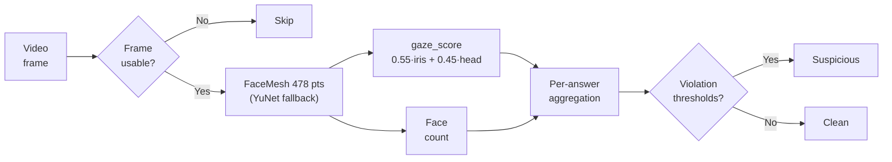

An answer is flagged *suspicious* when multiple faces appear, the face is absent for more than
20% of its frames, or the candidate looks away for more than 30% of its frames. As described in
Section 4.2, a suspicious answer incurs a score penalty (−5, or −8 when multiple faces are
detected) at blend time.

### Speech (STT / TTS)

The interview is voice-native. Each question is synthesized to speech with **Deepgram TTS** and
played to the candidate; each spoken answer is captured in the browser, sent to the backend, and
transcribed with **Deepgram STT** before being passed to the scoring pipeline. The transcript is
what the LLM judge and the neural evaluators actually score, so a candidate may answer by voice
or by typing with identical downstream handling.

### Anti-cheating in the candidate portal

Two browser-side problems are addressed in the portal. First, **silence is not the same as a
finished answer** — a candidate pausing to think must not have an incomplete answer submitted.
Second, **a candidate must not be able to skip a question by staying completely silent**. The
portal solves both with a small recording state machine built around browser **Voice Activity
Detection (VAD)** (Silero VAD via `@ricky0123/vad-web`):

- After a question's audio finishes, a mandatory **3-second "get ready" countdown** is shown
  before the microphone becomes active. This also makes it impossible to start answering before
  the question has fully played.
- The VAD's silence tolerance (`redemptionFrames`) is set so that a natural ~250 ms mid-sentence
  pause does **not** end the answer.
- When the candidate does fall silent after speaking, a **3-second submission countdown** appears
  with **"Keep Talking"** and **"Submit Now"** controls; speaking again cancels it. Only when the
  countdown reaches zero (or *Submit Now* is pressed) is the audio submitted.
- If the candidate never speaks at all, a **45-second no-speech timeout** auto-submits an empty
  answer, so silent non-participation cannot be used to dodge a question.

The complete control flow of these states — the pre-answer countdown, the recording and
submission-countdown transitions, and the no-speech timeout — is shown in the interview activity
diagram (Figure 3.9). Separating "the candidate is thinking" from "the candidate is done"
removed the most common usability complaint (premature submission), while the mandatory
pre-answer countdown and the no-speech timeout together close the two obvious ways to game a
hands-off interview. Because this logic lives in the portal's state, it applies identically to
the enterprise candidate portal and the practice interview room.

---

## 4.11 Cross-Cutting Concerns

Three concerns cut across the backend rather than belonging to any single feature: how requests
are authenticated, how the service is protected from abuse, and how its behaviour is observed.

**Dependency injection.** Authentication and tenancy are enforced through FastAPI's dependency
injection rather than being repeated inside each handler. Reusable dependencies — verifying the
Firebase ID token and resolving the caller's company (`get_current_company_id`) or requiring a
platform administrator (`require_admin`) — are declared once and attached to routes with
`Depends(...)`. Each protected enterprise route therefore receives an already-authorized
company identifier, and a route that omits the dependency simply has no access to tenant data.
Centralizing the checks in injected dependencies keeps authorization consistent and removes the
risk of a handler forgetting to verify ownership.

**Rate limiting.** The interview endpoints are protected by **SlowAPI**, a per-client rate
limiter keyed on the remote address. A shared `Limiter` is registered on the application and a
`RateLimitExceeded` handler returns a clean `429` response, preventing a single client from
exhausting the LLM, speech, and vector-search services that each request fans out to.

**Logging.** The backend configures Python's standard `logging` at start-up and obtains a
module-level logger in each module (`logging.getLogger(__name__)`). Model-registry health, RAG
indexing, the per-answer score blend, and proctoring penalties are logged at appropriate levels,
which makes a failed interview traceable without exposing any candidate-facing detail. As noted
in Chapter 7, this structured logging is the foundation for the production monitoring and tracing
that are not yet part of the current implementation.


<div style="page-break-after: always;"></div>

<div align="center" id="ch5">

# Chapter Five

# System Testing

</div>

<br/>

**Chapter Outline**

- 5.1 Testing Strategy
- 5.2 Installation
- 5.3 Running the System
- 5.4 Automated Test Suite
- 5.5 End-to-End Walkthrough

This chapter explains the testing strategy, how to install, configure, run, and test MyHR, and
walks through the end-to-end golden path with screenshots.

---

## 5.1 Testing Strategy

MyHR is tested at several levels, chosen to give the most confidence per unit of effort given a
system that mixes deterministic business logic with non-deterministic AI components.

| Level | What is tested | How |
|-------|----------------|-----|
| **Unit** | Pure logic: CV parsing, skill extraction, rubric scoring, the corporate-email gate, secure token generation, CV-text validation | `pytest` against the functions directly (`test_cv_parser.py`, `test_hr_helpers.py`) |
| **Integration** | Cross-module behaviour of the enterprise helpers | `pytest` (`test_integration.py`) with a fake model registry fixture |
| **API** | Endpoint contracts (status codes, auth gating, payload shape) | Manual and `pytest` against FastAPI's `/docs` and routes |
| **AI / model** | Model quality on held-out test folds (Spearman, NDCG, MAE) | Training-layer evaluators (`training/evaluate_*.py`) reported in Chapter 6 |
| **RAG** | Retrieval grounding quality | `training/evaluate_rag.py` |
| **Frontend** | React component behaviour | **Vitest** + React Testing Library |
| **Manual / UAT** | End-to-end golden path (Section 5.5) | Human walkthrough with screenshots |

A deliberate design choice is that the **non-deterministic AI is evaluated statistically** (on
test sets, by correlation metrics) rather than with brittle exact-output assertions, while the
**deterministic logic** (parsing, scoring rules, auth gates) is pinned with fast, exact unit
tests. The two heavy concerns — security gating and CV scoring — receive the most unit coverage
because they are both deterministic and high-risk. Performance, load, and full security
penetration testing are identified as future work (Chapter 7); they are **not applicable in the
current implementation** beyond the per-route rate limiting already provided by SlowAPI.

---

## 5.2 Installation

MyHR has a Python backend and a Node.js frontend. Both must be installed.

**Prerequisites**

- Python 3.11+ (the project is currently run on Python 3.14)
- Node.js 18+ and npm
- Accounts/keys for: Groq, Deepgram, Pinecone, Firebase, and an email transport (Resend or a
  Gmail App Password)

**Backend dependencies**

```bash
# from the project root
python -m venv .venv
. .venv/Scripts/activate      # Windows (Git Bash);  source .venv/bin/activate on Linux/macOS
pip install -r requirements.txt
```

**Frontend dependencies**

```bash
npm install
```

**Configuration.** Create a `.env` file in the project root with the variables listed in
**Table 4.5** (Section 4.9). At minimum, set `GROQ_API_KEY`, `DEEPGRAM_API_KEY`,
`PINECONE_API_KEY`, `FIREBASE_SERVICE_ACCOUNT_PATH`, the `VITE_FIREBASE_*` web config, an email
transport (`RESEND_API_KEY` or `SMTP_USER` + `SMTP_PASS`), and `MYHR_BASE_URL` pointing at the
frontend (e.g. `http://localhost:8080`).

---

## 5.3 Running the System

The backend and frontend run as two processes.

```bash
# Terminal 1 — backend (FastAPI on port 8000)
python server.py

# Terminal 2 — frontend (Vite dev server on port 8080)
npm run dev
```

On a healthy start, the backend logs a model-registry health check (all checkpoints present),
loads the skill matcher, initializes the LlamaIndex embedder, readies the proctor, loads the
emotion model, and reports *Application startup complete* with Uvicorn listening on
`http://0.0.0.0:8000`. The frontend serves the SPA at `http://localhost:8080`, and Vite proxies
all `/api` calls to the backend. The full process-and-service topology is given by the deployment
diagram in the design chapter (Figure 3.8).

For a production deployment, the frontend is built with `npm run build` (output in `dist/`) and
served as static assets, while the backend runs under a production ASGI server; object storage,
caching, and observability would be hardened as described in Chapter 7.

---

## 5.4 Automated Test Suite

The backend ships with a `pytest` suite under `tests/`.

```bash
python -m pytest tests/ -q
```

**Table 5.1 — Automated Test Summary.**

| Test file | Tests | Coverage focus |
|-----------|-------|----------------|
| `tests/test_cv_parser.py` | 38 | Email/phone/name/skill extraction, skill matching, rubric scoring (incl. the `framework_cap` knock-out rule) |
| `tests/test_hr_helpers.py` | 19 | Corporate-email gate, secure token generation, CV-text validation |
| `tests/test_integration.py` | 13 | Cross-module integration of enterprise helpers |
| **Total** | **70** | All passing |

`tests/conftest.py` provides shared fixtures (including a fake model registry) so the suite runs
without loading the heavy neural models. The pure-logic helpers (CV parsing, rubric scoring,
email validation, token generation) are tested directly, which keeps the suite fast and
deterministic.

The frontend uses **Vitest** (`npm run test`) with React Testing Library for component-level
tests.

---

## 5.5 End-to-End Walkthrough

The following golden path exercises the full system. Screenshot placeholders mark where to
insert captured images before submission.

**1. Request enterprise access.** A company submits the access form; a corporate email is
required (unless `BYPASS_EMAIL_CHECK` is set).

**[Add Screenshot: Enterprise "Request Access" form]**

**2. Admin approval.** The platform admin reviews pending requests and approves one, which
creates the company, generates an invitation token, and emails the HR contact a link.

**[Add Screenshot: Admin pending-requests review screen]**

**3. Accept invitation.** The HR user opens the emailed link, creates their account, is added to
the company's `adminUIDs`, and lands on the HR dashboard as an enterprise user.

**[Add Screenshot: HR accepting the company invitation]**

**4. Create a job and upload CVs.** The HR user posts a job (skills are auto-extracted from the
JD) and uploads candidate CVs in bulk; each CV is parsed, skill-matched, and rubric-scored.

**[Add Screenshot: Job management and bulk CV upload]**

**5. Review ranked candidates.** Candidates appear ranked by match score; the HR user can open
a candidate to see the match breakdown.

**[Add Screenshot: Ranked candidates list]**

**6. Invite a candidate to interview.** The HR user invites a candidate; an interview link is
emailed to the candidate.

**[Add Screenshot: Inviting a candidate to interview]**

**7. Candidate AI interview.** The candidate opens the link, grants camera/microphone access,
and completes an adaptive, grounded interview (voice or text). Proctoring runs silently; the
candidate never sees a score, only a thank-you screen on completion.

**[Add Screenshot: Candidate interview portal (camera + question)]**

**8. Hiring analytics.** Back on the dashboard, the HR user reviews aggregate analytics —
candidate counts, average match and interview scores, monthly trends, and recent activity —
served from the pre-computed `CompanyStats` document.

**[Add Screenshot: HR analytics dashboard]**

*Expected outcome.* After completion, the candidate's record shows an `interviewScore`, a
synthesized `interviewReport`, and a `totalScore` (40% CV match + 60% interview), and the
analytics document refreshes in the background. This confirms the full funnel — from access
request to scored interview — operates end-to-end.


<div style="page-break-after: always;"></div>

<div align="center" id="ch6">

# Chapter Six

# Results & Discussion

</div>

<br/>

**Chapter Outline**

- 6.1 Model Results (Held-Out Test Sets)
- 6.2 RAG & Grounding Results
- 6.3 System & Backend Performance
- 6.4 Enterprise Funnel Results
- 6.5 Strengths
- 6.6 Weaknesses
- 6.7 Lessons Learned

This chapter reports the measured outcomes of the project and discusses what they mean. Model
metrics are reported on **held-out test folds** (the fold used neither for training nor for
early-stopping), so they reflect generalization rather than memorization.

---

## 6.1 Model Results (Held-Out Test Sets)

The neural layer was trained with a consistent **70 / 15 / 15** train/validation/test split,
fixed random seeds, an AdamW optimizer with cosine-annealing learning rate, and early stopping
with best-state restoration. Final numbers are reported on the held-out test fold.

**Table 6.1 — Model Test-Set Metrics.**

| Model | Identifier | Primary metric | Value |
|-------|-----------|----------------|-------|
| MultiHeadEvaluator — relevance head | MOD-4 | Spearman's ρ | ≈ 0.95 |
| MultiHeadEvaluator — clarity head | MOD-4 | Spearman's ρ | ≈ 0.95 |
| MultiHeadEvaluator — depth head | MOD-4 | Spearman's ρ | ≈ 0.95 |
| CandidateScoringMLP | MOD-1 | Mean Absolute Error | ≈ 0.067 |
| CandidateScoringMLP | MOD-1 | Spearman's ρ | ≈ 0.93 |

The high Spearman correlations indicate that both models **order** answers very close to the
reference labels — which is the property that matters for ranking candidates, more than matching
an exact numeric value. The scoring MLP's low MAE (≈ 0.067 on a 0–1 scale) shows the absolute
predictions are also well-calibrated.

A **human-rating validation study** (`human_rating_study.py`) compared the system's blended
scores against human ratings on a stratified sample of answers, reporting a system-versus-human
**Spearman's ρ ≈ 0.95** and **Cohen's κ ≈ 0.50**. The strong rank correlation is encouraging;
the moderate κ reflects that exact-category agreement is harder than rank agreement, and is also
limited by the study currently using a single rater (see Chapter 7).

**Figure 6.1 — Score Distribution & Model Agreement.**

**[Add Figure: training-run plot — the evaluator's predicted-vs-reference scatter and the
blend's score-distribution histogram (export from the TensorBoard / MLflow run).]**

---

## 6.2 RAG & Grounding Results

The retrieval layer fuses BM25 (sparse) and dense (Pinecone, `all-mpnet-base-v2`) retrieval with
Reciprocal Rank Fusion (`k = 60`) and a cross-encoder reranker, evaluated with
`training/evaluate_rag.py`. Qualitatively, the most important result is the **grounding
guarantee**: because the agent retrieves CV/JD evidence *before* the LLM is prompted, generated
questions stay anchored to experience the candidate actually claimed, and the **question-to-answer
relevance gate** prevents a fluent but off-topic answer from earning the full neural score. The
gate uses the cosine similarity between the question and answer embeddings, scaled so that a
similarity of 0.5 or above counts as fully relevant — a ceiling chosen because interview answers
rarely exceed ~0.7 similarity even when excellent.

---

## 6.3 System & Backend Performance

The system meets its responsiveness objectives (NFR-5):

- **CV screening** turns a batch of uploaded CVs into a ranked shortlist in seconds. Parsing,
  skill extraction, neural skill matching, and rubric scoring run per file, and job statistics
  are updated in a single atomic Firestore transaction.
- **Analytics** are served from a pre-computed `CompanyStats` document with an in-memory
  time-to-live cache, avoiding an O(jobs × candidates) scan on every dashboard load.
- **Model loading** is lazy: the registry verifies checkpoints at startup but loads each model
  into memory only on first use, and the ~400 MB sentence-transformer embedder is initialized
  without blocking application import.
- **Graceful degradation** (NFR-6): a missing checkpoint, an unavailable MOD-1, or an absent
  MediaPipe wheel each fall back rather than crash — the scoring blend drops from 65/20/15 to
  65/35, and proctoring drops from iris tracking to head-pose.

Formal load and latency benchmarking of the interview WebSocket under concurrency was not
performed and is listed as future work (Chapter 7).

---

## 6.4 Enterprise Funnel Results

End-to-end, the platform delivers the complete hiring funnel described in the objectives: a
company can move from *requesting access* to a *ranked, interviewed shortlist* without a human
reading a single CV or conducting a single first-round interview. Each candidate's record ends
with three numbers — a CV `matchScore`, an `interviewScore`, and a combined `totalScore`
(**40% CV match + 60% interview**) — plus a synthesized `interviewReport`. Scores are computed
server-side only, so the funnel's output is defensible: a candidate cannot influence the number
that reaches the HR dashboard.

---

## 6.5 Strengths

- **Grounded by construction.** Every question is retrieved-then-generated, so the interviewer
  cannot interrogate experience the candidate never claimed.
- **Transparent, multi-signal scoring.** The 65/20/15 blend plus relevance gate is explainable
  and resists the most common gaming strategy (off-topic fluency).
- **Defensible and secure.** Server-side-only scoring, Firebase-verified ID tokens, invitation-only
  HR role, tenant isolation, PII redaction, and prompt-injection sanitization.
- **Rigorously trained models.** Held-out evaluation, consistent embedder, experiment tracking,
  and a human-rating study give the metrics credibility.
- **Clean architecture.** Three well-separated layers, 32 documented endpoints, 70 automated
  tests, and Docker packaging.
- **Robust candidate experience.** Voice-native interview with a usability-tuned, anti-cheat
  recording state machine.

## 6.6 Weaknesses

These are scoped for hardening rather than the graduation milestone, and are revisited in
Chapter 7:

- **Validation breadth.** Answer-quality labels and the primary judge both originate from an
  LLM, and the human study uses a single rater — strong agreement is shown, but broader,
  multi-rater validation would strengthen the claim.
- **Candidate-ranker data.** The neural candidate ranker is trained on synthetically generated
  comparative data, so it is used as a *tiebreaker* alongside the rubric and interview scores
  rather than an absolute measure (the code already treats it this way).
- **Storage & observability.** Media/reports use local disk and a MinIO/S3 configuration rather
  than a hardened cloud bucket, and observability is limited to a health endpoint, an in-process
  metrics endpoint, and structured logging.
- **No load testing.** Behaviour under concurrent interviews and large uploads has not been
  benchmarked.

**Table 6.2 — System Strengths and Weaknesses (Summary).**

| Aspect | Strength | Weakness / Limitation |
|--------|----------|----------------------|
| Grounding | Retrieve-then-generate; relevance gate | — |
| Scoring | Transparent 65/20/15 blend | LLM-origin labels; single-rater human study |
| Ranking | Neural + rubric + interview | Ranker on synthetic data (tiebreaker only) |
| Security | Server-side scoring, RBAC, PII redaction | Full pen-testing not performed |
| Storage | Works locally / MinIO | Not a hardened durable cloud bucket |
| Observability | Health + metrics + logs | No tracing/alerting/drift monitoring |
| Performance | Fast screening, cached analytics | No formal load/latency benchmarks |

## 6.7 Lessons Learned

- **Grounding beats raw model size.** The single highest-leverage design decision was forcing
  retrieval before generation; it did more for answer quality than any prompt tuning.
- **One embedder, everywhere.** Using the same `all-mpnet-base-v2` encoder at training and
  inference avoided a class of silent accuracy regressions; stamping checkpoints with the
  embedder identity made mismatches detectable.
- **Silence is ambiguous.** In a voice interview, "the candidate stopped talking" is not the
  same as "the candidate is finished," and conflating them produced the worst usability bug;
  separating the two states (with a cancellable submission countdown) fixed it.
- **Defensibility is an architecture property, not a feature.** Keeping all scoring server-side
  and all role grants invitation-based meant trust did not have to be retrofitted later.


<div style="page-break-after: always;"></div>

<div align="center" id="ch7">

# Chapter Seven

# Conclusion and Future Work

</div>

<br/>

**Chapter Outline**

- 7.1 Conclusion
- 7.2 Known Limitations
- 7.3 Future Work

---

## 7.1 Conclusion

MyHR set out to automate the two most repetitive stages of hiring — CV screening and
first-round interviewing — without sacrificing trustworthiness, and it achieves that goal as a
working, end-to-end system.

The project delivers three cooperating subsystems that function together: a **hybrid RAG layer**
that grounds every interview question in the candidate's own CV and the job description using
BM25, dense Pinecone retrieval, Reciprocal Rank Fusion, and cross-encoder reranking; a
**LangGraph LLM agent** that conducts an adaptive, voice-or-text interview and evaluates answers
through a transparent blend of an LLM judgment and purpose-trained neural models (65% LLM /
20% evaluator / 15% deep scorer, with a relevance gate); and a **neural layer of eight PyTorch
models** trained with professional hygiene — fixed seeds, early stopping, experiment tracking,
and reporting on held-out test sets — that reach Spearman correlations around 0.93–0.95 against
their reference labels.

Around this AI core, the system provides a complete **multi-tenant enterprise platform**:
Firebase-backed authentication, role-based access control that cleanly separates candidates from
HR users, batch CV upload with neural skill matching and rubric scoring, email-delivered
token-based interview invitations, server-side-only scoring that candidates cannot tamper with,
and a pre-computed analytics dashboard. The frontend is a polished React single-page
application, the backend a well-structured FastAPI service, and the whole is covered by an
automated test suite (70 passing backend tests) and this documentation.

In short, MyHR demonstrates that a grounded, neural-cross-checked AI interviewer can be embedded
in a real, secure, multi-tenant hiring product — and that the result is both demonstrable and
maintainable.

**Principal achievements**

- A grounded, adaptive AI interview engine with transparent, defensible scoring.
- Automated CV screening with neural skill matching and a rubric with a knock-out rule.
- A secure, multi-tenant enterprise portal with RBAC and token-based invitations.
- Eight neural models trained and evaluated on held-out test sets with experiment tracking.
- A clean separation of enterprise, interview-AI, and training layers, with automated tests.

---

## 7.2 Known Limitations

The system is demo-ready and architecturally healthy. A few areas are deliberately scoped for
future hardening rather than the graduation milestone:

- **Validation breadth.** Answer-quality labels and the primary judge both originate from an
  LLM, so the reported metrics demonstrate strong agreement with that judge; the human-rating
  validation study, while positive (Spearman ≈ 0.95), currently uses a single rater and would
  benefit from several raters for inter-rater reliability.
- **Candidate ranker data.** The neural candidate ranker is trained on synthetically generated
  comparative data, so its scores are best used as a *tiebreaker* alongside the rubric and
  interview scores rather than an absolute measure. The code already treats it this way.
- **Object storage.** Media and reports are stored against local disk and a MinIO/S3
  configuration rather than a hardened, durable cloud bucket.
- **Observability.** The backend exposes a health endpoint, an in-process metrics endpoint, and
  structured logging, but does not yet include full production monitoring, alerting, or
  distributed tracing.

None of these affects the demonstrated functionality; each is a natural next step toward a
production deployment.

---

## 7.3 Future Work

The following improvements would extend MyHR from a strong graduation system toward a
production-grade product:

- **Multi-rater validation.** Extend the human-rating study to several independent raters and
  report inter-rater reliability alongside the system-vs-human correlation.
- **Real comparative labels for ranking.** Retrain the candidate ranker on real hiring outcomes
  (e.g. which candidates were advanced or hired) to make its scores absolute rather than
  relative.
- **Durable object storage.** Replace the local-disk path with a hardened cloud object store
  for CVs, audio, and reports, with lifecycle and access policies.
- **Production observability.** Add metrics dashboards, alerting, request tracing, and model
  drift monitoring so quality regressions are caught automatically.
- **Model registry and versioning.** Promote the file-based checkpoints to a versioned model
  registry with rollback, so model updates are auditable and reversible.
- **Scaling and load testing.** Benchmark the interview WebSocket and batch upload paths under
  load, and introduce horizontal scaling and a continuous-delivery rollback strategy.
- **Richer analytics and fairness reporting.** Surface the existing fairness-audit harness in
  the dashboard and expand analytics with funnel and time-to-hire metrics.

Pursued in this order, these items would close the gap between the current, defensible
demonstration and a system ready for open enterprise use.


<div style="page-break-after: always;"></div>

<div align="center">

# Tools

</div>

**Table T.1 — Tools Used.**

| Category | Tool | Use in MyHR |
|----------|------|-------------|
| Language (backend) | Python 3.14 | Backend, AI engine, training |
| Language (frontend) | JavaScript (ES2022) | React SPA |
| Web framework | FastAPI + Uvicorn | REST + WebSocket API |
| Frontend build | Vite 5 | Dev server and production bundling |
| UI | React 18, Radix UI, Tailwind CSS | Component-based interface |
| Charts/UX | Recharts, Framer Motion | Analytics charts, animations |
| AI agent | LangGraph, LangChain | Interview state machine |
| LLM | Groq `llama-3.3-70b-versatile` | Question generation, answer judging |
| Vector DB | Pinecone (via LlamaIndex) | Dense retrieval |
| Sparse retrieval | `rank_bm25` | BM25 retrieval |
| Embeddings | `sentence-transformers` (`all-mpnet-base-v2`) | 768-D embeddings |
| Deep learning | PyTorch | Eight neural models |
| Speech | Deepgram SDK | STT / TTS |
| Computer vision | MediaPipe FaceMesh + OpenCV (YuNet) | Silent iris-gaze proctoring |
| Privacy | Microsoft Presidio | PII redaction |
| Auth | Firebase Authentication | Identity, ID tokens |
| Database | Google Cloud Firestore | Persistence |
| Email | Resend API / Gmail SMTP | Invitations, notifications |
| Experiment tracking | MLflow, TensorBoard | Training metrics |
| Rate limiting | SlowAPI | Per-route throttling |
| Testing | pytest, Vitest, React Testing Library | Automated tests |
| Version control | Git / GitHub | Source management |
| IDE | Visual Studio Code | Development |

**Hardware.** Development and training used a CUDA-capable GPU workstation (the backend logs
`device_name: cuda` when loading sentence-transformer models); the system also runs on CPU.

---

<div align="center">

# References

</div>

The following sources are ordered with books and papers first (by date), followed by the
official documentation of the technologies used (with last-retrieved dates).

1. A. Vaswani, N. Shazeer, N. Parmar, et al., "Attention Is All You Need," *Advances in Neural
   Information Processing Systems (NeurIPS)*, 2017.
2. S. Robertson and H. Zaragoza, "The Probabilistic Relevance Framework: BM25 and Beyond,"
   *Foundations and Trends in Information Retrieval*, 2009.
3. N. Reimers and I. Gurevych, "Sentence-BERT: Sentence Embeddings using Siamese
   BERT-Networks," *EMNLP*, 2019.
4. G. V. Cormack, C. L. A. Clarke, and S. Büttcher, "Reciprocal Rank Fusion Outperforms Condorcet
   and Individual Rank Learning Methods," *SIGIR*, 2009.
5. P. Lewis, E. Perez, A. Piktus, et al., "Retrieval-Augmented Generation for Knowledge-Intensive
   NLP Tasks," *NeurIPS*, 2020.
6. J. Schulman, F. Wolski, P. Dhariwal, A. Radford, and O. Klimov, "Proximal Policy Optimization
   Algorithms," *arXiv:1707.06347*, 2017.
7. K. Song, X. Tan, T. Qin, J. Lu, and T.-Y. Liu, "MPNet: Masked and Permuted Pre-training for
   Language Understanding," *NeurIPS*, 2020.
8. LangGraph Documentation, https://langchain-ai.github.io/langgraph/ , last retrieved
   27/06/2026.
9. FastAPI Documentation, https://fastapi.tiangolo.com/ , last retrieved 27/06/2026.
10. React Documentation, https://react.dev/ , last retrieved 27/06/2026.
11. PyTorch Documentation, https://pytorch.org/docs/stable/index.html , last retrieved 27/06/2026.
12. Pinecone Documentation, https://docs.pinecone.io/ , last retrieved 27/06/2026.
13. Groq Documentation, https://console.groq.com/docs , last retrieved 27/06/2026.
14. Firebase Authentication & Cloud Firestore Documentation, https://firebase.google.com/docs ,
    last retrieved 27/06/2026.
15. Deepgram Speech-to-Text & Text-to-Speech Documentation, https://developers.deepgram.com/ ,
    last retrieved 27/06/2026.
16. MediaPipe Face Mesh Documentation, https://developers.google.com/mediapipe , last retrieved
    27/06/2026.
17. Microsoft Presidio Documentation, https://microsoft.github.io/presidio/ , last retrieved
    27/06/2026.

---

<div align="center">

# Appendices

</div>

## Appendix A — Environment Variable Template

```ini
# LLM & AI services
GROQ_API_KEY=
DEEPGRAM_API_KEY=
PINECONE_API_KEY=
OPENAI_API_KEY=

# Firebase (Admin SDK + web config)
FIREBASE_SERVICE_ACCOUNT_PATH=
VITE_FIREBASE_API_KEY=
VITE_FIREBASE_AUTH_DOMAIN=
VITE_FIREBASE_PROJECT_ID=
VITE_FIREBASE_STORAGE_BUCKET=
VITE_FIREBASE_MESSAGING_SENDER_ID=
VITE_FIREBASE_APP_ID=

# Email transport (use one)
RESEND_API_KEY=
SMTP_USER=
SMTP_PASS=

# URLs & infrastructure
MYHR_BASE_URL=http://localhost:8080
AWS_ACCESS_KEY_ID=
AWS_SECRET_ACCESS_KEY=
AWS_REGION=
S3_BUCKET_NAME=
MINIO_ENDPOINT=
REDIS_URL=
DATABASE_URL=

# Dev escape hatch (omit in production)
BYPASS_EMAIL_CHECK=
```

## Appendix B — Endpoint Index

See **Tables 4.3 and 4.4** for the complete REST/WebSocket surface (10 interview/system
endpoints in `server.py`, 22 enterprise endpoints in `hr_routes.py`).

## Appendix C — Repository Structure (selected)

```
MyHR/
├── server.py              FastAPI app, interview WebSocket, system endpoints
├── hr_routes.py           Enterprise router (jobs, CVs, invites, analytics)
├── agent.py               LangGraph interview agent + scoring blend
├── ingest.py              RAG indexing + lazy embedder
├── retriever.py           BM25 + dense + RRF + cross-encoder rerank
├── cv_parser.py           CV parsing, skill extraction, rubric scoring
├── email_service.py       Resend / Gmail SMTP transport + templates
├── firestore_client.py    Firestore helpers + role sync
├── prompts.py             LLM prompt templates
├── models/                8 neural models + registry + proctor
│   ├── registry.py
│   ├── multi_head_evaluator.py, scoring_model.py, candidate_ranker.py
│   ├── skill_matcher.py, difficulty_engine.py, emotion_model.py
│   ├── performance_predictor.py, cross_encoder_scorer.py, proctor.py
│   └── checkpoints/       Trained model weights
├── training/              Data generation, trainers, evaluation, human study
├── tests/                 pytest suite (70 tests)
├── src/                   React SPA (pages, components, contexts, hooks, lib)
└── docs/                  This documentation set
```

> **Note on auxiliary modules.** The repository also contains supporting modules not central to
> the core flow described above — for example `tone.py`, `services.py`, `s3_utils.py`,
> `feature_extractor.py`, `explainer.py`, and the `recommender/` package — as well as utility
> and demo scripts (`run_training.py`, `check_phase1.py`, `demo_phase1.py`,
> `cleanup_pinecone.py`). These are part of the codebase but are outside the primary
> request-lifecycle documented in Chapter 4.


<div style="page-break-after: always;"></div>

