<!--
  MyHR — Master Documentation (assembled)
  Generated from docs/*.md. Edit the per-chapter files in docs/ and re-assemble.
-->

<!--
  FRONT MATTER — MyHR Graduation Documentation
  Fill the bracketed [ ] fields before submission (team members, supervisors, logos).
  Convert to PDF/Word with Times New Roman per the faculty template at export time.
-->

<div align="center">

# Ain Shams University
### Faculty of Computer & Information Sciences
#### Computer Science Department

<br/>

# MyHR — An Adaptive AI-Powered Hiring & Interview Platform

<br/>

*[Cover background image suitable for the project]*

<br/><br/>

**June 2026**

<br/>

*[Sponsor logo if exists]*  &nbsp;&nbsp;&nbsp;&nbsp; *[ITIDA logo if exists]*

</div>

---

<div align="center">

# Ain Shams University
### Faculty of Computer & Information Sciences
#### Computer Science Department

<br/>

# MyHR — An Adaptive AI-Powered Hiring & Interview Platform

This documentation is submitted in partial fulfillment of the requirements for the
**Bachelor's degree in Computer and Information Sciences**

<br/>

**By**

| Name | Department |
|------|------------|
| [Team Member 1] | [Department] |
| [Team Member 2] | [Department] |
| [Team Member 3] | [Department] |
| [Team Member 4] | [Department] |

<br/>

**Under Supervision of**

**[Supervisor 1]**
[Supervisor Title], [Department] Department,
Faculty of Computer and Information Sciences, Ain Shams University.

**[Supervisor 2]**
[Supervisor Title], [Department] Department,
Faculty of Computer and Information Sciences, Ain Shams University.

<br/>

**June 2026**

</div>

---

## Revision History

| Version | Date | Author | Description |
|---------|------|--------|-------------|
| 0.1 | 2026-06 | Project Team | Initial draft of all chapters |
| 1.0 | 2026-06 | Project Team | First complete release for review |

---

## Acknowledgements

All praise and thanks to ALLAH, who provided us the ability to complete this work.

We are grateful to our families, whose continuous support and encouragement carried us
through every year of study.

We offer our sincerest gratitude to our supervisors, **[Supervisor 1]** and
**[Supervisor 2]**, who guided this project with their patience, knowledge, and experience,
and whose feedback shaped both the engineering and the scientific rigor of MyHR.

Finally, we thank our friends and everyone who supported us throughout the development of
this project.

---

## Abstract

Recruitment at scale is bottlenecked by two manual, time-consuming, and inconsistency-prone
tasks: screening large volumes of résumés (CVs) against a job description (JD), and
conducting first-round interviews. **MyHR** is an adaptive, AI-powered hiring platform that
automates both. It pairs an **enterprise hiring portal** — where companies post jobs, upload
CVs in batches, and obtain neural rankings of candidates — with an **AI interview engine**
that conducts a grounded, adaptive, voice-or-text interview and produces a defensible,
server-computed score for every candidate.

The platform is built on three cooperating subsystems. A **Large Language Model (LLM) agent**,
orchestrated as a state machine with LangGraph and powered by Groq's `llama-3.3-70b-versatile`,
generates interview questions and evaluates answers. A **hybrid Retrieval-Augmented Generation
(RAG) layer** grounds every question in the candidate's own CV and the JD using sparse
retrieval (BM25), dense retrieval (Pinecone with `all-mpnet-base-v2` embeddings), Reciprocal
Rank Fusion, and a cross-encoder reranker. A **custom neural layer** of eight PyTorch models
contributes CV–JD skill matching, multi-dimensional answer evaluation, candidate ranking,
adaptive question difficulty (reinforcement learning), emotion analysis, and performance
prediction. Final answer scores are produced by a transparent blend that weights the LLM
judgment at 65%, the neural evaluator at 20%, and the deep scoring model at 15%, with a
relevance gate that suppresses the neural contribution on off-topic answers.

The system is delivered as a **React** single-page application and a **FastAPI** backend, with
**Firebase Authentication**, **Cloud Firestore** persistence, role-based access control
separating candidates from enterprise HR users, and token-based public interview links. This
document describes the problem, the relevant background, the proposed system architecture, the
detailed implementation of each component, the testing strategy, and the project's conclusions
and future work.

**Keywords:** AI interview, retrieval-augmented generation, LLM agent, candidate ranking,
neural scoring, FastAPI, React, Firestore, adaptive difficulty.

---

## Table of Contents

| Section | Page |
|---------|------|
| Acknowledgements | i |
| Abstract | ii |
| List of Figures | iii |
| List of Tables | iv |
| List of Abbreviations | v |
| **Chapter 1: Introduction** | 1 |
| &nbsp;&nbsp;1.1 Problem Definition | 1 |
| &nbsp;&nbsp;&nbsp;&nbsp;1.1.1 History | 1 |
| &nbsp;&nbsp;&nbsp;&nbsp;1.1.2 Applications | 2 |
| &nbsp;&nbsp;1.2 Motivation | 3 |
| &nbsp;&nbsp;1.3 Objectives | 3 |
| &nbsp;&nbsp;1.4 Scope | 4 |
| &nbsp;&nbsp;1.5 Time Plan | 4 |
| &nbsp;&nbsp;1.6 Documentation Outline | 5 |
| **Chapter 2: Background** | 6 |
| &nbsp;&nbsp;2.1 Retrieval-Augmented Generation | 6 |
| &nbsp;&nbsp;2.2 LLM Agent Orchestration | 7 |
| &nbsp;&nbsp;2.3 Transformer Embeddings & Reranking | 8 |
| &nbsp;&nbsp;2.4 Neural Answer Scoring | 8 |
| &nbsp;&nbsp;2.5 Reinforcement Learning for Adaptive Difficulty | 9 |
| &nbsp;&nbsp;2.6 Emotion Recognition & Proctoring | 9 |
| &nbsp;&nbsp;2.7 Platform Technologies | 10 |
| **Chapter 3: Proposed System** | 11 |
| &nbsp;&nbsp;3.1 System Architecture | 11 |
| &nbsp;&nbsp;3.2 Three-Layer Architecture | 12 |
| &nbsp;&nbsp;3.3 Component Diagram | 13 |
| &nbsp;&nbsp;3.4 Enterprise Hiring Workflow | 14 |
| &nbsp;&nbsp;3.5 Candidate Interview Workflow | 15 |
| **Chapter 4: System Implementation** | 16 |
| &nbsp;&nbsp;4.1 Hybrid RAG Pipeline | 16 |
| &nbsp;&nbsp;4.2 LangGraph Interview Agent | 18 |
| &nbsp;&nbsp;4.3 AI/ML Model Layer | 20 |
| &nbsp;&nbsp;4.4 Enterprise Layer | 23 |
| &nbsp;&nbsp;4.5 Training Layer | 25 |
| &nbsp;&nbsp;4.6 Database Design | 27 |
| &nbsp;&nbsp;4.7 API Reference | 29 |
| &nbsp;&nbsp;4.8 Authentication & Authorization | 31 |
| &nbsp;&nbsp;4.9 Configuration | 33 |
| **Chapter 5: System Testing** | 34 |
| &nbsp;&nbsp;5.1 Installation | 34 |
| &nbsp;&nbsp;5.2 Running the System | 35 |
| &nbsp;&nbsp;5.3 Automated Test Suite | 36 |
| &nbsp;&nbsp;5.4 End-to-End Walkthrough | 37 |
| **Chapter 6: Conclusion and Future Work** | 40 |
| &nbsp;&nbsp;6.1 Conclusion | 40 |
| &nbsp;&nbsp;6.2 Known Limitations | 40 |
| &nbsp;&nbsp;6.3 Future Work | 41 |
| Tools | 42 |
| References | 43 |
| Glossary & Abbreviations | 44 |
| Appendices | 45 |

> Page numbers are indicative and should be regenerated after exporting to PDF/Word.

---

## List of Figures

| Figure | Title | Page |
|--------|-------|------|
| Figure 1.1 | Project Time Plan (Gantt) | 4 |
| Figure 3.1 | System Architecture | 11 |
| Figure 3.2 | Three-Layer Architecture | 12 |
| Figure 3.3 | Component Diagram | 13 |
| Figure 3.4 | Enterprise Hiring Workflow (Sequence) | 14 |
| Figure 3.5 | Candidate Interview Workflow (Sequence) | 15 |
| Figure 4.1 | Hybrid RAG Pipeline | 16 |
| Figure 4.2 | LangGraph Agent State Graph | 18 |
| Figure 4.3 | Answer Scoring & Blend Flow | 19 |
| Figure 4.4 | Training Pipeline | 25 |
| Figure 4.5 | Database Relationships | 27 |
| Figure 4.6 | Authentication & RBAC Flow | 31 |
| Figure 5.1 | Deployment Architecture | 35 |

---

## List of Tables

| Table | Title | Page |
|-------|-------|------|
| Table 2.1 | Platform Technology Stack | 10 |
| Table 4.1 | Neural Model Layer (8 models) | 20 |
| Table 4.2 | Firestore Collections | 27 |
| Table 4.3 | API Reference — Interview Endpoints | 29 |
| Table 4.4 | API Reference — Enterprise Endpoints | 30 |
| Table 4.5 | Environment Variables | 33 |
| Table 5.1 | Automated Test Summary | 36 |
| Table T.1 | Tools Used | 42 |

---

## List of Abbreviations

| Abbreviation | Meaning |
|--------------|---------|
| API | Application Programming Interface |
| BM25 | Best Matching 25 (sparse ranking function) |
| CV | Curriculum Vitae (résumé) |
| HR | Human Resources |
| JD | Job Description |
| LLM | Large Language Model |
| MLP | Multi-Layer Perceptron |
| NDCG | Normalized Discounted Cumulative Gain |
| PII | Personally Identifiable Information |
| PPO | Proximal Policy Optimization |
| RAG | Retrieval-Augmented Generation |
| RBAC | Role-Based Access Control |
| RL | Reinforcement Learning |
| RRF | Reciprocal Rank Fusion |
| SPA | Single-Page Application |
| STT | Speech-to-Text |
| TTS | Text-to-Speech |
| WS | WebSocket |


---

<div align="center">

# Chapter One

# Introduction

</div>

<br/>

**Chapter Outline**

- 1.1 Problem Definition
  - 1.1.1 History
  - 1.1.2 Applications
- 1.2 Motivation
- 1.3 Objectives
- 1.4 Scope
- 1.5 Time Plan
- 1.6 Documentation Outline

---

## 1.1 Problem Definition

Hiring is one of the most resource-intensive processes a company undertakes, and two of its
earliest stages are also its most repetitive:

- **Résumé screening.** For a single open role, recruiters may receive hundreds of CVs. Each
  must be read, compared against the job description, and judged for fit. The process is slow,
  subjective, and inconsistent between reviewers and across time of day.
- **First-round interviewing.** Even after shortlisting, conducting an initial screening
  interview for every promising candidate consumes scarce interviewer time. Scheduling alone
  introduces days of delay, and the quality of questions varies with the interviewer's
  preparation and fatigue.

These two stages share a common weakness: they depend on a human reading the same kinds of
documents and asking the same kinds of questions, over and over, with no guarantee of
consistency. The result is a hiring funnel that is **slow, expensive, hard to audit, and
vulnerable to unconscious bias**.

MyHR addresses this problem directly. It provides:

1. An **enterprise portal** that ingests CVs in bulk, parses them, matches them against the
   job's required skills, and ranks candidates with neural models — turning hundreds of
   documents into an ordered shortlist in seconds.
2. An **AI interview engine** that conducts an adaptive, grounded interview with each invited
   candidate and returns a single, defensible score and a structured report, without occupying
   any human interviewer's time.

In short, the problem statement is: *manual CV screening and first-round interviewing are
slow, inconsistent, and costly; they can be made faster and more consistent by grounding an
LLM-driven interviewer in the candidate's own documents and by scoring candidates with
purpose-trained neural models.*

### 1.1.1 History

The two enabling technologies behind MyHR matured only recently:

- **Applicant Tracking Systems (ATS)** have existed for decades, but classical ATS rely on
  keyword matching. They reward candidates who echo the job description's wording rather than
  candidates who actually possess the underlying skills, and they cannot conduct an interview.
- **Large Language Models (LLMs)** became capable of fluent, context-aware question generation
  and answer evaluation only after the transformer architecture and instruction-tuned chat
  models. However, an LLM used naively will *hallucinate* — it may ask about experience the
  candidate never claimed, or score an answer it never actually grounded in the role.
- **Retrieval-Augmented Generation (RAG)** emerged as the standard technique to keep an LLM
  grounded in trustworthy source documents. By retrieving the most relevant passages of a CV
  and JD and feeding them to the model, RAG constrains the interview to facts that actually
  exist in the candidate's profile.

MyHR combines these threads: it replaces keyword ATS matching with neural skill matching, and
it replaces an ungrounded LLM with a RAG-grounded interview agent whose scores are
cross-checked by dedicated neural evaluators.

### 1.1.2 Applications

The platform serves two distinct audiences from one codebase:

- **Enterprise hiring (primary).** A company requests access, is approved by a platform
  administrator, posts jobs, uploads candidate CVs, receives a neural ranking, invites the top
  candidates to an AI interview by email, and reviews completed interviews and aggregate
  analytics on a dashboard.
- **Candidate self-practice (secondary).** An individual candidate can sign up and run mock AI
  interviews against their own CV to prepare for real interviews, tracking their readiness over
  time.

Both audiences are gated by **role-based access control**: an account is either a *candidate*
or an enterprise *HR* user, and the two roles are mutually exclusive for a given email.

---

## 1.2 Motivation

The motivation for MyHR is to demonstrate that a **single, coherent system can automate the
top of the hiring funnel without sacrificing trustworthiness**. Three concerns drove the
design:

- **Grounding over fluency.** An interviewer that sounds fluent but invents facts is worse than
  useless. MyHR's central engineering bet is that every question and every score must be
  grounded in retrieved evidence from the candidate's own CV and the JD.
- **Defensibility over convenience.** A candidate's score must be computed on the server from
  evidence the candidate cannot tamper with, and it must be explainable as a transparent blend
  of an LLM judgment and purpose-trained neural models rather than a single opaque number.
- **Separation of concerns.** The enterprise workflow (multi-tenant, authenticated, persisted)
  and the AI interview workflow (stateful, real-time, model-heavy) are genuinely different
  problems, and the architecture keeps them in separate, well-defined layers.

---

## 1.3 Objectives

The project's objectives are to:

1. **Build an adaptive AI interviewer** that generates role-specific questions grounded in the
   candidate's CV and the JD, accepts spoken or typed answers, and adapts question difficulty
   to the candidate's running performance.
2. **Produce a defensible candidate score** by blending an LLM judgment with purpose-trained
   neural evaluators, computed entirely server-side.
3. **Automate CV screening** by parsing uploaded CVs, extracting skills, matching them against
   the JD with a neural skill matcher, and ranking candidates.
4. **Deliver a multi-tenant enterprise portal** with authentication, role-based access control,
   job management, batch CV upload, email invitations, and hiring analytics.
5. **Train and evaluate the neural layer rigorously**, using held-out test sets, standard
   ranking metrics, experiment tracking, and a human-rating validation study.
6. **Ship a maintainable, documented system** with automated tests and a clean separation
   between the frontend, the API, the AI engine, and the training pipeline.

---

## 1.4 Scope

**In scope.** Enterprise account onboarding and approval; job posting; batch CV parsing,
skill extraction, and rubric scoring; neural candidate ranking; email-delivered, token-based
interview invitations; an adaptive, RAG-grounded, voice/text AI interview with silent
proctoring; server-side answer scoring and report synthesis; hiring analytics; candidate
self-practice; the full neural training and evaluation pipeline.

**Out of scope / partial.** Production-grade object storage is stubbed against local disk and a
MinIO/S3 configuration rather than a hardened cloud bucket; observability is limited to a
health endpoint, an in-process metrics endpoint, and structured logging; the candidate ranker
is trained on synthetically generated comparative data pending real labeled outcomes; the
human-rating validation study was conducted with a single rater. These items are documented in
**Chapter 6 (Known Limitations and Future Work)**.

---

## 1.5 Time Plan

**Figure 1.1 — Project Time Plan.** The project was executed in five overlapping phases:
foundations and research, core AI engine, enterprise layer, training and evaluation, and
hardening and documentation.

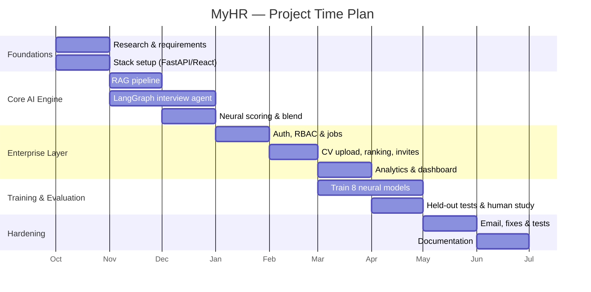

---

## 1.6 Documentation Outline

The remainder of this document is organized as follows:

- **Chapter 2 (Background)** reviews the techniques and technologies the system relies on:
  retrieval-augmented generation, LLM agent orchestration, transformer embeddings and
  reranking, neural answer scoring, reinforcement learning for adaptive difficulty, emotion
  recognition and proctoring, and the platform stack.
- **Chapter 3 (Proposed System)** presents the high-level architecture, the three-layer
  decomposition, the component diagram, and the two principal end-to-end workflows.
- **Chapter 4 (System Implementation)** describes each component in detail — the RAG pipeline,
  the interview agent, the eight neural models, the enterprise layer, the training layer, the
  database design, the API surface, authentication and authorization, and configuration —
  using diagrams and pseudocode rather than source listings.
- **Chapter 5 (System Testing)** explains how to install, configure, and run the system,
  summarizes the automated test suite, and walks through the end-to-end golden path with
  screenshots.
- **Chapter 6 (Conclusion and Future Work)** summarizes the achievements, states the known
  limitations honestly, and proposes future improvements.

The document closes with the tools used, references, a glossary, and appendices.


---

<div align="center">

# Chapter Two

# Background

</div>

<br/>

**Chapter Outline**

- 2.1 Retrieval-Augmented Generation
- 2.2 LLM Agent Orchestration
- 2.3 Transformer Embeddings & Reranking
- 2.4 Neural Answer Scoring
- 2.5 Reinforcement Learning for Adaptive Difficulty
- 2.6 Emotion Recognition & Proctoring
- 2.7 Platform Technologies

This chapter introduces the concepts, algorithms, and technologies that MyHR is built upon. It
is intended to give the reader the background necessary to follow the system design in
Chapter 3 and the implementation in Chapter 4.

---

## 2.1 Retrieval-Augmented Generation

A **Large Language Model (LLM)** generates text by predicting the most likely continuation of
a prompt. While powerful, an LLM only "knows" what was in its training data and what is placed
in its prompt; asked about a specific candidate, it will confidently *hallucinate* details. To
ground an LLM in trustworthy, up-to-date facts, **Retrieval-Augmented Generation (RAG)** first
*retrieves* the most relevant passages from a source corpus and then *augments* the LLM's
prompt with them, so the model reasons over real evidence rather than guesses.

A retrieval system can be **sparse** or **dense**:

- **Sparse retrieval** matches exact terms. **BM25** (Best Matching 25) is the classical sparse
  ranking function; it scores a document by the frequency of the query's terms within it,
  discounted by how common those terms are across the corpus. BM25 excels at exact keyword
  overlap (e.g. a specific framework name) but misses paraphrases.
- **Dense retrieval** matches *meaning*. Each passage is encoded into a high-dimensional vector
  (an *embedding*) by a transformer model, and relevance is measured by vector similarity
  (cosine distance). Dense retrieval captures semantic similarity even when no words overlap,
  but can miss rare exact terms.

Because the two approaches have complementary strengths, modern systems **fuse** them.
**Reciprocal Rank Fusion (RRF)** combines several ranked lists into one by summing, for each
document, a score of `1 / (k + rank)` across the lists, where `k` is a smoothing constant
(commonly 60). RRF is robust because it depends only on a document's *rank* in each list, not
on incomparable raw scores. Finally, a **cross-encoder reranker** re-scores the fused
shortlist by reading the query and each candidate passage *together*, yielding the most precise
ordering at the cost of more computation — which is why it is applied only to the top fused
candidates rather than the whole corpus.

MyHR uses exactly this stack: BM25 + dense (Pinecone) retrieval, RRF with `k = 60`, and a
cross-encoder reranker, to ground each interview question in the candidate's CV and the JD.

---

## 2.2 LLM Agent Orchestration

A single LLM call is stateless. A realistic interview, however, is a *process*: rewrite the
context, retrieve evidence, check that the evidence is good enough, generate a question, accept
an answer, evaluate it, decide whether to continue, and adapt. Coordinating these steps
requires an **agent** — a controller that maintains state and routes execution between
specialized steps.

**LangGraph** models such an agent as a **state graph**: a set of *nodes* (each a function that
reads and writes a shared state object) connected by *edges*. Some edges are **conditional** —
the next node is chosen at runtime based on the current state (for example, "if the retrieved
context is insufficient, re-retrieve; otherwise generate the question"). A **checkpointer**
persists the state between turns so a long-running, multi-question interview can resume exactly
where it left off.

This graph-based formulation makes the interview logic explicit and inspectable, which is
important for a system whose outputs must be defensible. MyHR's interview agent is a LangGraph
state machine whose nodes are `rewrite`, `retrieve`, `grade`, `generate`, and `process_answer`.

---

## 2.3 Transformer Embeddings & Reranking

The quality of dense retrieval depends entirely on the embedding model. MyHR uses
**`all-mpnet-base-v2`**, a sentence-transformer that maps text to a **768-dimensional** vector.
It is a strong general-purpose semantic encoder and is used consistently at both indexing time
and query time — a deliberate choice, because using one embedder to *train* a model and a
*different* one at inference silently degrades accuracy. The same embedder is therefore used
for indexing CV/JD chunks, for the relevance gate in the scoring blend, and for re-encoding
training answers so that the trained models see the same representation they will see in
production.

A **cross-encoder** differs from the bi-encoder used for retrieval. A bi-encoder embeds the
query and the document *independently* and compares the two vectors — fast, because document
vectors can be precomputed. A cross-encoder feeds the query and document *together* through the
transformer and outputs a single relevance score — slower, but far more accurate. MyHR applies
a cross-encoder only as a final reranking step over the small fused candidate set.

---

## 2.4 Neural Answer Scoring

Relying on an LLM as the *sole* judge of an answer has a weakness: the score is an opaque
opinion of one model. MyHR therefore complements the LLM with purpose-trained neural networks:

- A **Multi-Layer Perceptron (MLP)** is a feed-forward neural network of fully connected layers
  with non-linear activations. Given a fixed-length feature vector (here, embeddings of the
  question and answer), an MLP can be trained to regress a quality score.
- A **multi-head** network shares a common representation but ends in several independent output
  "heads," each predicting a different target. MyHR's evaluator uses three heads to score an
  answer's **relevance**, **clarity**, and **depth** separately.

These models are trained with standard supervised learning and evaluated with **rank-aware
metrics** — most importantly **Spearman's rank correlation**, which measures whether the model
orders answers the same way the ground truth does (rather than matching exact values), and
**NDCG** (Normalized Discounted Cumulative Gain) for ranking quality. The final answer score is
a transparent weighted blend of the LLM judgment and these neural evaluators.

---

## 2.5 Reinforcement Learning for Adaptive Difficulty

A good interviewer adapts: if a candidate answers easily, the questions get harder; if they
struggle, the questions get easier. This is naturally framed as a **reinforcement learning
(RL)** problem, where an *agent* observes a *state* (the candidate's recent performance), takes
an *action* (choose the next question's difficulty), and receives a *reward* (a more
informative interview).

**Proximal Policy Optimization (PPO)** is a widely used, stable policy-gradient RL algorithm
that improves the policy in small, clipped steps to avoid destructive updates; **REINFORCE** is
the simpler policy-gradient baseline. MyHR's adaptive-difficulty module is trained in a
simulated interview environment to map a compact performance state to a difficulty action.

---

## 2.6 Emotion Recognition & Proctoring

Two auxiliary signals enrich the interview:

- **Emotion recognition** analyzes the candidate's facial expression and/or vocal tone to
  estimate affective state during the interview, providing context for the report.
- **Proctoring** runs silently to detect integrity issues — whether a face is present, whether
  the candidate is looking away, and whether multiple faces appear. MyHR uses **OpenCV** with
  the lightweight **YuNet** face detector for this, deliberately avoiding heavyweight
  dependencies. Proctoring observations are aggregated per answer and never shown to the
  candidate.

---

## 2.7 Platform Technologies

MyHR is assembled from established, production-grade components.

**Table 2.1 — Platform Technology Stack.**

| Layer | Technology | Role in MyHR |
|-------|-----------|--------------|
| Frontend | React 18 + Vite 5 | Single-page application (SPA) for candidates and HR |
| Frontend | Radix UI + Tailwind CSS | Accessible component library and styling |
| Frontend | React Router, TanStack Query | Routing and server-state management |
| Frontend | Recharts, Framer Motion | Analytics charts and animations |
| Backend | FastAPI (Python) | REST + WebSocket API server |
| Backend | Uvicorn | ASGI server runtime |
| AI Agent | LangGraph + LangChain | Interview agent state machine |
| LLM | Groq `llama-3.3-70b-versatile` | Question generation and answer evaluation |
| RAG | LlamaIndex + Pinecone | Dense vector index and retrieval |
| RAG | `rank_bm25` | Sparse BM25 retrieval |
| Embeddings | `sentence-transformers` (`all-mpnet-base-v2`) | 768-D text embeddings |
| Neural layer | PyTorch | Eight custom models (scoring, ranking, etc.) |
| Speech | Deepgram SDK | Speech-to-text and text-to-speech |
| Proctoring | OpenCV (YuNet) | Silent face/attention detection |
| Privacy | Microsoft Presidio | PII detection and redaction before indexing |
| Auth | Firebase Authentication | Identity and ID-token verification |
| Database | Google Cloud Firestore | Multi-tenant document persistence |
| Email | Resend API / Gmail SMTP | Invitation and notification delivery |
| Training | MLflow + TensorBoard | Experiment tracking and metrics |
| Rate limiting | SlowAPI | Per-route request throttling |

The next chapter shows how these technologies are composed into the MyHR architecture.


---

<div align="center">

# Chapter Three

# Proposed System

</div>

<br/>

**Chapter Outline**

- 3.1 System Architecture
- 3.2 Three-Layer Architecture
- 3.3 Component Diagram
- 3.4 Enterprise Hiring Workflow
- 3.5 Candidate Interview Workflow

This chapter presents the architecture of MyHR: how the major components are organized, how
they communicate, and how data flows through the two principal end-to-end workflows.

---

## 3.1 System Architecture

MyHR follows a classic **client–server** architecture. A React single-page application runs in
the browser and communicates with a FastAPI backend over HTTP (REST) and, during a live
interview, over a WebSocket. The backend orchestrates four external/internal services: the
LLM (Groq), the vector database (Pinecone), the neural model layer (PyTorch, in-process), and
the persistence and identity services (Firestore and Firebase Authentication). Speech
conversion is handled by Deepgram, and transactional email by Resend or Gmail SMTP.

**Figure 3.1 — System Architecture.**

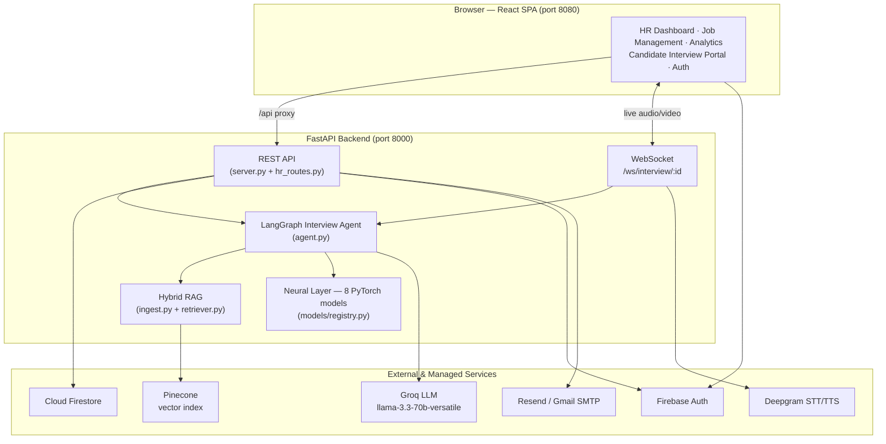

The frontend never talks to Groq, Pinecone, or the neural models directly; all AI work is
mediated by the backend, which is also the only place candidate scores are computed.

---

## 3.2 Three-Layer Architecture

Conceptually, the system decomposes into three layers with distinct responsibilities,
lifecycles, and audiences.

**Figure 3.2 — Three-Layer Architecture.**

```mermaid
flowchart LR
    subgraph L1["Enterprise Layer"]
        direction TB
        E1["Accounts & RBAC"]
        E2["Jobs & CV upload"]
        E3["Neural ranking"]
        E4["Invitations & analytics"]
    end

    subgraph L2["Interview-AI Layer"]
        direction TB
        I1["RAG grounding"]
        I2["LangGraph agent"]
        I3["Answer scoring & blend"]
        I4["Proctoring & report"]
    end

    subgraph L3["Training Layer"]
        direction TB
        T1["Data generation"]
        T2["Model training (8)"]
        T3["Held-out evaluation"]
        T4["Human-rating study"]
    end

    L1 -->|invites candidates into| L2
    L3 -->|produces checkpoints for| L2
    L3 -->|skill matcher & ranker for| L1
```

- The **Enterprise Layer** (`hr_routes.py`, frontend HR pages) is multi-tenant, authenticated,
  and persisted in Firestore. It owns the hiring funnel.
- The **Interview-AI Layer** (`server.py`, `agent.py`, `ingest.py`, `retriever.py`,
  `models/`) is stateful and real-time. It conducts interviews and scores answers.
- The **Training Layer** (`training/`) is offline. It generates data, trains the eight neural
  models, evaluates them on held-out test sets, and runs the human-rating validation study. Its
  outputs are the model checkpoints consumed by the other two layers.

---

## 3.3 Component Diagram

**Figure 3.3 — Component Diagram.** The following diagram shows the principal backend modules
and their dependencies.

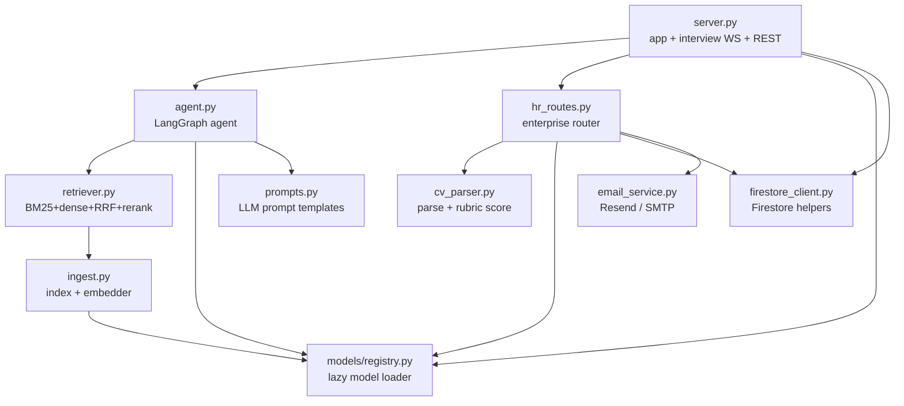

---

## 3.4 Enterprise Hiring Workflow

The enterprise workflow is the hiring funnel, from a company requesting access through to
reviewing completed interviews.

**Figure 3.4 — Enterprise Hiring Workflow (Sequence).**

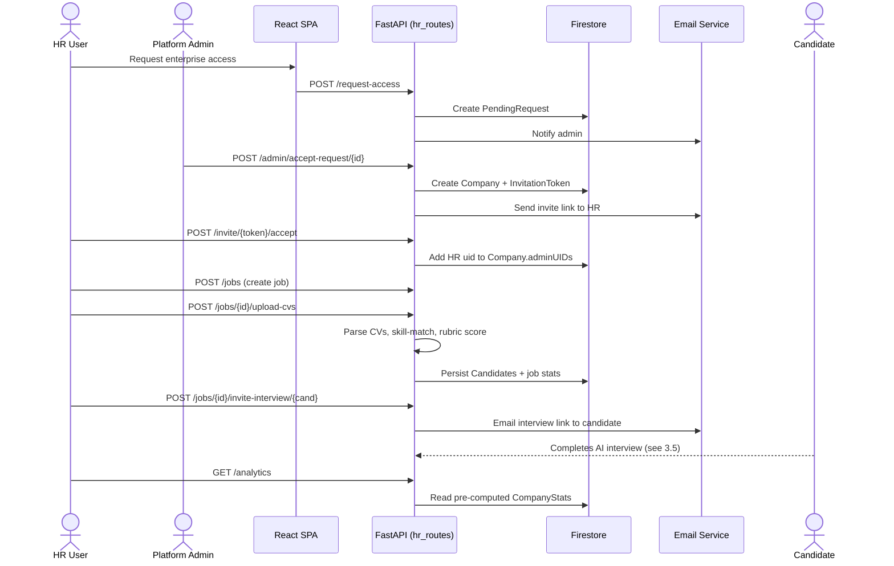

---

## 3.5 Candidate Interview Workflow

When a candidate opens their interview link, they enter a stateful, real-time session driven
by the LangGraph agent.

**Figure 3.5 — Candidate Interview Workflow (Sequence).**

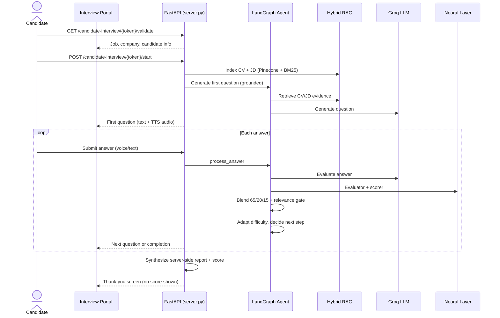

Two design properties are visible here. First, the question is **grounded** before the LLM is
ever called — the agent retrieves CV/JD evidence first. Second, the final score is
**synthesized on the server** from the accumulated evaluations; the candidate is shown only a
thank-you screen, never their score, and cannot influence the number that reaches the HR
dashboard.

The next chapter details how each of these components is implemented.


---

<div align="center">

# Chapter Four

# System Implementation

</div>

<br/>

**Chapter Outline**

- 4.1 Hybrid RAG Pipeline
- 4.2 LangGraph Interview Agent
- 4.3 AI/ML Model Layer
- 4.4 Enterprise Layer
- 4.5 Training Layer
- 4.6 Database Design
- 4.7 API Reference
- 4.8 Authentication & Authorization
- 4.9 Configuration

This chapter describes the detailed implementation of each component. In keeping with the
documentation standard, it presents **flowcharts and pseudocode** rather than source listings,
followed by a short results-and-discussion note for each component.

---

## 4.1 Hybrid RAG Pipeline

**Modules:** `ingest.py` (indexing) and `retriever.py` (retrieval).

When an interview starts, the candidate's CV and the JD are turned into a private, searchable
index scoped to the interview session. Before indexing, every document passes through two
safety filters: **PII redaction** (Microsoft Presidio replaces names, phones, emails, and
similar entities with typed tokens, so raw personal data is never persisted in the vector
store) and a **prompt-injection sanitizer** (regular-expression patterns that strip attempts to
override the system's instructions). The cleaned text is split into overlapping chunks
(`chunk_size = 512`, `chunk_overlap = 50`), each CV chunk is prefixed with a small header
carrying the candidate name and role, and the chunks are written to two stores in parallel:
**Pinecone** (dense vectors, `all-mpnet-base-v2`, 768-D, namespaced by session) and a **local
BM25 store** (raw chunk text for sparse retrieval).

**Figure 4.1 — Hybrid RAG Pipeline.**

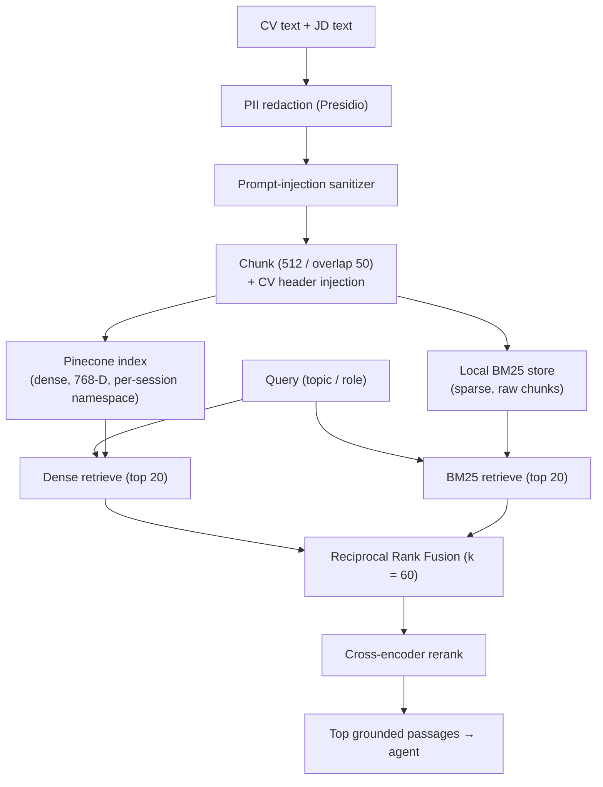

At retrieval time, the query is run against both stores; the two ranked lists are merged with
**Reciprocal Rank Fusion** (`score += 1 / (k + rank + 1)`, `k = 60`); and the fused shortlist
is re-scored by the cross-encoder reranker for final ordering.

**Pseudocode — hybrid retrieval.**

```
function retrieve(query, session_id):
    dense  = pinecone_index(session_id).search(query, top_k = 20)
    sparse = bm25(session_id).search(query, top_k = 20)
    fused  = {}
    for rank, doc in enumerate(dense):  fused[doc] += 1 / (60 + rank + 1)
    for rank, doc in enumerate(sparse): fused[doc] += 1 / (60 + rank + 1)
    shortlist = sort(fused, descending)
    return cross_encoder_rerank(query, shortlist)
```

*Results & discussion.* The hybrid design retrieves both exact-term matches (BM25 — useful for
specific technologies named in a JD) and semantic matches (dense — useful for paraphrased
experience). The embedder is initialized lazily at server startup so the ~400 MB model does
not block import; the same embedder is used everywhere to avoid train/inference mismatch.

---

## 4.2 LangGraph Interview Agent

**Module:** `agent.py`. The interview is a LangGraph **state graph** compiled with a
checkpointer so each session's state survives between turns.

**Figure 4.2 — LangGraph Agent State Graph.**

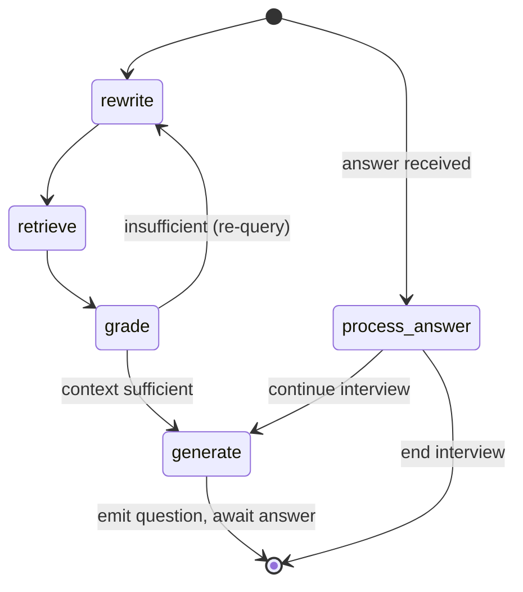

- **rewrite** — reformulates the current topic into an effective retrieval query.
- **retrieve** — runs the hybrid RAG pipeline (4.1) to gather grounded evidence.
- **grade** — checks whether the retrieved context is good enough; a conditional edge
  (`check_grade`) loops back to re-query if not.
- **generate** — prompts the Groq LLM (`llama-3.3-70b-versatile`) to produce the next question
  from the grounded context.
- **process_answer** — evaluates the candidate's answer, updates running performance, adapts
  difficulty, and a conditional edge (`decide_next_step`) decides whether to ask another
  question or end.

### Answer scoring and the blend

When an answer arrives, three independent signals are computed and combined.

**Figure 4.3 — Answer Scoring & Blend Flow.**

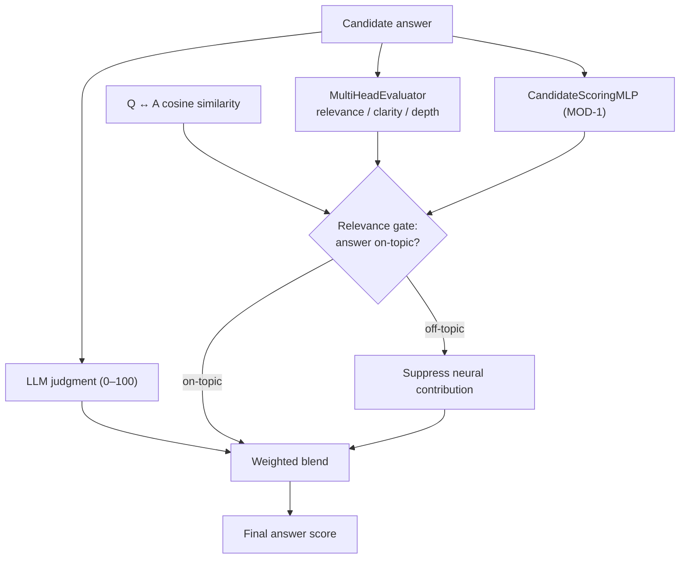

The blend weights are explicit in the code: when all three signals are available, the final
score is **65% LLM + 20% neural evaluator + 15% MOD-1** (`_BLEND_3WAY`); when MOD-1 is
unavailable, the system falls back to **65% LLM + 35% evaluator** (`_BLEND_2WAY`). A **relevance
gate** based on the cosine similarity between the question and the answer suppresses the neural
contribution when the answer is off-topic, preventing a fluent but irrelevant answer from being
rewarded by the neural models.

**Pseudocode — answer evaluation.**

```
function evaluate_answer(question, answer):
    llm   = llm_judge(question, answer)            # 0–100
    eval3 = evaluator(question, answer)            # relevance, clarity, depth
    mod1  = scoring_mlp(question, answer)          # 0–100
    if cosine(question, answer) < threshold:       # relevance gate
        neural = downweighted(eval3, mod1)
    else:
        neural = combine(eval3, mod1)
    if mod1 available:  return 0.65*llm + 0.20*eval_score + 0.15*mod1
    else:               return 0.65*llm + 0.35*eval_score
```

*Results & discussion.* The blend keeps the LLM as the primary judge while letting
purpose-trained models temper its opinion, and the relevance gate guards against the most
common failure mode (off-topic fluency). Proctoring signals are aggregated per answer and an
answer is flagged "suspicious" if multiple faces appear, the face is absent for more than 20%
of frames, or the candidate looks away for more than 30% of frames.

---

## 4.3 AI/ML Model Layer

**Modules:** `models/` with the lazy loader in `models/registry.py`. The registry checks each
checkpoint at startup (a health check), but loads each model into memory only on first use, and
guards against dimension and embedder mismatches.

**Table 4.1 — Neural Model Layer.**

| # | Model | File | Input | Output | Role |
|---|-------|------|-------|--------|------|
| MOD-1 | CandidateScoringMLP | `scoring_model.py` | Q+A embeddings (1536-D) | Score 0–100 | Deep answer scoring in the blend |
| MOD-4 | MultiHeadEvaluator | `multi_head_evaluator.py` | Answer embedding (768-D) | relevance, clarity, depth | Multi-dimensional answer evaluation |
| — | SkillMatchSiamese | `skill_matcher.py` | CV skills, JD skills | Match similarity | CV↔JD skill matching for ranking |
| — | NeuralCandidateRanker | `candidate_ranker.py` | 7-D candidate features | Ranking score | Order candidates within a job |
| — | AdaptiveDifficulty | `difficulty_engine.py` | Performance state (3-D/6-D) | Difficulty action | RL-based question difficulty |
| — | EmotionModel | `emotion_model.py` | Face/tone features | Emotion estimate | Affective context for the report |
| — | PerformancePredictor | `performance_predictor.py` | Interview features | Market-positioning estimate | Auxiliary report signal |
| — | CrossEncoderScorer | `cross_encoder_scorer.py` | (query, passage) | Relevance | RAG reranking |

Supporting modules include `proctor.py` (OpenCV YuNet face/attention detection),
`feature_extractor.py` (feature assembly), and `explainer.py` (score explanation helpers).

*Results & discussion.* On held-out test sets (Chapter 4.5), the MultiHeadEvaluator reaches
Spearman ≈ 0.95 on each of relevance, clarity, and depth, and the scoring MLP reaches
MAE ≈ 0.067 with Spearman ≈ 0.93 — i.e. both models order answers very close to the reference
labels. The candidate ranker is currently trained on synthetically generated comparative data
and is therefore treated as a *tiebreaker* alongside the rubric and interview scores rather than
an absolute measure (see Chapter 6).

---

## 4.4 Enterprise Layer

**Module:** `hr_routes.py` (the `hr_router`), with `cv_parser.py` for CV processing and
`firestore_client.py` for persistence.

The enterprise layer implements the hiring funnel. Key implementation details:

- **Batch CV upload** (`POST /jobs/{id}/upload-cvs`) parses each file, extracts contact details
  and skills, runs the neural **skill matcher** against the JD, computes a **rubric score**, and
  persists each candidate. Uploads are capped at **5 MiB** per file (`MAX_CV_BYTES`), and
  duplicate CVs are skipped by content hash and email.
- **Rubric scoring** (`cv_parser.compute_rubric_score`) scores a CV on four axes — technical
  stack, architecture, experience, and preferred/extra signals — assigns an experience tier
  (senior/mid/junior), and applies a **knock-out rule** (`framework_cap`): if a CV has zero
  skill overlap against a JD that lists at least five extractable skills, its score is capped at
  40, preventing irrelevant CVs from scoring highly.
- **Atomic job statistics** are updated within a Firestore transaction so concurrent uploads do
  not lose updates.
- **Pre-computed analytics.** `GET /analytics` reads a pre-computed `CompanyStats` document
  rather than scanning every candidate on each request; the document is refreshed in the
  background after CV uploads and interview completions, with an in-memory time-to-live cache as
  a fast path. This avoids an O(jobs × candidates) scan on every dashboard load.
- **Ownership checks.** Every job-scoped route verifies that the job belongs to the caller's
  company before returning data, enforcing tenant isolation.

**Pseudocode — batch CV upload.**

```
function upload_cvs(job_id, files, company_id):
    job = authorize_job(job_id, company_id)
    for file in files:
        if size(file) > 5 MiB: skip
        text   = parse(file)
        if duplicate(hash(text)) or duplicate(email(text)): skip
        skills = extract_skills(text)
        match  = skill_matcher(skills, job.skills)
        score  = rubric_score(text, job.description, job.skills)
        persist_candidate(job_id, {skills, match, score, ...})
    update_job_stats(job_id)         # atomic transaction
    refresh_analytics(company_id)    # background
```

---

## 4.5 Training Layer

**Module:** `training/`. The training layer is offline and produces the checkpoints consumed by
the other layers.

**Figure 4.4 — Training Pipeline.**

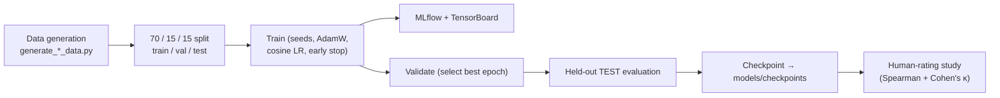

Each trainer (`train_evaluator.py`, `train_scorer.py`, `train_ranker.py`,
`train_skill_matcher.py`, `train_difficulty.py` / `train_difficulty_ppo.py`,
`train_emotion.py`, `train_predictor.py`, `train_cross_encoder.py`) shares the same hygiene:
fixed random seeds, an AdamW optimizer with cosine-annealing learning-rate schedule, early
stopping with best-state restoration, dual MLflow + TensorBoard logging, and rank-aware metrics
(Spearman, NDCG, F1). Models are trained on a **70/15/15** split and final numbers are reported
on the **held-out test fold**, not the validation fold used for early stopping.

To prevent a train/inference embedding mismatch, the evaluator's training answers are
re-encoded with the same `all-mpnet-base-v2` embedder used in production, and the checkpoint is
stamped with the embedder identity so the registry can reject a mismatched model.

**Representative held-out TEST metrics.**

| Model | Metric | Value |
|-------|--------|-------|
| MultiHeadEvaluator | Spearman (relevance) | ≈ 0.95 |
| MultiHeadEvaluator | Spearman (clarity) | ≈ 0.95 |
| MultiHeadEvaluator | Spearman (depth) | ≈ 0.95 |
| CandidateScoringMLP | MAE | ≈ 0.067 |
| CandidateScoringMLP | Spearman | ≈ 0.93 |

A **human-rating study** (`human_rating_study.py`) compares the system's scores against human
ratings on a stratified sample of answers, reporting Spearman's correlation (≈ 0.95) and
Cohen's κ (≈ 0.50). A **fairness audit** and a **RAG evaluation** harness are also provided.

*Results & discussion.* The held-out methodology and consistent embedder give the reported
metrics credibility. As noted in Chapter 6, the human study currently has a single rater and
should be extended to several raters for inter-rater reliability.

---

## 4.6 Database Design

MyHR persists all enterprise state in **Cloud Firestore**, a document database. Collections and
their relationships are shown below.

**Figure 4.5 — Database Relationships.**

```mermaid
erDiagram
    COMPANIES ||--o{ JOBS : owns
    JOBS ||--o{ CANDIDATES : contains
    COMPANIES ||--o{ COMPANYSTATS : "1:1 analytics"
    PENDINGREQUESTS ||--|| COMPANIES : "approval creates"
    INVITATIONTOKENS }o--|| COMPANIES : "scoped to"
    USERS }o--o{ COMPANIES : "adminUIDs membership"

    COMPANIES { string id; string name; array adminUIDs; string domain; object settings }
    JOBS { string id; string companyId; string title; string description; array extractedSkills; object stats }
    CANDIDATES { string id; string name; string email; number matchScore; number interviewScore; number totalScore; string interviewStatus }
    USERS { string uid; string role }
    PENDINGREQUESTS { string id; string companyName; string contactEmail; string status }
    INVITATIONTOKENS { string token; string type; string companyId; string jobId; string candidateId; datetime expiresAt }
    COMPANYSTATS { string companyId; object stats; array monthly_trends; datetime updatedAt }
```

**Table 4.2 — Firestore Collections.**

| Collection | Purpose | Key fields |
|------------|---------|-----------|
| `Companies` | Tenant record | `name`, `adminUIDs`, `domain`, `settings` |
| `Jobs` | Job postings | `companyId`, `title`, `description`, `extractedSkills`, `stats` |
| `Jobs/{id}/Candidates` | Candidates per job (subcollection) | `name`, `email`, `matchScore`, `interviewScore`, `totalScore`, `interviewStatus` |
| `Users` | Portal role registry | `uid`, `role` (`candidate`) |
| `PendingRequests` | Enterprise access requests | `companyName`, `contactEmail`, `status` |
| `InvitationTokens` | Access & interview tokens | `type`, `companyId`, `jobId`, `candidateId`, `expiresAt`, `usedAt` |
| `CompanyStats` | Pre-computed analytics | `stats`, `monthly_trends`, `updatedAt` |

The total candidate score combines the CV match and the interview at a fixed weighting —
**40% CV match + 60% interview** (`CV_SCORE_WEIGHT = 0.4`, `INTERVIEW_SCORE_WEIGHT = 0.6`).

---

## 4.7 API Reference

The backend exposes two routers: interview/system endpoints in `server.py`, and the enterprise
router in `hr_routes.py`.

**Table 4.3 — API Reference: Interview & System Endpoints (`server.py`).**

| Method | Path | Auth | Purpose |
|--------|------|------|---------|
| POST | `/start_interview` | Token/session | Start a (practice) interview session |
| POST | `/candidate-interview/{token}/start` | Public token | Start a token-based candidate interview |
| WS | `/ws/interview/{session_id}` | Session | Live audio/video interview channel |
| GET | `/end_interview/{session_id}` | Session | End an interview and finalize |
| POST | `/analyze_frame` | Session | Proctoring: analyze a single video frame |
| POST | `/submit_answer` | Session | Submit and evaluate an answer |
| POST | `/candidates/rank` | Internal | Rank candidates with the neural ranker |
| GET | `/health` | Public | Liveness/health check |
| GET | `/metrics` | Public | In-process metrics |

**Table 4.4 — API Reference: Enterprise Endpoints (`hr_routes.py`).**

| Method | Path | Auth | Purpose |
|--------|------|------|---------|
| POST | `/request-access` | Public | Submit enterprise access request |
| GET | `/admin/pending-requests` | Admin | List pending requests |
| POST | `/admin/accept-request/{id}` | Admin | Approve request, create company + invite |
| POST | `/admin/reject-request/{id}` | Admin | Reject a request |
| GET | `/invite/{token}/validate` | Public token | Validate a company-access invite |
| POST | `/invite/{token}/accept` | Firebase | Link user to company (grants HR role) |
| POST | `/jobs` | HR | Create a job |
| GET | `/jobs` | HR | List company jobs |
| GET | `/jobs/{id}` | HR | Get a job |
| POST | `/jobs/{id}/upload-cvs` | HR | Batch upload + score CVs |
| GET | `/jobs/{id}/candidates` | HR | List candidates (paged/filtered) |
| GET | `/jobs/{id}/candidates/{cid}` | HR | Get a candidate (with report) |
| DELETE | `/jobs/{id}/candidates/{cid}` | HR | Remove a candidate |
| POST | `/user/role` | Firebase | Self-register as candidate |
| GET | `/user/role/{uid}` | Public | Resolve a user's role |
| POST | `/jobs/{id}/invite-interview/{cid}` | HR | Email an interview invite |
| GET | `/candidate-interview/{token}/validate` | Public token | Validate interview token |
| POST | `/candidate-interview/{token}/complete` | Public token | Finalize interview (server-scored) |
| GET | `/analytics` | HR | Company hiring analytics |
| POST | `/jobs/{id}/rank-candidates` | HR | Neural ranking of candidates |

---

## 4.8 Authentication & Authorization

**Modules:** `firestore_client.py`, `hr_routes.py`, and `src/contexts/AuthContext.jsx` on the
frontend. Identity is provided by **Firebase Authentication**; the backend verifies the
Firebase **ID token** on protected routes.

Three roles exist:

- **Candidate** — self-registerable (`POST /user/role` accepts only `candidate`). Candidates can
  run practice interviews.
- **HR (enterprise)** — *not* self-assignable. The role is granted only by accepting a company
  invitation, which adds the user's UID to the company's `adminUIDs` array; the role resolver
  (`GET /user/role/{uid}`) reports `hr` precisely when the UID appears in some company's
  `adminUIDs`. An email already registered as a candidate cannot also become enterprise, and
  vice-versa — one email maps to one role.
- **Super-admin** — a fixed allowlist email with platform privileges (approving requests).

Public interview links use cryptographically strong tokens (`secrets.token_urlsafe`) with an
expiry, validated server-side; the corporate-email gate restricts enterprise sign-up to
corporate domains (with a `BYPASS_EMAIL_CHECK` escape hatch for local testing). Interview scores
are computed only from the server-side synthesized report, so a candidate cannot submit their
own score.

**Figure 4.6 — Authentication & RBAC Flow.**

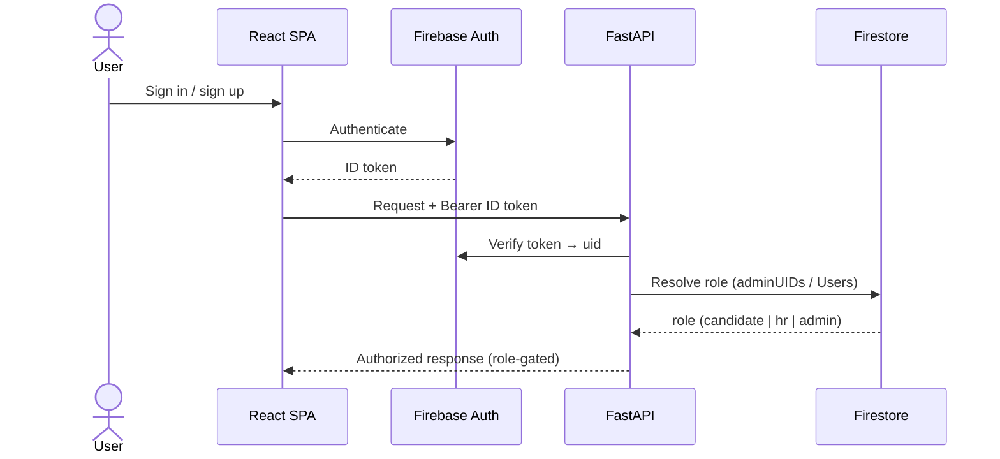

---

## 4.9 Configuration

Configuration is supplied via environment variables (a local `.env` file in development).

**Table 4.5 — Environment Variables.**

| Variable | Purpose |
|----------|---------|
| `GROQ_API_KEY` | Groq LLM access (`llama-3.3-70b-versatile`) |
| `DEEPGRAM_API_KEY` | Speech-to-text / text-to-speech |
| `PINECONE_API_KEY` | Pinecone vector index |
| `OPENAI_API_KEY` | Optional LLM/embedding access |
| `FIREBASE_SERVICE_ACCOUNT_PATH` | Firebase Admin SDK credentials |
| `VITE_FIREBASE_*` | Frontend Firebase web config |
| `RESEND_API_KEY` | Resend email transport |
| `SMTP_USER`, `SMTP_PASS` | Gmail SMTP transport (App Password) |
| `MYHR_BASE_URL` | Frontend base URL for email links (e.g. `http://localhost:8080`) |
| `AWS_*`, `S3_BUCKET_NAME`, `MINIO_ENDPOINT` | Object storage (MinIO/S3) configuration |
| `REDIS_URL` | Redis connection (caching) |
| `DATABASE_URL` | Relational database URL (auxiliary) |
| `BYPASS_EMAIL_CHECK` | Dev escape hatch for the corporate-email gate |

The email service tries Gmail SMTP first (when `SMTP_USER`/`SMTP_PASS` are set), then falls
back to the Resend API, and logs a warning if neither is configured. The LLM embedder is loaded
lazily at startup so model loading does not block application import.


---

<div align="center">

# Chapter Five

# System Testing

</div>

<br/>

**Chapter Outline**

- 5.1 Installation
- 5.2 Running the System
- 5.3 Automated Test Suite
- 5.4 End-to-End Walkthrough

This chapter explains how to install, configure, run, and test MyHR, and walks through the
end-to-end golden path with screenshots.

---

## 5.1 Installation

MyHR has a Python backend and a Node.js frontend. Both must be installed.

**Prerequisites**

- Python 3.11+ (the project is currently run on Python 3.14)
- Node.js 18+ and npm
- Accounts/keys for: Groq, Deepgram, Pinecone, Firebase, and an email transport (Resend or a
  Gmail App Password)

**Backend dependencies**

```bash
# from the project root
python -m venv .venv
. .venv/Scripts/activate      # Windows (Git Bash);  source .venv/bin/activate on Linux/macOS
pip install -r requirements.txt
```

**Frontend dependencies**

```bash
npm install
```

**Configuration.** Create a `.env` file in the project root with the variables listed in
**Table 4.5** (Chapter 4.9). At minimum, set `GROQ_API_KEY`, `DEEPGRAM_API_KEY`,
`PINECONE_API_KEY`, `FIREBASE_SERVICE_ACCOUNT_PATH`, the `VITE_FIREBASE_*` web config, an email
transport (`RESEND_API_KEY` or `SMTP_USER` + `SMTP_PASS`), and `MYHR_BASE_URL` pointing at the
frontend (e.g. `http://localhost:8080`).

---

## 5.2 Running the System

The backend and frontend run as two processes.

```bash
# Terminal 1 — backend (FastAPI on port 8000)
python server.py

# Terminal 2 — frontend (Vite dev server on port 8080)
npm run dev
```

On a healthy start, the backend logs a model-registry health check (all eight checkpoints
present), loads the skill matcher, initializes the LlamaIndex embedder, readies the OpenCV
proctor, loads the emotion model, and reports *Application startup complete* with Uvicorn
listening on `http://0.0.0.0:8000`. The frontend serves the SPA at `http://localhost:8080`,
and Vite proxies all `/api` calls to the backend.

**Figure 5.1 — Deployment Architecture.**

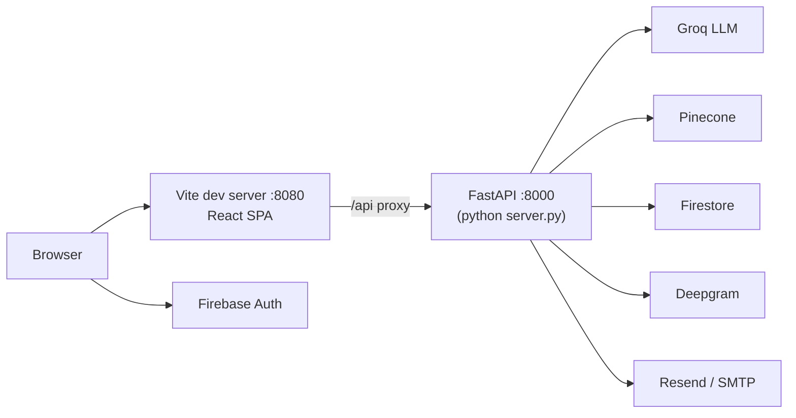

For a production deployment, the frontend is built with `npm run build` (output in `dist/`) and
served as static assets, while the backend runs under a production ASGI server; object storage,
caching, and observability would be hardened as described in Chapter 6.

---

## 5.3 Automated Test Suite

The backend ships with a `pytest` suite under `tests/`.

```bash
python -m pytest tests/ -q
```

**Table 5.1 — Automated Test Summary.**

| Test file | Tests | Coverage focus |
|-----------|-------|----------------|
| `tests/test_cv_parser.py` | 38 | Email/phone/name/skill extraction, skill matching, rubric scoring (incl. the `framework_cap` knock-out rule) |
| `tests/test_hr_helpers.py` | 19 | Corporate-email gate, secure token generation, CV-text validation |
| `tests/test_integration.py` | 13 | Cross-module integration of enterprise helpers |
| **Total** | **70** | All passing |

`tests/conftest.py` provides shared fixtures (including a fake model registry) so the suite runs
without loading the heavy neural models. The pure-logic helpers (CV parsing, rubric scoring,
email validation, token generation) are tested directly, which keeps the suite fast and
deterministic.

The frontend uses **Vitest** (`npm run test`) with React Testing Library for component-level
tests.

---

## 5.4 End-to-End Walkthrough

The following golden path exercises the full system. Screenshot placeholders mark where to
insert captured images before submission.

**1. Request enterprise access.** A company submits the access form; a corporate email is
required (unless `BYPASS_EMAIL_CHECK` is set).


**2. Admin approval.** The platform admin reviews pending requests and approves one, which
creates the company, generates an invitation token, and emails the HR contact a link.


**3. Accept invitation.** The HR user opens the emailed link, creates their account, is added to
the company's `adminUIDs`, and lands on the HR dashboard as an enterprise user.


**4. Create a job and upload CVs.** The HR user posts a job (skills are auto-extracted from the
JD) and uploads candidate CVs in bulk; each CV is parsed, skill-matched, and rubric-scored.


**5. Review ranked candidates.** Candidates appear ranked by match score; the HR user can open
a candidate to see the match breakdown.


**6. Invite a candidate to interview.** The HR user invites a candidate; an interview link is
emailed to the candidate.


**7. Candidate AI interview.** The candidate opens the link, grants camera/microphone access,
and completes an adaptive, grounded interview (voice or text). Proctoring runs silently; the
candidate never sees a score, only a thank-you screen on completion.


**8. Hiring analytics.** Back on the dashboard, the HR user reviews aggregate analytics —
candidate counts, average match and interview scores, monthly trends, and recent activity —
served from the pre-computed `CompanyStats` document.


*Expected outcome.* After completion, the candidate's record shows an `interviewScore`, a
synthesized `interviewReport`, and a `totalScore` (40% CV match + 60% interview), and the
analytics document refreshes in the background. This confirms the full funnel — from access
request to scored interview — operates end-to-end.


---

<div align="center">

# Chapter Six

# Conclusion and Future Work

</div>

<br/>

**Chapter Outline**

- 6.1 Conclusion
- 6.2 Known Limitations
- 6.3 Future Work

---

## 6.1 Conclusion

MyHR set out to automate the two most repetitive stages of hiring — CV screening and
first-round interviewing — without sacrificing trustworthiness, and it achieves that goal as a
working, end-to-end system.

The project delivers three cooperating subsystems that function together: a **hybrid RAG layer**
that grounds every interview question in the candidate's own CV and the job description using
BM25, dense Pinecone retrieval, Reciprocal Rank Fusion, and cross-encoder reranking; a
**LangGraph LLM agent** that conducts an adaptive, voice-or-text interview and evaluates answers
through a transparent blend of an LLM judgment and purpose-trained neural models (65% LLM /
20% evaluator / 15% deep scorer, with a relevance gate); and a **neural layer of eight PyTorch
models** trained with professional hygiene — fixed seeds, early stopping, experiment tracking,
and reporting on held-out test sets — that reach Spearman correlations around 0.93–0.95 against
their reference labels.

Around this AI core, the system provides a complete **multi-tenant enterprise platform**:
Firebase-backed authentication, role-based access control that cleanly separates candidates from
HR users, batch CV upload with neural skill matching and rubric scoring, email-delivered
token-based interview invitations, server-side-only scoring that candidates cannot tamper with,
and a pre-computed analytics dashboard. The frontend is a polished React single-page
application, the backend a well-structured FastAPI service, and the whole is covered by an
automated test suite (70 passing backend tests) and this documentation.

In short, MyHR demonstrates that a grounded, neural-cross-checked AI interviewer can be embedded
in a real, secure, multi-tenant hiring product — and that the result is both demonstrable and
maintainable.

**Principal achievements**

- A grounded, adaptive AI interview engine with transparent, defensible scoring.
- Automated CV screening with neural skill matching and a rubric with a knock-out rule.
- A secure, multi-tenant enterprise portal with RBAC and token-based invitations.
- Eight neural models trained and evaluated on held-out test sets with experiment tracking.
- A clean separation of enterprise, interview-AI, and training layers, with automated tests.

---

## 6.2 Known Limitations

The system is demo-ready and architecturally healthy. A few areas are deliberately scoped for
future hardening rather than the graduation milestone:

- **Validation breadth.** Answer-quality labels and the primary judge both originate from an
  LLM, so the reported metrics demonstrate strong agreement with that judge; the human-rating
  validation study, while positive (Spearman ≈ 0.95), currently uses a single rater and would
  benefit from several raters for inter-rater reliability.
- **Candidate ranker data.** The neural candidate ranker is trained on synthetically generated
  comparative data, so its scores are best used as a *tiebreaker* alongside the rubric and
  interview scores rather than an absolute measure. The code already treats it this way.
- **Object storage.** Media and reports are stored against local disk and a MinIO/S3
  configuration rather than a hardened, durable cloud bucket.
- **Observability.** The backend exposes a health endpoint, an in-process metrics endpoint, and
  structured logging, but does not yet include full production monitoring, alerting, or
  distributed tracing.

None of these affects the demonstrated functionality; each is a natural next step toward a
production deployment.

---

## 6.3 Future Work

The following improvements would extend MyHR from a strong graduation system toward a
production-grade product:

- **Multi-rater validation.** Extend the human-rating study to several independent raters and
  report inter-rater reliability alongside the system-vs-human correlation.
- **Real comparative labels for ranking.** Retrain the candidate ranker on real hiring outcomes
  (e.g. which candidates were advanced or hired) to make its scores absolute rather than
  relative.
- **Durable object storage.** Replace the local-disk path with a hardened cloud object store
  for CVs, audio, and reports, with lifecycle and access policies.
- **Production observability.** Add metrics dashboards, alerting, request tracing, and model
  drift monitoring so quality regressions are caught automatically.
- **Model registry and versioning.** Promote the file-based checkpoints to a versioned model
  registry with rollback, so model updates are auditable and reversible.
- **Scaling and load testing.** Benchmark the interview WebSocket and batch upload paths under
  load, and introduce horizontal scaling and a continuous-delivery rollback strategy.
- **Richer analytics and fairness reporting.** Surface the existing fairness-audit harness in
  the dashboard and expand analytics with funnel and time-to-hire metrics.

Pursued in this order, these items would close the gap between the current, defensible
demonstration and a system ready for open enterprise use.


---

<div align="center">

# Tools

</div>

**Table T.1 — Tools Used.**

| Category | Tool | Use in MyHR |
|----------|------|-------------|
| Language (backend) | Python 3.14 | Backend, AI engine, training |
| Language (frontend) | JavaScript (ES2022) | React SPA |
| Web framework | FastAPI + Uvicorn | REST + WebSocket API |
| Frontend build | Vite 5 | Dev server and production bundling |
| UI | React 18, Radix UI, Tailwind CSS | Component-based interface |
| Charts/UX | Recharts, Framer Motion | Analytics charts, animations |
| AI agent | LangGraph, LangChain | Interview state machine |
| LLM | Groq `llama-3.3-70b-versatile` | Question generation, answer judging |
| Vector DB | Pinecone (via LlamaIndex) | Dense retrieval |
| Sparse retrieval | `rank_bm25` | BM25 retrieval |
| Embeddings | `sentence-transformers` (`all-mpnet-base-v2`) | 768-D embeddings |
| Deep learning | PyTorch | Eight neural models |
| Speech | Deepgram SDK | STT / TTS |
| Computer vision | OpenCV (YuNet) | Silent proctoring |
| Privacy | Microsoft Presidio | PII redaction |
| Auth | Firebase Authentication | Identity, ID tokens |
| Database | Google Cloud Firestore | Persistence |
| Email | Resend API / Gmail SMTP | Invitations, notifications |
| Experiment tracking | MLflow, TensorBoard | Training metrics |
| Rate limiting | SlowAPI | Per-route throttling |
| Testing | pytest, Vitest, React Testing Library | Automated tests |
| Version control | Git / GitHub | Source management |
| IDE | Visual Studio Code | Development |

**Hardware.** Development and training used a CUDA-capable GPU workstation (the backend logs
`device_name: cuda` when loading sentence-transformer models); the system also runs on CPU.

---

<div align="center">

# References

</div>

> Books and papers first (ordered by date), then websites (with last-retrieved dates). Replace
> or extend with the exact sources cited in the final printed document.

1. A. Vaswani, N. Shazeer, N. Parmar, et al., "Attention Is All You Need," *Advances in Neural
   Information Processing Systems (NeurIPS)*, 2017.
2. S. Robertson and H. Zaragoza, "The Probabilistic Relevance Framework: BM25 and Beyond,"
   *Foundations and Trends in Information Retrieval*, 2009.
3. N. Reimers and I. Gurevych, "Sentence-BERT: Sentence Embeddings using Siamese
   BERT-Networks," *EMNLP*, 2019.
4. G. V. Cormack, C. L. A. Clarke, and S. Büttcher, "Reciprocal Rank Fusion Outperforms Condorcet
   and Individual Rank Learning Methods," *SIGIR*, 2009.
5. P. Lewis, E. Perez, A. Piktus, et al., "Retrieval-Augmented Generation for Knowledge-Intensive
   NLP Tasks," *NeurIPS*, 2020.
6. J. Schulman, F. Wolski, P. Dhariwal, A. Radford, and O. Klimov, "Proximal Policy Optimization
   Algorithms," *arXiv:1707.06347*, 2017.
7. K. Song, X. Tan, T. Qin, J. Lu, and T.-Y. Liu, "MPNet: Masked and Permuted Pre-training for
   Language Understanding," *NeurIPS*, 2020.
8. LangGraph Documentation, https://langchain-ai.github.io/langgraph/ , last retrieved
   27/06/2026.
9. FastAPI Documentation, https://fastapi.tiangolo.com/ , last retrieved 27/06/2026.
10. Pinecone Documentation, https://docs.pinecone.io/ , last retrieved 27/06/2026.
11. Groq Documentation, https://console.groq.com/docs , last retrieved 27/06/2026.
12. Firebase Documentation, https://firebase.google.com/docs , last retrieved 27/06/2026.
13. Deepgram Documentation, https://developers.deepgram.com/ , last retrieved 27/06/2026.

---

<div align="center">

# Glossary & Abbreviations

</div>

| Term | Definition |
|------|------------|
| **API** | Application Programming Interface — the contract the backend exposes to the frontend. |
| **ATS** | Applicant Tracking System — traditional, keyword-based hiring software. |
| **BM25** | Sparse ranking function scoring documents by term overlap with the query. |
| **Bi-encoder** | Embeds query and document independently for fast similarity search. |
| **Cross-encoder** | Scores a (query, document) pair jointly for higher-precision reranking. |
| **CV** | Curriculum Vitae — a candidate's résumé. |
| **Dense retrieval** | Semantic search using vector embeddings and cosine similarity. |
| **Embedding** | A fixed-length numeric vector representing the meaning of text. |
| **JD** | Job Description. |
| **Knock-out rule** | A rubric cap that limits the score of a clearly unqualified CV. |
| **LLM** | Large Language Model. |
| **MLP** | Multi-Layer Perceptron — a feed-forward neural network. |
| **Multi-head** | A network with several output heads predicting different targets. |
| **NDCG** | Normalized Discounted Cumulative Gain — a ranking-quality metric. |
| **PII** | Personally Identifiable Information. |
| **PPO** | Proximal Policy Optimization — a reinforcement-learning algorithm. |
| **Proctoring** | Silent integrity monitoring (face presence, gaze, multiple faces). |
| **RAG** | Retrieval-Augmented Generation. |
| **RBAC** | Role-Based Access Control. |
| **Relevance gate** | A check that suppresses the neural score when an answer is off-topic. |
| **RL** | Reinforcement Learning. |
| **RRF** | Reciprocal Rank Fusion — merges several ranked lists into one. |
| **SPA** | Single-Page Application. |
| **Spearman's ρ** | Rank correlation measuring whether two orderings agree. |
| **STT / TTS** | Speech-to-Text / Text-to-Speech. |
| **WebSocket (WS)** | A persistent two-way connection used for the live interview. |

---

<div align="center">

# Appendices

</div>

## Appendix A — Environment Variable Template

```ini
# LLM & AI services
GROQ_API_KEY=
DEEPGRAM_API_KEY=
PINECONE_API_KEY=
OPENAI_API_KEY=

# Firebase (Admin SDK + web config)
FIREBASE_SERVICE_ACCOUNT_PATH=
VITE_FIREBASE_API_KEY=
VITE_FIREBASE_AUTH_DOMAIN=
VITE_FIREBASE_PROJECT_ID=
VITE_FIREBASE_STORAGE_BUCKET=
VITE_FIREBASE_MESSAGING_SENDER_ID=
VITE_FIREBASE_APP_ID=

# Email transport (use one)
RESEND_API_KEY=
SMTP_USER=
SMTP_PASS=

# URLs & infrastructure
MYHR_BASE_URL=http://localhost:8080
AWS_ACCESS_KEY_ID=
AWS_SECRET_ACCESS_KEY=
AWS_REGION=
S3_BUCKET_NAME=
MINIO_ENDPOINT=
REDIS_URL=
DATABASE_URL=

# Dev escape hatch (omit in production)
BYPASS_EMAIL_CHECK=
```

## Appendix B — Endpoint Index

See **Tables 4.3 and 4.4** for the complete REST/WebSocket surface (9 interview/system
endpoints in `server.py`, 20 enterprise endpoints in `hr_routes.py`).

## Appendix C — Repository Structure (selected)

```
MyHR/
├── server.py              FastAPI app, interview WebSocket, system endpoints
├── hr_routes.py           Enterprise router (jobs, CVs, invites, analytics)
├── agent.py               LangGraph interview agent + scoring blend
├── ingest.py              RAG indexing + lazy embedder
├── retriever.py           BM25 + dense + RRF + cross-encoder rerank
├── cv_parser.py           CV parsing, skill extraction, rubric scoring
├── email_service.py       Resend / Gmail SMTP transport + templates
├── firestore_client.py    Firestore helpers + role sync
├── prompts.py             LLM prompt templates
├── models/                8 neural models + registry + proctor
│   ├── registry.py
│   ├── multi_head_evaluator.py, scoring_model.py, candidate_ranker.py
│   ├── skill_matcher.py, difficulty_engine.py, emotion_model.py
│   ├── performance_predictor.py, cross_encoder_scorer.py, proctor.py
│   └── checkpoints/       Trained model weights
├── training/              Data generation, trainers, evaluation, human study
├── tests/                 pytest suite (70 tests)
├── src/                   React SPA (pages, components, contexts, hooks, lib)
└── docs/                  This documentation set
```

> **Note on auxiliary modules.** The repository also contains supporting modules not central to
> the core flow described above — for example `tone.py`, `services.py`, `s3_utils.py`,
> `feature_extractor.py`, `explainer.py`, and the `recommender/` package — as well as utility
> and demo scripts (`run_training.py`, `check_phase1.py`, `demo_phase1.py`,
> `cleanup_pinecone.py`). These are part of the codebase but are outside the primary
> request-lifecycle documented in Chapter 4.
