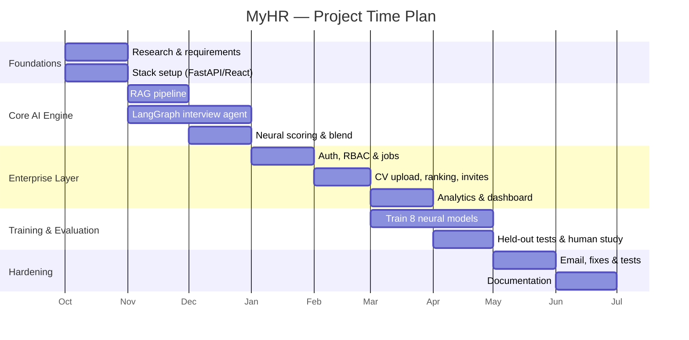

# Chapter One

# Introduction

 

**Chapter Outline**

- 1.1 Problem Definition
  - 1.1.1 History
  - 1.1.2 Applications
- 1.2 Motivation
- 1.3 Objectives
- 1.4 Scope
- 1.5 Functional Requirements
- 1.6 Non-Functional Requirements
- 1.7 Project Timeline
- 1.8 Documentation Outline

---

## 1.1 Problem Definition

Hiring is one of the most resource-intensive processes a company undertakes, and two of its
earliest stages are also its most repetitive:

- **Résumé screening.** For a single open role, recruiters may receive hundreds of CVs. Each
  must be read, compared against the job description, and judged for fit. The process is slow,
  subjective, and inconsistent between reviewers and across time of day.
- **First-round interviewing.** Even after shortlisting, conducting an initial screening
  interview for every promising candidate consumes scarce interviewer time. Scheduling alone
  introduces days of delay, and the quality of questions varies with the interviewer's
  preparation and fatigue.

These two stages share a common weakness: they depend on a human reading the same kinds of
documents and asking the same kinds of questions, over and over, with no guarantee of
consistency. The result is a hiring funnel that is **slow, expensive, hard to audit, and
vulnerable to unconscious bias**.

MyHR addresses this problem directly. It provides:

1. An **enterprise portal** that ingests CVs in bulk, parses them, matches them against the
   job's required skills, and ranks candidates with neural models — turning hundreds of
   documents into an ordered shortlist in seconds.
2. An **AI interview engine** that conducts an adaptive, grounded interview with each invited
   candidate and returns a single, defensible score and a structured report, without occupying
   any human interviewer's time.

In short, the problem statement is: *manual CV screening and first-round interviewing are
slow, inconsistent, and costly; they can be made faster and more consistent by grounding an
LLM-driven interviewer in the candidate's own documents and by scoring candidates with
purpose-trained neural models.*

### 1.1.1 History

The two enabling technologies behind MyHR matured only recently:

- **Applicant Tracking Systems (ATS)** have existed for decades, but classical ATS rely on
  keyword matching. They reward candidates who echo the job description's wording rather than
  candidates who actually possess the underlying skills, and they cannot conduct an interview.
- **Large Language Models (LLMs)** became capable of fluent, context-aware question generation
  and answer evaluation only after the transformer architecture and instruction-tuned chat
  models. However, an LLM used naively will *hallucinate* — it may ask about experience the
  candidate never claimed, or score an answer it never actually grounded in the role.
- **Retrieval-Augmented Generation (RAG)** emerged as the standard technique to keep an LLM
  grounded in trustworthy source documents. By retrieving the most relevant passages of a CV
  and JD and feeding them to the model, RAG constrains the interview to facts that actually
  exist in the candidate's profile.

MyHR combines these threads: it replaces keyword ATS matching with neural skill matching, and
it replaces an ungrounded LLM with a RAG-grounded interview agent whose scores are
cross-checked by dedicated neural evaluators.

### 1.1.2 Applications

The platform serves two distinct audiences from one codebase:

- **Enterprise hiring (primary).** A company requests access, is approved by a platform
  administrator, posts jobs, uploads candidate CVs, receives a neural ranking, invites the top
  candidates to an AI interview by email, and reviews completed interviews and aggregate
  analytics on a dashboard.
- **Candidate self-practice (secondary).** An individual candidate can sign up and run mock AI
  interviews against their own CV to prepare for real interviews, tracking their readiness over
  time.

Both audiences are gated by **role-based access control**: an account is either a *candidate*
or an enterprise *HR* user, and the two roles are mutually exclusive for a given email.

---

## 1.2 Motivation

The motivation for MyHR is to demonstrate that a **single, coherent system can automate the
top of the hiring funnel without sacrificing trustworthiness**. Three concerns drove the
design:

- **Grounding over fluency.** An interviewer that sounds fluent but invents facts is worse than
  useless. MyHR's central engineering bet is that every question and every score must be
  grounded in retrieved evidence from the candidate's own CV and the JD.
- **Defensibility over convenience.** A candidate's score must be computed on the server from
  evidence the candidate cannot tamper with, and it must be explainable as a transparent blend
  of an LLM judgment and purpose-trained neural models rather than a single opaque number.
- **Separation of concerns.** The enterprise workflow (multi-tenant, authenticated, persisted)
  and the AI interview workflow (stateful, real-time, model-heavy) are genuinely different
  problems, and the architecture keeps them in separate, well-defined layers.

---

## 1.3 Objectives

The project's objectives are grouped into five categories.

**Functional objectives** — what the system must *do*:

1. Allow companies to onboard (request access → admin approval → invitation) and manage job
   postings.
2. Ingest candidate CVs in bulk, parse them, and rank candidates against each job.
3. Conduct an adaptive, voice-or-text AI interview with every invited candidate.
4. Produce a per-candidate interview report and a combined hiring score, and present hiring
   analytics to HR users.

**Technical objectives** — how the system must be *engineered*:

5. Implement a clean three-layer architecture (enterprise / interview-AI / training) with a
   FastAPI backend, a React single-page application, and Firestore persistence.
6. Expose a well-defined REST + WebSocket API and cover the core logic with automated tests.
7. Keep the codebase maintainable and containerized for reproducible deployment.

**AI objectives** — the intelligence the system must exhibit:

8. Ground every interview question in retrieved evidence from the candidate's CV and the JD
   (hybrid RAG) so the interviewer never hallucinates experience.
9. Score answers through a transparent blend of an LLM judgment and purpose-trained neural
   models, guarded by a question-to-answer relevance gate.
10. Train and evaluate the neural model layer rigorously, on held-out test sets with standard
    ranking metrics, experiment tracking, and a human-rating validation study.

**Security objectives** — the trust guarantees the system must provide:

11. Authenticate all users via Firebase ID tokens and enforce role-based access control that
    cleanly separates candidates, HR users, and platform administrators.
12. Compute candidate scores server-side only, so a candidate cannot tamper with their result,
    and issue public interview links as cryptographically strong, expiring tokens.
13. Redact personally identifiable information before any document is placed in the vector
    store, and sanitize inputs against prompt-injection.

**Performance objectives** — the responsiveness the system must achieve:

14. Turn a batch of uploaded CVs into a ranked shortlist in seconds rather than hours.
15. Serve hiring analytics from pre-computed aggregates instead of scanning every candidate on
    each request, and load neural models lazily so application startup is not blocked.

---

## 1.4 Scope

**In scope.** Enterprise account onboarding and approval; job posting; batch CV parsing,
skill extraction, and rubric scoring; neural candidate ranking; email-delivered, token-based
interview invitations; an adaptive, RAG-grounded, voice/text AI interview with silent
proctoring; server-side answer scoring and report synthesis; hiring analytics; candidate
self-practice; the full neural training and evaluation pipeline.

**Out of scope / partial.** Production-grade object storage is stubbed against local disk and a
MinIO/S3 configuration rather than a hardened cloud bucket; observability is limited to a
health endpoint, an in-process metrics endpoint, and structured logging; the candidate ranker
is trained on synthetically generated comparative data pending real labeled outcomes; the
human-rating validation study was conducted with a single rater. These items are documented in
**Chapter 7 (Known Limitations and Future Work)**.

---

## 1.5 Functional Requirements

The functional requirements define the behavior the system must exhibit. **Table 1.2** lists
them grouped by actor.

**Table 1.2 — Functional Requirements.**

| ID | Actor | Requirement |
|----|-------|-------------|
| FR-1 | HR (prospective) | Submit an enterprise access request using a corporate email address. |
| FR-2 | Admin | Review, approve, or reject pending access requests. |
| FR-3 | HR | Accept a company invitation and be granted the HR role. |
| FR-4 | HR | Create, view, edit, close, and reopen job postings. |
| FR-5 | HR | Upload candidate CVs in bulk (PDF/DOCX) for a job. |
| FR-6 | System | Parse each CV, extract skills, match against the JD, and compute a rubric score. |
| FR-7 | HR | View candidates ranked by match score and inspect a per-candidate skill breakdown. |
| FR-8 | HR | Invite a candidate to an AI interview (delivers an email link); blocked when the job is closed. |
| FR-9 | Candidate | Open a token-based interview link, grant camera/microphone access, and take the interview. |
| FR-10 | System | Generate adaptive, CV/JD-grounded questions and accept spoken or typed answers. |
| FR-11 | System | Run silent proctoring (face count, gaze) and enforce anti-cheating timing during answers. |
| FR-12 | System | Score answers server-side and synthesize a per-candidate interview report. |
| FR-13 | HR | View a candidate's interview report and combined hiring score; regenerate a report on demand. |
| FR-14 | HR | View company-level hiring analytics and per-job pipeline statistics. |
| FR-15 | Candidate | Self-register for candidate practice interviews. |

---

## 1.6 Non-Functional Requirements

The non-functional requirements define the quality attributes of the system. **Table 1.3**
lists them by category.

**Table 1.3 — Non-Functional Requirements.**

| ID | Category | Requirement |
|----|----------|-------------|
| NFR-1 | Security | All protected endpoints verify a Firebase ID token; scores are computed server-side only. |
| NFR-2 | Security | Public interview links are cryptographically strong, single-purpose, and expire. |
| NFR-3 | Privacy | PII is redacted before indexing; inputs are sanitized against prompt-injection. |
| NFR-4 | Multi-tenancy | Every job-scoped request enforces company ownership (tenant isolation). |
| NFR-5 | Performance | A batch of CVs is parsed and ranked in seconds; analytics are served from pre-computed aggregates. |
| NFR-6 | Reliability | Missing model checkpoints or external services degrade gracefully rather than crash. |
| NFR-7 | Usability | Voice-native interview with a clear status indicator, countdown, and accessible UI. |
| NFR-8 | Maintainability | Clean three-layer separation; core logic covered by an automated test suite. |
| NFR-9 | Portability | Containerized with Docker; runs on CPU or CUDA GPU. |
| NFR-10 | Transparency | Answer scores are an explainable weighted blend, not a single opaque number. |

---

## 1.7 Project Timeline

**Figure 1.1 — Project Time Plan.** The project was executed in five overlapping phases:
foundations and research, core AI engine, enterprise layer, training and evaluation, and
hardening and documentation.

---

## 1.8 Documentation Outline

The remainder of this document is organized as follows:

- **Chapter 2 (Background)** reviews the techniques and technologies the system relies on:
  retrieval-augmented generation, LLM agent orchestration, transformer embeddings and
  reranking, neural answer scoring, reinforcement learning for adaptive difficulty, emotion
  recognition and proctoring, and the platform stack.
- **Chapter 3 (System Analysis & Design)** presents the high-level architecture, the
  three-layer decomposition, the component and deployment diagrams, the database
  entity-relationship model, and the principal end-to-end workflows as sequence and activity
  diagrams.
- **Chapter 4 (System Implementation)** describes each component in detail — the RAG pipeline,
  the interview agent, the neural models, the enterprise layer, proctoring and anti-cheating,
  the training layer, the database, the API surface, authentication and authorization, and
  configuration — using diagrams and pseudocode rather than source listings.
- **Chapter 5 (System Testing)** explains the testing strategy, how to install, configure, and
  run the system, the automated test suite, and the end-to-end golden path with screenshots.
- **Chapter 6 (Results & Discussion)** reports the measured outcomes — model metrics, system
  performance, strengths, weaknesses, and lessons learned.
- **Chapter 7 (Conclusion and Future Work)** summarizes the achievements, states the known
  limitations honestly, and proposes future improvements.

The document closes with the tools used, references, a glossary, and appendices.
