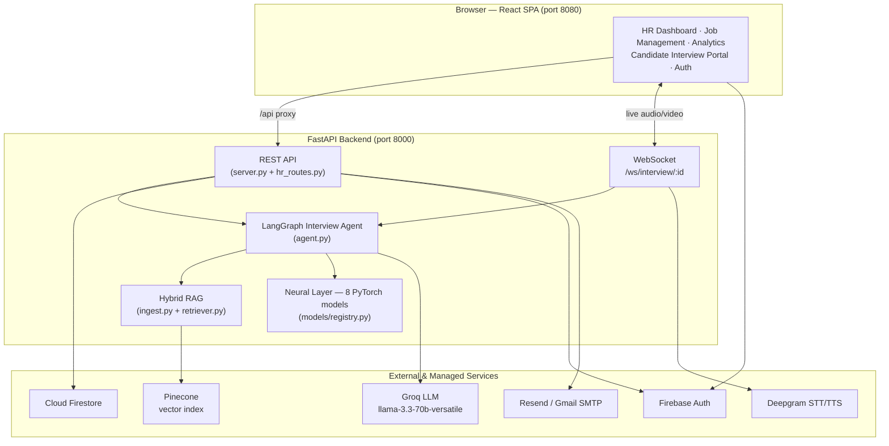
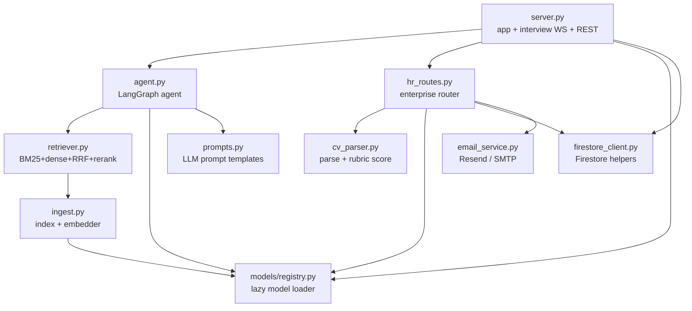
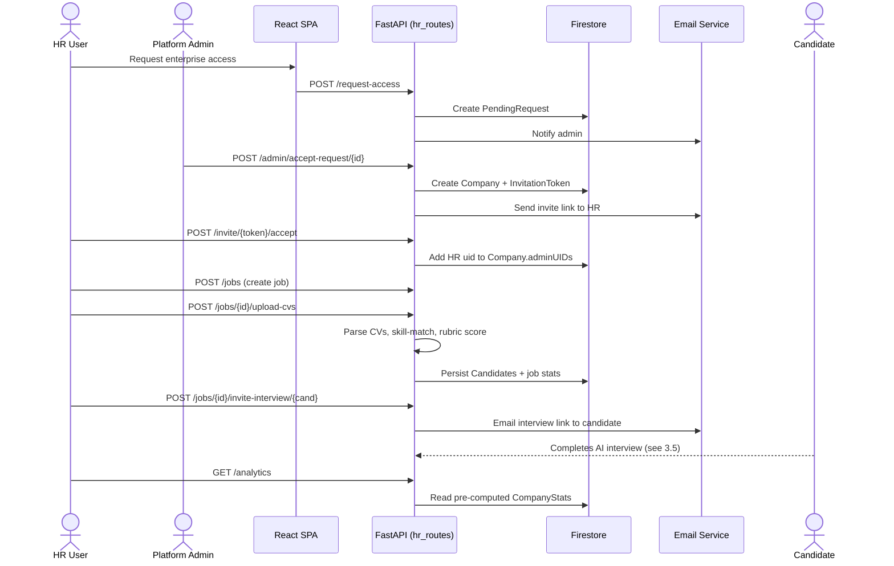
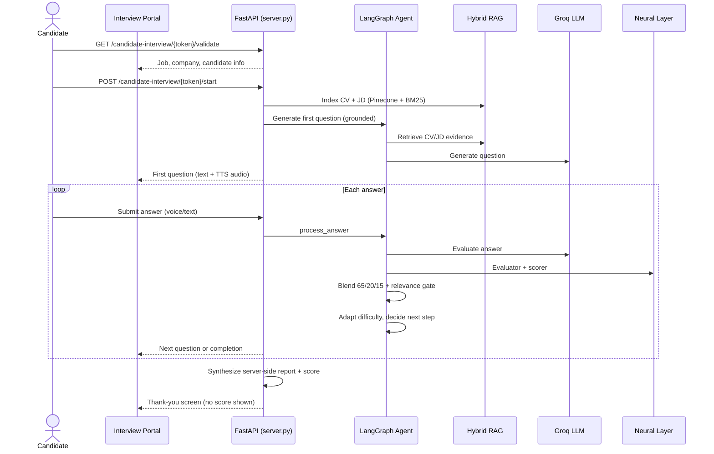

# Chapter Three

# Proposed System

 

**Chapter Outline**

- 3.1 System Architecture
- 3.2 Three-Layer Architecture
- 3.3 Component Diagram
- 3.4 Enterprise Hiring Workflow
- 3.5 Candidate Interview Workflow

This chapter presents the architecture of MyHR: how the major components are organized, how
they communicate, and how data flows through the two principal end-to-end workflows.

---

## 3.1 System Architecture

MyHR follows a classic **client–server** architecture. A React single-page application runs in
the browser and communicates with a FastAPI backend over HTTP (REST) and, during a live
interview, over a WebSocket. The backend orchestrates four external/internal services: the
LLM (Groq), the vector database (Pinecone), the neural model layer (PyTorch, in-process), and
the persistence and identity services (Firestore and Firebase Authentication). Speech
conversion is handled by Deepgram, and transactional email by Resend or Gmail SMTP.

**Figure 3.1 — System Architecture.**

The frontend never talks to Groq, Pinecone, or the neural models directly; all AI work is
mediated by the backend, which is also the only place candidate scores are computed.

---

## 3.2 Three-Layer Architecture

Conceptually, the system decomposes into three layers with distinct responsibilities,
lifecycles, and audiences.

**Figure 3.2 — Three-Layer Architecture.**

```mermaid
flowchart LR
    subgraph L1["Enterprise Layer"]
        direction TB
        E1["Accounts & RBAC"]
        E2["Jobs & CV upload"]
        E3["Neural ranking"]
        E4["Invitations & analytics"]
    end

    subgraph L2["Interview-AI Layer"]
        direction TB
        I1["RAG grounding"]
        I2["LangGraph agent"]
        I3["Answer scoring & blend"]
        I4["Proctoring & report"]
    end

    subgraph L3["Training Layer"]
        direction TB
        T1["Data generation"]
        T2["Model training (8)"]
        T3["Held-out evaluation"]
        T4["Human-rating study"]
    end

    L1 -->|invites candidates into| L2
    L3 -->|produces checkpoints for| L2
    L3 -->|skill matcher & ranker for| L1
```

- The **Enterprise Layer** (`hr_routes.py`, frontend HR pages) is multi-tenant, authenticated,
  and persisted in Firestore. It owns the hiring funnel.
- The **Interview-AI Layer** (`server.py`, `agent.py`, `ingest.py`, `retriever.py`,
  `models/`) is stateful and real-time. It conducts interviews and scores answers.
- The **Training Layer** (`training/`) is offline. It generates data, trains the eight neural
  models, evaluates them on held-out test sets, and runs the human-rating validation study. Its
  outputs are the model checkpoints consumed by the other two layers.

---

## 3.3 Component Diagram

**Figure 3.3 — Component Diagram.** The following diagram shows the principal backend modules
and their dependencies.

---

## 3.4 Enterprise Hiring Workflow

The enterprise workflow is the hiring funnel, from a company requesting access through to
reviewing completed interviews.

**Figure 3.4 — Enterprise Hiring Workflow (Sequence).**

---

## 3.5 Candidate Interview Workflow

When a candidate opens their interview link, they enter a stateful, real-time session driven
by the LangGraph agent.

**Figure 3.5 — Candidate Interview Workflow (Sequence).**

Two design properties are visible here. First, the question is **grounded** before the LLM is
ever called — the agent retrieves CV/JD evidence first. Second, the final score is
**synthesized on the server** from the accumulated evaluations; the candidate is shown only a
thank-you screen, never their score, and cannot influence the number that reaches the HR
dashboard.

The next chapter details how each of these components is implemented.
