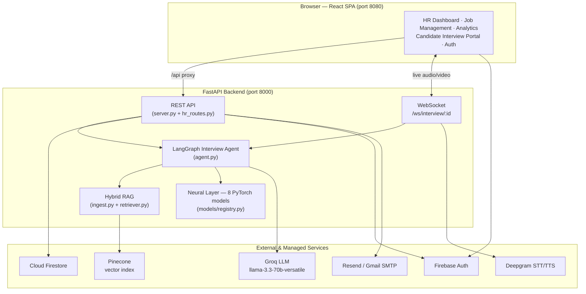
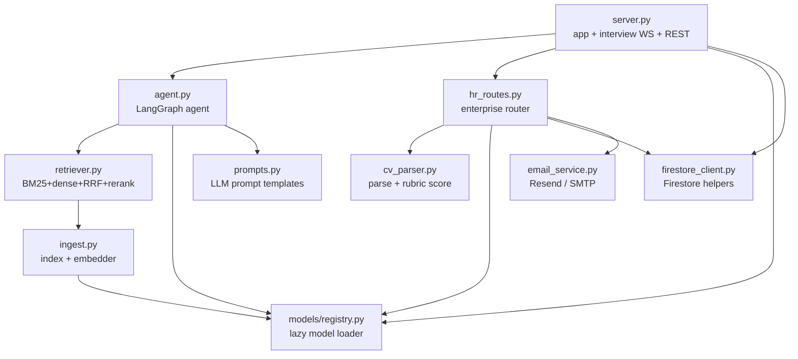
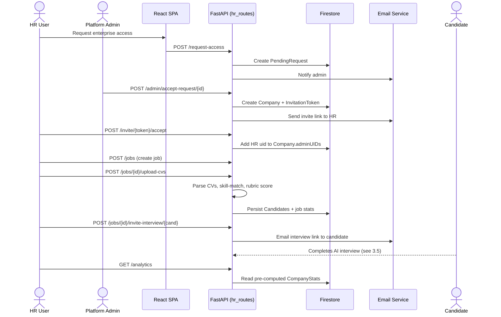
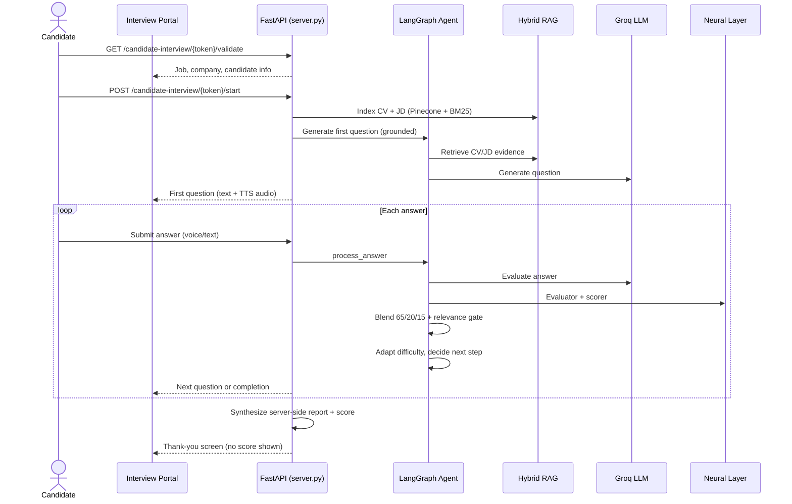
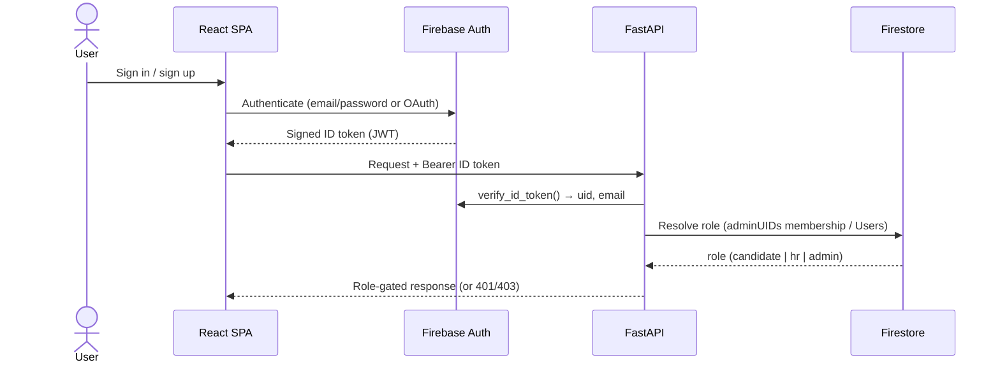
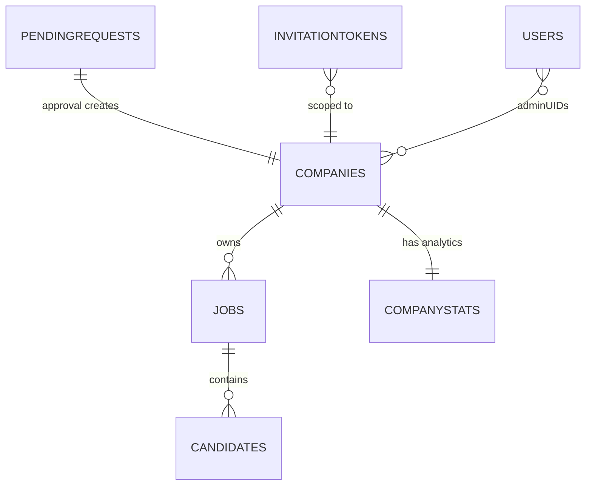
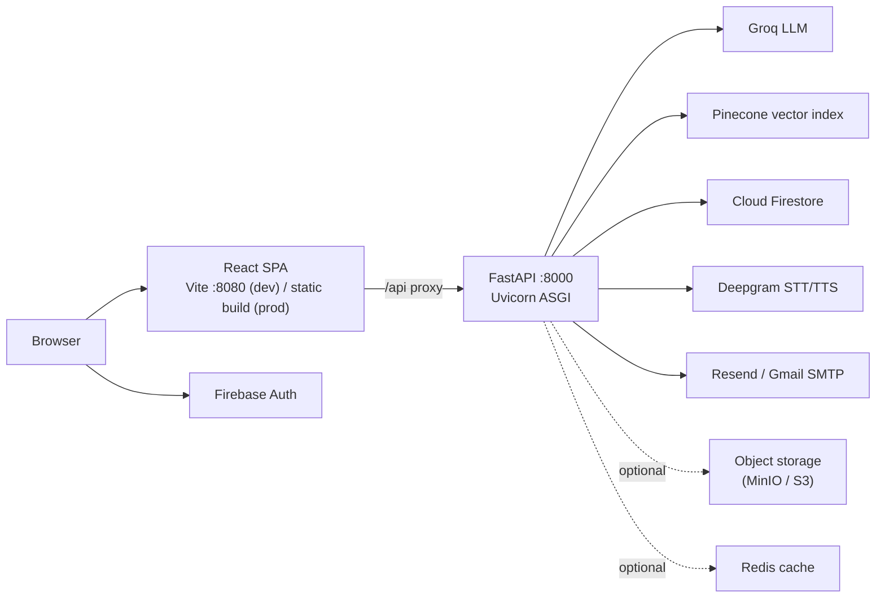
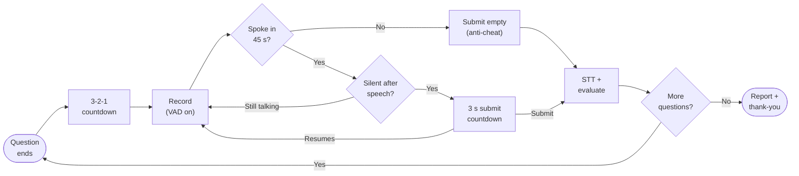

# Chapter Three

# System Analysis & Design

 

**Chapter Outline**

- 3.1 System Architecture
- 3.2 Three-Layer Architecture
- 3.3 Component Diagram
- 3.4 Enterprise Hiring Workflow
- 3.5 Candidate Interview Workflow
- 3.6 Authentication & Authorization Design
- 3.7 Database Design (Entity-Relationship Model)
- 3.8 Deployment Design
- 3.9 Interview Activity Diagram

This chapter presents the analysis and design of MyHR: how the major components are organized,
how they communicate, how users and data flow through the system, and how the persistence,
security, and deployment concerns are structured. Design decisions and trade-offs are noted
throughout; the detailed implementation of each component follows in Chapter 4.

---

## 3.1 System Architecture

MyHR follows a classic **client–server** architecture. A React single-page application runs in
the browser and communicates with a FastAPI backend over HTTP (REST) and, during a live
interview, over a WebSocket. The backend orchestrates four external/internal services: the
LLM (Groq), the vector database (Pinecone), the neural model layer (PyTorch, in-process), and
the persistence and identity services (Firestore and Firebase Authentication). Speech
conversion is handled by Deepgram, and transactional email by Resend or Gmail SMTP.

**Figure 3.1 — System Architecture.**

The frontend never talks to Groq, Pinecone, or the neural models directly; all AI work is
mediated by the backend, which is also the only place candidate scores are computed.

---

## 3.2 Three-Layer Architecture

Conceptually, the system decomposes into three layers with distinct responsibilities,
lifecycles, and audiences.

**Figure 3.2 — Three-Layer Architecture.**

```mermaid
flowchart LR
    subgraph L1["Enterprise Layer"]
        direction TB
        E1["Accounts & RBAC"]
        E2["Jobs & CV upload"]
        E3["Neural ranking"]
        E4["Invitations & analytics"]
    end

    subgraph L2["Interview-AI Layer"]
        direction TB
        I1["RAG grounding"]
        I2["LangGraph agent"]
        I3["Answer scoring & blend"]
        I4["Proctoring & report"]
    end

    subgraph L3["Training Layer"]
        direction TB
        T1["Data generation"]
        T2["Model training (8)"]
        T3["Held-out evaluation"]
        T4["Human-rating study"]
    end

    L1 -->|invites candidates into| L2
    L3 -->|produces checkpoints for| L2
    L3 -->|skill matcher & ranker for| L1
```

- The **Enterprise Layer** (`hr_routes.py`, frontend HR pages) is multi-tenant, authenticated,
  and persisted in Firestore. It owns the hiring funnel.
- The **Interview-AI Layer** (`server.py`, `agent.py`, `ingest.py`, `retriever.py`,
  `models/`) is stateful and real-time. It conducts interviews and scores answers.
- The **Training Layer** (`training/`) is offline. It generates data, trains the eight neural
  models, evaluates them on held-out test sets, and runs the human-rating validation study. Its
  outputs are the model checkpoints consumed by the other two layers.

---

## 3.3 Component Diagram

The following diagram shows the principal backend modules and their dependencies.

**Figure 3.3 — Component Diagram.**

---

## 3.4 Enterprise Hiring Workflow

The enterprise workflow is the hiring funnel, from a company requesting access through to
reviewing completed interviews.

**Figure 3.4 — Enterprise Hiring Workflow (Sequence).**

---

## 3.5 Candidate Interview Workflow

When a candidate opens their interview link, they enter a stateful, real-time session driven
by the LangGraph agent.

**Figure 3.5 — Candidate Interview Workflow (Sequence).**

Two design properties are visible here. First, the question is **grounded** before the LLM is
ever called — the agent retrieves CV/JD evidence first. Second, the final score is
**synthesized on the server** from the accumulated evaluations; the candidate is shown only a
thank-you screen, never their score, and cannot influence the number that reaches the HR
dashboard.

---

## 3.6 Authentication & Authorization Design

Identity is delegated to **Firebase Authentication**. The browser authenticates the user and
receives a signed **ID token** (a JSON Web Token); every protected backend request carries this
token in an `Authorization: Bearer …` header, and the backend verifies it with the Firebase
Admin SDK before acting. This keeps password handling and token signing entirely within a
managed identity provider.

Authorization is **role-based**. Three roles exist and are resolved on the server:

- **Candidate** — self-registerable; may run practice interviews.
- **HR (enterprise)** — *not* self-assignable; granted only by accepting a company invitation,
  which adds the user's UID to that company's `adminUIDs` array.
- **Platform administrator** — a fixed allowlist (an `ADMIN_EMAIL` plus optional `ADMIN_UIDS`);
  may approve or reject enterprise access requests.

**Figure 3.6 — Authentication & Authorization Flow.**

*Design rationale.* Making the HR role grantable only through an invitation — rather than a
self-service toggle — means a malicious user cannot escalate themselves into another company's
data. Tenant isolation is then enforced on every job-scoped route by checking that the job's
`companyId` matches the caller's company.

---

## 3.7 Database Design (Entity-Relationship Model)

MyHR persists all enterprise state in **Cloud Firestore**, a NoSQL document database. The
logical entities and their relationships are shown in Figure 3.7; the physical collection
layout and field-level detail appear in Section 4.6.

**Figure 3.7 — Database Entity-Relationship Diagram.**

The field-level contents of each collection are listed in Table 4.2 (Section 4.6).

*Design rationale.* Candidates are stored as a **subcollection** under each job
(`Jobs/{jobId}/Candidates`) rather than in a top-level collection, so that listing a job's
candidates is a single scoped query and tenant isolation falls out of the document path. The
denormalized `stats` object on each job and the separate `CompanyStats` document trade a small
amount of write-time bookkeeping for fast, scan-free dashboard reads.

---

## 3.8 Deployment Design

In development the system runs as two processes — the Vite dev server (port 8080) proxying
`/api` to the FastAPI backend (port 8000). The project is also containerized (a `Dockerfile`
and `docker-compose.yml` are provided) so the backend and its dependencies can be brought up
reproducibly.

**Figure 3.8 — Deployment Diagram.**

The frontend never contacts Groq, Pinecone, Deepgram, or the neural models directly; all AI
work is mediated by the backend, which is the single place candidate scores are computed.

The container configuration reflects two deliberate decisions. First, the backend image is
based on `python:3.12-slim` and installs only the system libraries the runtime actually needs
(`libglib2.0-0` for OpenCV, `libsndfile1` for audio, and `ffmpeg` for decoding); the heavy
TensorFlow/DeepFace stack is intentionally excluded in favour of the lighter MediaPipe/YuNet
proctor. Second, the multi-hundred-megabyte trained checkpoints are **not** baked into the
image — they are excluded through `.dockerignore` and mounted read-only at runtime, which keeps
the image small and lets models be updated without rebuilding. Secrets are supplied through an
env-file rather than image layers, and generated reports and audio are persisted to host
volumes. A single `docker compose up --build` brings up the backend (8000) and the frontend
(8080) together.

---

## 3.9 Interview Activity Diagram

Figure 3.9 shows the control flow of a single interview turn from the candidate's perspective,
including the proctoring and anti-cheating timing introduced in the portal.

**Figure 3.9 — Interview Turn (Activity Diagram).**

The next chapter details how each of these components is implemented.
