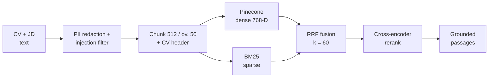
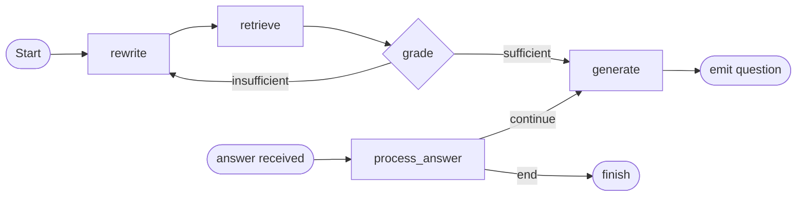
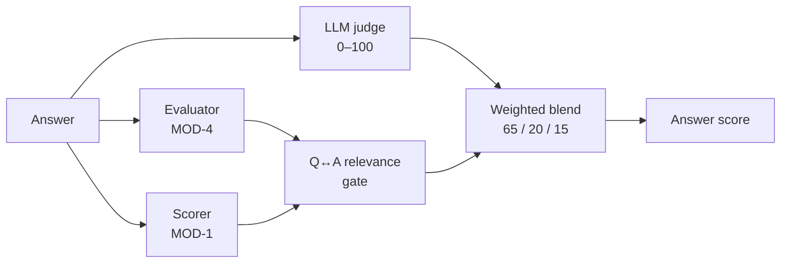
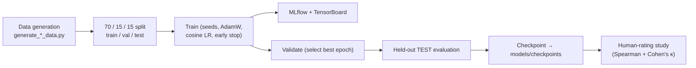
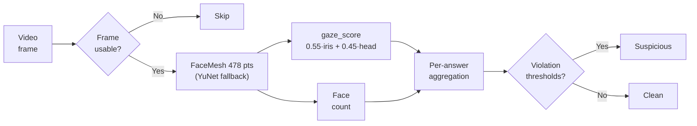

# Chapter Four

# System Implementation

 

**Chapter Outline**

- 4.1 Hybrid RAG Pipeline
- 4.2 LangGraph Interview Agent
- 4.3 AI/ML Model Layer
- 4.4 Enterprise Layer
- 4.5 Training Layer
- 4.6 Database Design
- 4.7 API Reference
- 4.8 Authentication & Authorization
- 4.9 Configuration
- 4.10 Proctoring, Speech & Anti-Cheating
- 4.11 Cross-Cutting Concerns

This chapter describes the detailed implementation of each component. In keeping with the
documentation standard, it explains the design, workflow, and engineering rationale of each
subsystem using diagrams and prose rather than source listings, with a short
results-and-discussion note where relevant.

---

## 4.1 Hybrid RAG Pipeline

**Modules:** `ingest.py` (indexing) and `retriever.py` (retrieval).

When an interview starts, the candidate's CV and the JD are turned into a private, searchable
index scoped to the interview session. Before indexing, every document passes through two
safety filters: **PII redaction** (Microsoft Presidio replaces names, phones, emails, and
similar entities with typed tokens, so raw personal data is never persisted in the vector
store) and a **prompt-injection sanitizer** (regular-expression patterns that strip attempts to
override the system's instructions). The cleaned text is split into overlapping chunks
(`chunk_size = 512`, `chunk_overlap = 50`), each CV chunk is prefixed with a small header
carrying the candidate name and role, and the chunks are written to two stores in parallel:
**Pinecone** (dense vectors, `all-mpnet-base-v2`, 768-D, namespaced by session) and a **local
BM25 store** (raw chunk text for sparse retrieval).

The retrieval stage, illustrated in Figure 4.1, runs the query against both stores
independently and retrieves the top twenty passages from each. The two ranked lists are merged
by **Reciprocal Rank Fusion**, which assigns each passage a score of `1 / (k + rank)` summed
across the lists (`k = 60`); because fusion depends only on a passage's rank in each list, it is
robust to the incomparable raw scores produced by sparse and dense retrieval. The fused
shortlist is then re-scored by the cross-encoder reranker, which reads the query and each
passage jointly to produce the final ordering passed to the agent.

**Figure 4.1 — Hybrid RAG Pipeline (indexing and retrieval).**

The hybrid design captures both exact-term matches (BM25, useful for specific technologies named
in a JD) and semantic matches (dense retrieval, useful for paraphrased experience). The embedder
is initialized lazily at startup so the ~400 MB model does not block application import, and the
same embedder is used at indexing and query time to avoid a train/inference representation
mismatch.

---

## 4.2 LangGraph Interview Agent

**Module:** `agent.py`. The interview is a LangGraph **state graph** compiled with a
checkpointer so each session's state survives between turns.

**Figure 4.2 — LangGraph Agent State Graph.**

- **rewrite** — reformulates the current topic into an effective retrieval query.
- **retrieve** — runs the hybrid RAG pipeline (Section 4.1) to gather grounded evidence.
- **grade** — checks whether the retrieved context is good enough; a conditional edge
  (`check_grade`) loops back to re-query if not.
- **generate** — prompts the Groq LLM (`llama-3.3-70b-versatile`) to produce the next question
  from the grounded context.
- **process_answer** — evaluates the candidate's answer, updates running performance, adapts
  difficulty, and a conditional edge (`decide_next_step`) decides whether to ask another
  question or end.

### Answer scoring and the blend

When an answer is received, three independent quality signals are computed and combined, as
shown in Figure 4.3. The **LLM judge** produces an overall score on a 0–100 scale; the
**MultiHeadEvaluator** (MOD-4) scores the answer's relevance, clarity, and depth; and the
**CandidateScoringMLP** (MOD-1) produces a deep-learned score from the question and answer
embeddings. Before blending, a **relevance gate** scales the neural contribution by the cosine
similarity between the question and answer embeddings, so a fluent but off-topic answer cannot
earn a high neural score.

**Figure 4.3 — Answer Scoring and Blend.**

The blend weights are fixed in the code. When all three signals are available the score is
**65% LLM + 20% evaluator + 15% MOD-1** (`_BLEND_3WAY`); when MOD-1 is unavailable the system
degrades gracefully to **65% LLM + 35% evaluator** (`_BLEND_2WAY`). This keeps the LLM as the
primary judge while allowing the purpose-trained models to temper its opinion, and the relevance
gate guards against the most common failure mode, off-topic fluency. Proctoring observations are
aggregated per answer (Section 4.10) and an answer that is flagged suspicious incurs a score
penalty at this stage.

---

## 4.3 AI/ML Model Layer

**Modules:** `models/` with the lazy loader in `models/registry.py`. The registry checks each
checkpoint at startup (a health check), but loads each model into memory only on first use, and
guards against dimension and embedder mismatches.

**Table 4.1 — Neural Model Layer.**

| # | Model | File | Input | Output | Role |
|---|-------|------|-------|--------|------|
| MOD-1 | CandidateScoringMLP | `scoring_model.py` | Q+A embeddings (1536-D) | Score 0–100 | Deep answer scoring in the blend |
| MOD-4 | MultiHeadEvaluator | `multi_head_evaluator.py` | Answer embedding (768-D) | relevance, clarity, depth | Multi-dimensional answer evaluation |
| MOD-5 | NeuralCandidateRanker | `candidate_ranker.py` | 7-D candidate features | Ranking score | Order candidates within a job |
| MOD-6 | PerformancePredictor | `performance_predictor.py` | Interview features | Market-positioning estimate | Auxiliary report signal |
| — | SkillMatchSiamese | `skill_matcher.py` | CV skills, JD skills | Match similarity | CV↔JD skill matching for ranking |
| — | AdaptiveDifficulty | `difficulty_engine.py` | Performance state (3-D/6-D) | Difficulty action | RL-based question difficulty |
| — | EmotionModel | `emotion_model.py` | Face/tone features | Emotion estimate | Affective context for the report |
| — | CrossEncoderScorer | `cross_encoder_scorer.py` | (query, passage) | Relevance | RAG reranking |

Supporting modules include `proctor.py` (MediaPipe/YuNet face and iris-gaze detection),
`feature_extractor.py` (feature assembly), and `explainer.py` (score-explanation helpers).

On held-out test sets (Section 4.5), the MultiHeadEvaluator reaches
Spearman ≈ 0.95 on each of relevance, clarity, and depth, and the scoring MLP reaches
MAE ≈ 0.067 with Spearman ≈ 0.93 — i.e. both models order answers very close to the reference
labels. The candidate ranker is currently trained on synthetically generated comparative data
and is therefore treated as a *tiebreaker* alongside the rubric and interview scores rather than
an absolute measure (see Chapter 7).

---

## 4.4 Enterprise Layer

**Module:** `hr_routes.py` (the `hr_router`), with `cv_parser.py` for CV processing and
`firestore_client.py` for persistence.

The enterprise layer implements the hiring funnel. Key implementation details:

- **Batch CV upload** (`POST /jobs/{id}/upload-cvs`) parses each file, extracts contact details
  and skills, runs the neural **skill matcher** against the JD, computes a **rubric score**, and
  persists each candidate. Uploads are capped at **5 MiB** per file (`MAX_CV_BYTES`), and
  duplicate CVs are skipped by content hash and email.
- **Rubric scoring** (`cv_parser.compute_rubric_score`) scores a CV on four axes — technical
  stack, architecture, experience, and preferred/extra signals — assigns an experience tier
  (senior/mid/junior), and applies a **knock-out rule** (`framework_cap`): if a CV has zero
  skill overlap against a JD that lists at least five extractable skills, its score is capped at
  40, preventing irrelevant CVs from scoring highly.
- **Atomic job statistics** are updated within a Firestore transaction so concurrent uploads do
  not lose updates.
- **Pre-computed analytics.** `GET /analytics` reads a pre-computed `CompanyStats` document
  rather than scanning every candidate on each request; the document is refreshed in the
  background after CV uploads and interview completions, with an in-memory time-to-live cache as
  a fast path. This avoids an O(jobs × candidates) scan on every dashboard load.
- **Ownership checks.** Every job-scoped route verifies that the job belongs to the caller's
  company before returning data, enforcing tenant isolation.

For each uploaded file the upload handler verifies job ownership, rejects oversized files,
extracts the text, and skips duplicates by content hash and email. It then extracts the
candidate's skills, runs the neural skill matcher against the job's skills, computes the rubric
score, and persists the candidate document. After the batch completes, job statistics are
updated in a single atomic transaction and the company analytics document is refreshed in the
background, so neither concurrent uploads nor large batches block the response.

---

## 4.5 Training Layer

**Module:** `training/`. The training layer is offline and produces the checkpoints consumed by
the other layers.

**Figure 4.4 — Training Pipeline.**

Each trainer (`train_evaluator.py`, `train_scorer.py`, `train_ranker.py`,
`train_skill_matcher.py`, `train_difficulty.py` / `train_difficulty_ppo.py`,
`train_emotion.py`, `train_predictor.py`, `train_cross_encoder.py`) shares the same hygiene:
fixed random seeds, an AdamW optimizer with cosine-annealing learning-rate schedule, early
stopping with best-state restoration, dual MLflow + TensorBoard logging, and rank-aware metrics
(Spearman, NDCG, F1). Models are trained on a **70/15/15** split and final numbers are reported
on the **held-out test fold**, not the validation fold used for early stopping.

To prevent a train/inference embedding mismatch, the evaluator's training answers are
re-encoded with the same `all-mpnet-base-v2` embedder used in production, and the checkpoint is
stamped with the embedder identity so the registry can reject a mismatched model.

**Representative held-out TEST metrics.**

| Model | Metric | Value |
|-------|--------|-------|
| MultiHeadEvaluator | Spearman (relevance) | ≈ 0.95 |
| MultiHeadEvaluator | Spearman (clarity) | ≈ 0.95 |
| MultiHeadEvaluator | Spearman (depth) | ≈ 0.95 |
| CandidateScoringMLP | MAE | ≈ 0.067 |
| CandidateScoringMLP | Spearman | ≈ 0.93 |

A **human-rating study** (`human_rating_study.py`) compares the system's scores against human
ratings on a stratified sample of answers, reporting Spearman's correlation (≈ 0.95) and
Cohen's κ (≈ 0.50). A **fairness audit** and a **RAG evaluation** harness are also provided.

The held-out methodology and the consistent embedder give the reported metrics credibility. As
noted in Chapter 7, the human study currently uses a single rater and should be extended to
several raters for inter-rater reliability.

---

## 4.6 Database Design

MyHR persists all enterprise state in **Cloud Firestore**, a NoSQL document database. The logical
entity model and relationships were presented in the design chapter (Figure 3.7); this section
documents the physical collection layout and the fields each collection carries, summarized in
Table 4.2.

**Table 4.2 — Firestore Collections.**

| Collection | Purpose | Key fields |
|------------|---------|-----------|
| `Companies` | Tenant record | `name`, `adminUIDs`, `domain`, `settings` |
| `Jobs` | Job postings | `companyId`, `title`, `description`, `extractedSkills`, `stats` |
| `Jobs/{id}/Candidates` | Candidates per job (subcollection) | `name`, `email`, `matchScore`, `interviewScore`, `totalScore`, `interviewStatus` |
| `Users` | Portal role registry | `uid`, `role` (`candidate`) |
| `PendingRequests` | Enterprise access requests | `companyName`, `contactEmail`, `status` |
| `InvitationTokens` | Access & interview tokens | `type`, `companyId`, `jobId`, `candidateId`, `expiresAt`, `usedAt` |
| `CompanyStats` | Pre-computed analytics | `stats`, `monthly_trends`, `updatedAt` |

The total candidate score combines the CV match and the interview at a fixed weighting —
**40% CV match + 60% interview** (`CV_SCORE_WEIGHT = 0.4`, `INTERVIEW_SCORE_WEIGHT = 0.6`).

---

## 4.7 API Reference

The backend exposes two routers: interview/system endpoints in `server.py`, and the enterprise
router in `hr_routes.py`.

**Table 4.3 — API Reference: Interview & System Endpoints (`server.py`).**

| Method | Path | Auth | Purpose |
|--------|------|------|---------|
| POST | `/start_interview` | Token/session | Start a (practice) interview session |
| POST | `/candidate-interview/{token}/start` | Public token | Start a token-based candidate interview |
| WS | `/ws/interview/{session_id}` | Session | Live audio/video interview channel |
| GET | `/end_interview/{session_id}` | Session | End an interview and finalize |
| POST | `/analyze_frame` | Session | Proctoring: analyze a single video frame |
| POST | `/submit_answer` | Session | Submit and evaluate an answer |
| GET | `/api/proctoring/{session_id}` | Session | Retrieve aggregated proctoring results |
| POST | `/candidates/rank` | Internal | Rank candidates with the neural ranker |
| GET | `/health` | Public | Liveness/health check |
| GET | `/metrics` | Public | In-process metrics |

**Table 4.4 — API Reference: Enterprise Endpoints (`hr_routes.py`).**

| Method | Path | Auth | Purpose |
|--------|------|------|---------|
| POST | `/request-access` | Public | Submit enterprise access request |
| GET | `/admin/pending-requests` | Admin | List pending requests |
| POST | `/admin/accept-request/{id}` | Admin | Approve request, create company + invite |
| POST | `/admin/reject-request/{id}` | Admin | Reject a request |
| GET | `/invite/{token}/validate` | Public token | Validate a company-access invite |
| POST | `/invite/{token}/accept` | Firebase | Link user to company (grants HR role) |
| POST | `/jobs` | HR | Create a job |
| GET | `/jobs` | HR | List company jobs |
| GET | `/jobs/{id}` | HR | Get a job |
| PATCH | `/jobs/{id}` | HR | Edit a job; close or reopen it |
| POST | `/jobs/{id}/upload-cvs` | HR | Batch upload + score CVs |
| GET | `/jobs/{id}/candidates` | HR | List candidates (paged/filtered) |
| GET | `/jobs/{id}/candidates/{cid}` | HR | Get a candidate (with report) |
| POST | `/jobs/{id}/candidates/{cid}/regenerate-report` | HR | Re-synthesize a candidate's interview report |
| DELETE | `/jobs/{id}/candidates/{cid}` | HR | Remove a candidate |
| POST | `/user/role` | Firebase | Self-register as candidate |
| GET | `/user/role/{uid}` | Public | Resolve a user's role |
| POST | `/jobs/{id}/invite-interview/{cid}` | HR | Email an interview invite |
| GET | `/candidate-interview/{token}/validate` | Public token | Validate interview token |
| POST | `/candidate-interview/{token}/complete` | Public token | Finalize interview (server-scored) |
| GET | `/analytics` | HR | Company hiring analytics |
| POST | `/jobs/{id}/rank-candidates` | HR | Neural ranking of candidates |

---

## 4.8 Authentication & Authorization

**Modules:** `firestore_client.py`, `hr_routes.py`, and `src/contexts/AuthContext.jsx` on the
frontend. Identity is provided by **Firebase Authentication**; the backend verifies the
Firebase **ID token** on protected routes.

Three roles exist:

- **Candidate** — self-registerable (`POST /user/role` accepts only `candidate`). Candidates can
  run practice interviews.
- **HR (enterprise)** — *not* self-assignable. The role is granted only by accepting a company
  invitation, which adds the user's UID to the company's `adminUIDs` array; the role resolver
  (`GET /user/role/{uid}`) reports `hr` precisely when the UID appears in some company's
  `adminUIDs`. An email already registered as a candidate cannot also become enterprise, and
  vice-versa — one email maps to one role.
- **Super-admin** — a fixed allowlist email with platform privileges (approving requests).

Public interview links use cryptographically strong tokens (`secrets.token_urlsafe`) with an
expiry and are validated server-side. The corporate-email gate restricts enterprise sign-up to
corporate domains, with a `BYPASS_EMAIL_CHECK` escape hatch for local testing. Because interview
scores are computed only from the server-side synthesized report, a candidate cannot submit or
influence their own score. The end-to-end token verification and role-resolution sequence was
presented in the design chapter (Figure 3.6).

---

## 4.9 Configuration

Configuration is supplied via environment variables (a local `.env` file in development).

**Table 4.5 — Environment Variables.**

| Variable | Purpose |
|----------|---------|
| `GROQ_API_KEY` | Groq LLM access (`llama-3.3-70b-versatile`) |
| `DEEPGRAM_API_KEY` | Speech-to-text / text-to-speech |
| `PINECONE_API_KEY` | Pinecone vector index |
| `OPENAI_API_KEY` | Optional LLM/embedding access |
| `FIREBASE_SERVICE_ACCOUNT_PATH` | Firebase Admin SDK credentials |
| `VITE_FIREBASE_*` | Frontend Firebase web config |
| `RESEND_API_KEY` | Resend email transport |
| `SMTP_USER`, `SMTP_PASS` | Gmail SMTP transport (App Password) |
| `MYHR_BASE_URL` | Frontend base URL for email links (e.g. `http://localhost:8080`) |
| `AWS_*`, `S3_BUCKET_NAME`, `MINIO_ENDPOINT` | Object storage (MinIO/S3) configuration |
| `REDIS_URL` | Redis connection (caching) |
| `DATABASE_URL` | Relational database URL (auxiliary) |
| `BYPASS_EMAIL_CHECK` | Dev escape hatch for the corporate-email gate |

The email service tries Gmail SMTP first (when `SMTP_USER`/`SMTP_PASS` are set), then falls
back to the Resend API, and logs a warning if neither is configured. The LLM embedder is loaded
lazily at startup so model loading does not block application import.

---

## 4.10 Proctoring, Speech & Anti-Cheating

**Modules:** `models/proctor.py` (computer-vision proctoring), the Deepgram integration in
`server.py` (speech), and the candidate portal hooks `src/hooks/useVAD.js` and
`src/pages/CandidateInterviewPortal.jsx` (anti-cheating).

### Computer-vision proctoring

Proctoring runs silently throughout the interview and never surfaces to the candidate. For each
captured video frame, the proctor estimates three things: **how many faces are present**,
**whether the candidate is looking away**, and **whether the eyes are closed / gaze is extreme**.
It uses a three-tier detection chain so it degrades gracefully on machines without the heavier
dependency:

1. **MediaPipe FaceMesh** (`refine_landmarks=True`) provides **478 facial landmarks**, including
   the iris contours (landmarks 468–477). From these the proctor computes an **Iris Position
   Ratio (IPR)** — the horizontal position of the iris centre between the eye corners — and an
   **Eye Aspect Ratio (EAR)** for closed-eye / extreme-downward-gaze detection. The final gaze
   score is a weighted combination of iris position (0.55) and head pose (0.45).
2. **YuNet** (`cv2.FaceDetectorYN`, an ONNX detector) provides fast, reliable **face counting**
   and a head-pose fallback when MediaPipe is unavailable.
3. **Haar cascade** is the final fallback.

The detection pipeline is summarized in Figure 4.5. Each usable frame is processed by MediaPipe
FaceMesh (or the YuNet fallback) to produce a gaze score and a face count, which are aggregated
across all of an answer's frames and tested against the violation thresholds.

**Figure 4.5 — Proctoring Detection Pipeline.**

An answer is flagged *suspicious* when multiple faces appear, the face is absent for more than
20% of its frames, or the candidate looks away for more than 30% of its frames. As described in
Section 4.2, a suspicious answer incurs a score penalty (−5, or −8 when multiple faces are
detected) at blend time.

### Speech (STT / TTS)

The interview is voice-native. Each question is synthesized to speech with **Deepgram TTS** and
played to the candidate; each spoken answer is captured in the browser, sent to the backend, and
transcribed with **Deepgram STT** before being passed to the scoring pipeline. The transcript is
what the LLM judge and the neural evaluators actually score, so a candidate may answer by voice
or by typing with identical downstream handling.

### Anti-cheating in the candidate portal

Two browser-side problems are addressed in the portal. First, **silence is not the same as a
finished answer** — a candidate pausing to think must not have an incomplete answer submitted.
Second, **a candidate must not be able to skip a question by staying completely silent**. The
portal solves both with a small recording state machine built around browser **Voice Activity
Detection (VAD)** (Silero VAD via `@ricky0123/vad-web`):

- After a question's audio finishes, a mandatory **3-second "get ready" countdown** is shown
  before the microphone becomes active. This also makes it impossible to start answering before
  the question has fully played.
- The VAD's silence tolerance (`redemptionFrames`) is set so that a natural ~250 ms mid-sentence
  pause does **not** end the answer.
- When the candidate does fall silent after speaking, a **3-second submission countdown** appears
  with **"Keep Talking"** and **"Submit Now"** controls; speaking again cancels it. Only when the
  countdown reaches zero (or *Submit Now* is pressed) is the audio submitted.
- If the candidate never speaks at all, a **45-second no-speech timeout** auto-submits an empty
  answer, so silent non-participation cannot be used to dodge a question.

The complete control flow of these states — the pre-answer countdown, the recording and
submission-countdown transitions, and the no-speech timeout — is shown in the interview activity
diagram (Figure 3.9). Separating "the candidate is thinking" from "the candidate is done"
removed the most common usability complaint (premature submission), while the mandatory
pre-answer countdown and the no-speech timeout together close the two obvious ways to game a
hands-off interview. Because this logic lives in the portal's state, it applies identically to
the enterprise candidate portal and the practice interview room.

---

## 4.11 Cross-Cutting Concerns

Three concerns cut across the backend rather than belonging to any single feature: how requests
are authenticated, how the service is protected from abuse, and how its behaviour is observed.

**Dependency injection.** Authentication and tenancy are enforced through FastAPI's dependency
injection rather than being repeated inside each handler. Reusable dependencies — verifying the
Firebase ID token and resolving the caller's company (`get_current_company_id`) or requiring a
platform administrator (`require_admin`) — are declared once and attached to routes with
`Depends(...)`. Each protected enterprise route therefore receives an already-authorized
company identifier, and a route that omits the dependency simply has no access to tenant data.
Centralizing the checks in injected dependencies keeps authorization consistent and removes the
risk of a handler forgetting to verify ownership.

**Rate limiting.** The interview endpoints are protected by **SlowAPI**, a per-client rate
limiter keyed on the remote address. A shared `Limiter` is registered on the application and a
`RateLimitExceeded` handler returns a clean `429` response, preventing a single client from
exhausting the LLM, speech, and vector-search services that each request fans out to.

**Logging.** The backend configures Python's standard `logging` at start-up and obtains a
module-level logger in each module (`logging.getLogger(__name__)`). Model-registry health, RAG
indexing, the per-answer score blend, and proctoring penalties are logged at appropriate levels,
which makes a failed interview traceable without exposing any candidate-facing detail. As noted
in Chapter 7, this structured logging is the foundation for the production monitoring and tracing
that are not yet part of the current implementation.
