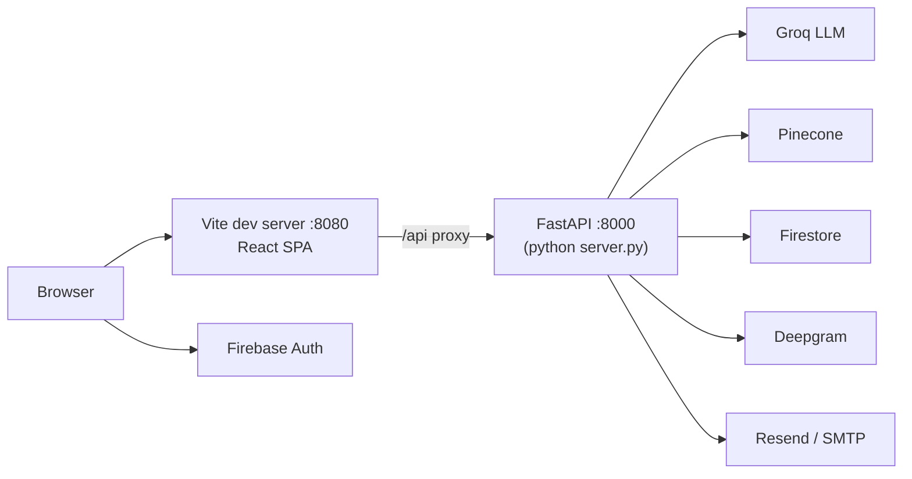

<div align="center">

# Chapter Five

# System Testing

</div>

<br/>

**Chapter Outline**

- 5.1 Installation
- 5.2 Running the System
- 5.3 Automated Test Suite
- 5.4 End-to-End Walkthrough

This chapter explains how to install, configure, run, and test MyHR, and walks through the
end-to-end golden path with screenshots.

---

## 5.1 Installation

MyHR has a Python backend and a Node.js frontend. Both must be installed.

**Prerequisites**

- Python 3.11+ (the project is currently run on Python 3.14)
- Node.js 18+ and npm
- Accounts/keys for: Groq, Deepgram, Pinecone, Firebase, and an email transport (Resend or a
  Gmail App Password)

**Backend dependencies**

```bash
# from the project root
python -m venv .venv
. .venv/Scripts/activate      # Windows (Git Bash);  source .venv/bin/activate on Linux/macOS
pip install -r requirements.txt
```

**Frontend dependencies**

```bash
npm install
```

**Configuration.** Create a `.env` file in the project root with the variables listed in
**Table 4.5** (Chapter 4.9). At minimum, set `GROQ_API_KEY`, `DEEPGRAM_API_KEY`,
`PINECONE_API_KEY`, `FIREBASE_SERVICE_ACCOUNT_PATH`, the `VITE_FIREBASE_*` web config, an email
transport (`RESEND_API_KEY` or `SMTP_USER` + `SMTP_PASS`), and `MYHR_BASE_URL` pointing at the
frontend (e.g. `http://localhost:8080`).

---

## 5.2 Running the System

The backend and frontend run as two processes.

```bash
# Terminal 1 — backend (FastAPI on port 8000)
python server.py

# Terminal 2 — frontend (Vite dev server on port 8080)
npm run dev
```

On a healthy start, the backend logs a model-registry health check (all eight checkpoints
present), loads the skill matcher, initializes the LlamaIndex embedder, readies the OpenCV
proctor, loads the emotion model, and reports *Application startup complete* with Uvicorn
listening on `http://0.0.0.0:8000`. The frontend serves the SPA at `http://localhost:8080`,
and Vite proxies all `/api` calls to the backend.

**Figure 5.1 — Deployment Architecture.**



For a production deployment, the frontend is built with `npm run build` (output in `dist/`) and
served as static assets, while the backend runs under a production ASGI server; object storage,
caching, and observability would be hardened as described in Chapter 6.

---

## 5.3 Automated Test Suite

The backend ships with a `pytest` suite under `tests/`.

```bash
python -m pytest tests/ -q
```

**Table 5.1 — Automated Test Summary.**

| Test file | Tests | Coverage focus |
|-----------|-------|----------------|
| `tests/test_cv_parser.py` | 38 | Email/phone/name/skill extraction, skill matching, rubric scoring (incl. the `framework_cap` knock-out rule) |
| `tests/test_hr_helpers.py` | 19 | Corporate-email gate, secure token generation, CV-text validation |
| `tests/test_integration.py` | 13 | Cross-module integration of enterprise helpers |
| **Total** | **70** | All passing |

`tests/conftest.py` provides shared fixtures (including a fake model registry) so the suite runs
without loading the heavy neural models. The pure-logic helpers (CV parsing, rubric scoring,
email validation, token generation) are tested directly, which keeps the suite fast and
deterministic.

The frontend uses **Vitest** (`npm run test`) with React Testing Library for component-level
tests.

---

## 5.4 End-to-End Walkthrough

The following golden path exercises the full system. Screenshot placeholders mark where to
insert captured images before submission.

**1. Request enterprise access.** A company submits the access form; a corporate email is
required (unless `BYPASS_EMAIL_CHECK` is set).


**2. Admin approval.** The platform admin reviews pending requests and approves one, which
creates the company, generates an invitation token, and emails the HR contact a link.


**3. Accept invitation.** The HR user opens the emailed link, creates their account, is added to
the company's `adminUIDs`, and lands on the HR dashboard as an enterprise user.


**4. Create a job and upload CVs.** The HR user posts a job (skills are auto-extracted from the
JD) and uploads candidate CVs in bulk; each CV is parsed, skill-matched, and rubric-scored.


**5. Review ranked candidates.** Candidates appear ranked by match score; the HR user can open
a candidate to see the match breakdown.


**6. Invite a candidate to interview.** The HR user invites a candidate; an interview link is
emailed to the candidate.


**7. Candidate AI interview.** The candidate opens the link, grants camera/microphone access,
and completes an adaptive, grounded interview (voice or text). Proctoring runs silently; the
candidate never sees a score, only a thank-you screen on completion.


**8. Hiring analytics.** Back on the dashboard, the HR user reviews aggregate analytics —
candidate counts, average match and interview scores, monthly trends, and recent activity —
served from the pre-computed `CompanyStats` document.


*Expected outcome.* After completion, the candidate's record shows an `interviewScore`, a
synthesized `interviewReport`, and a `totalScore` (40% CV match + 60% interview), and the
analytics document refreshes in the background. This confirms the full funnel — from access
request to scored interview — operates end-to-end.
